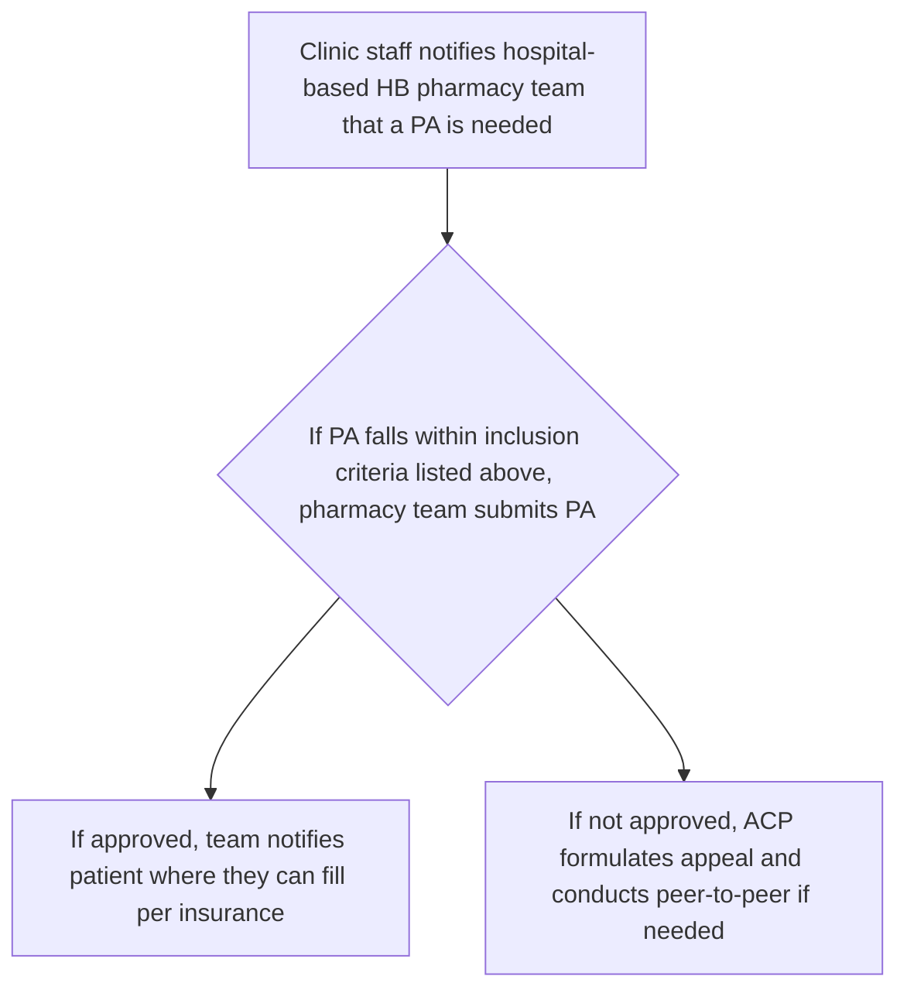

SHIELDS HEALTH SOLUTIONS logo

# Pharmacist Impact in a Multiple Sclerosis Clinic

Mekala Paparian, PharmD, MSCS, CSP; Martha Stutsky, PharmD, BCPS; Kate Smullen, PharmD, MSCS, CSP

QR code to scan

## Background

* Multiple sclerosis (MS) is a complex, neurodegenerative disease affecting the central nervous system. To delay disease progression in MS, patients are treated with disease modifying therapies (DMT).1

* Prompt treatment initiation is essential as therapy delays can lead to poor patient outcomes.2

* Ambulatory care pharmacists (ACP) are equipped to support intricate medication management for MS patients.2

* Objective: to demonstrate the ACP impact in facilitating MS medication access on prior authorization (PA) turn-around-times (TAT), medication appeal and PA approval rates, and clinic satisfaction scores.

## Methods

* Retrospective observational study comparing PA TAT and appeal/PA approval rates in NY health system-based (HSB) MS patients

    - **Pre-ACP time period**: 4/1/2021-9/31/2021
    - **Post-ACP time period**: 10/1/2021-3/31/2022

* Inclusion criteria: patients with a prescription for a DMT, dextroamphetamine+amphetamine, modafinil, EmgalityR, lisdexamfetamine, or methylphenidate.

* The following data was analyzed for pre- and post-implementation periods: percentage of PAs/appeals approved and PA TAT.

* Satisfaction scores for the ACP service were collected from clinic staff.

## Results

Since the incorporation of an ACP within a NY HSB MS center, total PA TAT decreased by one day and both PA and appeal approval rates increased by 23% and 12% respectively (Figure 1). Results of the clinic survey, to which 11/14 individuals responded, demonstrated overwhelmingly positive feedback to the ACP service. Specifically, 100% of clinicians found PA and appeal assistance the most impactful, followed by patient counseling and drug information resource (90%), and assistance in pharmacy prescription clarification (63.6%) (Figure 2). All staff who completed the survey would enhance ACP integration, with 70% specifically requesting more teach-appointments and incorporation into clinic initiatives (Figure 3). All staff who completed the survey rated the benefit of an integrated ACP as very beneficial.

Figure 1: Pre- and Post- ACP Clinic Metrics

|                      | Pre-ACP  | Post-ACP |
| -------------------- | -------- | -------- |
| PA TAT               | 2.8 days | 1.8 days |
| PA approval rate     | 62%      | 85%      |
| Appeal approval rate | 50%      | 62%      |

| 37%                        | 1 Day            | 24%                            |
| -------------------------- | ---------------- | ------------------------------ |
| INCREASED PA approval rate | DECREASED PA TAT | INCREASED Appeal approval rate |

Figure 2: Most Impactful ACP Service Provided

| Service                    | Percentage of Responses (%) |
| -------------------------- | --------------------------- |
| Prescription Clarification | 63.6                        |
| Patient Counseling         | 90                          |
| Drug Information           | 90.9                        |
| Appeal Assistance          | 100                         |

100% Clinic Satisfaction integrated ACP rated as "very beneficial"

Figure 3: Interest in Additional ACP Services

| Service                       | Percentage of Responses (%) |
| ----------------------------- | --------------------------- |
| Support in Clinic Initiatives | 70                          |
| Virtual TA                    | 70                          |
| Drug Information...           | 60                          |
| In-person TA                  | 50                          |
| Visibility of ACP             | 50                          |
| Documentation                 | 0                           |

## Conclusion

* The incorporation of an ACP into a NY HSB MS center is associated with favorable clinical and operational outcomes: improved PA TAT and increased PA/appeal approval rates.

* Integration of an ACP is an effective way to enhance patient care and achieve clinic satisfaction.

* Additional ways to expand ACP services include: accelerate onsite clinic initiatives/pilots, increase documentation visibility in EMR, host drug information presentations and virtual/in-person teach appointments.

## DISCLOSURES

The authors of this presentation have nothing to disclose concerning possible financial or personal relationships with commercial entities that may have a direct or indirect interest in the subject matter of this presentation.

## REFERENCES

1. Noyes K, Weinstock-Guttman B. Impact of diagnosis and early treatment on the course of multiple sclerosis. Am J Manag Care. 2013 Nov;19(17 Suppl):s321-31. PMID: 24494633

2. May A, Morgan O, Quairoli K. Incorporation, and Impact of a Clinical Pharmacist in a Hospital-Based Neurology Clinic Treating Patients with Multiple Sclerosis. Int J MS Care. 2021 Jan-Feb;23(1):16-20. doi: 10.7224/1537-2073.2019-032. Epub 2020 Feb 14. PMID: 33658901; PMCID: PMC7906034.

