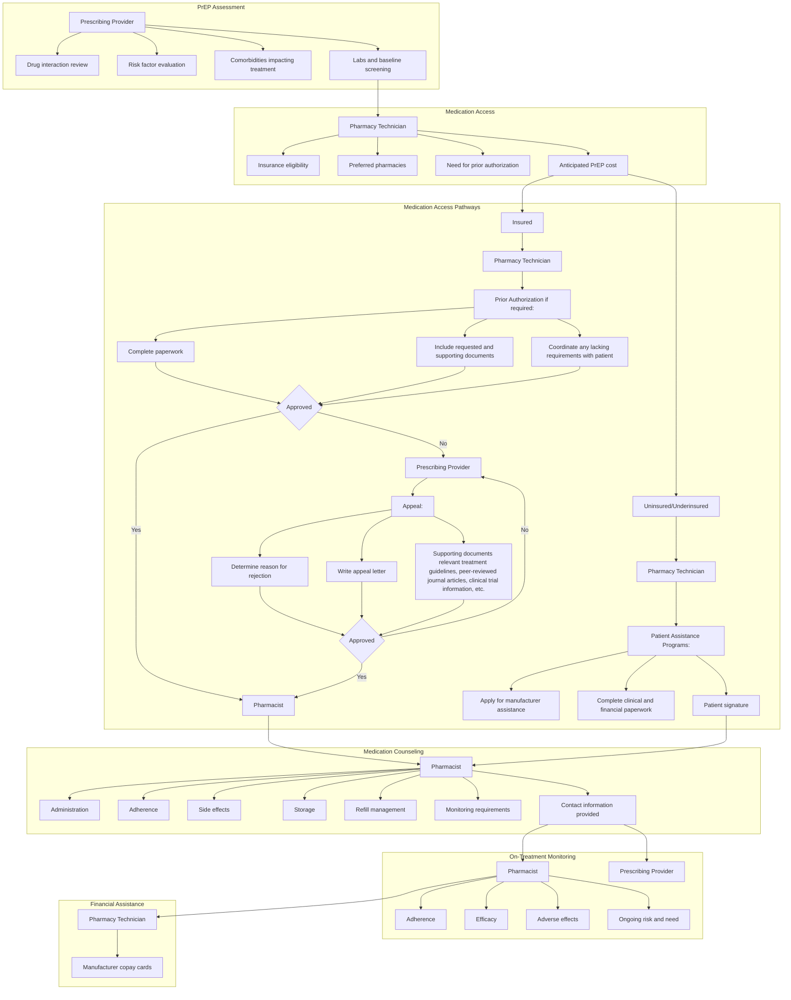

# OVERCOMING PRESCRIBER CONCERNS THROUGH SUCCESSFUL ACCESS AND AFFORDABILITY OF PREP

**KRISTEN WHELCHEL, PHARMD, CSP1, AUTUMN D. ZUCKERMAN, PHARMD, BCPS, AAHIVP, CSP1, JOSH DECLERCQ, MS2, LEENA CHOI, PHD2; SHAHRISTAN RASHID, PHARMD3, SEAN G. KELLY, MD4**

VANDERBILT UNIVERSITY MEDICAL CENTER logo

1VANDERBILT SPECIALTY PHARMACY, VANDERBILT UNIVERSITY MEDICAL CENTER, 2DEPARTMENT OF BIOSTATISTICS, VANDERBILT UNIVERSITY MEDICAL CENTER, 3DEPARTMENT OF PHARMACY, TRISTAR CENTENNIAL MEDICAL CENTER, 4DEPARTMENT OF MEDICINE, VANDERBILT UNIVERSITY MEDICAL CENTER

726 Melrose Avenue Nashville, TN 37211
Email: kristen.w.whelchel@vumc.org
Tel: 615.875.6131 Fax: 615.875.0666

## BACKGROUND

\* Human immunodeficiency virus (HIV) Pre-Exposure Prophylaxis (PrEP) significantly reduces the risk for HIV infection in high-risk adults

\* Increasing the number HIV PrEP providers expands PrEP access to more eligible patients and is one of the key tools to ending the HIV epidemic

\* Non-prescribers of PrEP have noted perceived financial barriers as a limitation to prescribing

**Objective:** Describe PrEP medication access process and outcomes in patients seen at a multidisciplinary PrEP clinic

### Figure 1. Specialty Pharmacist Role in Outpatient PrEP Clinic

## METHODS

| Design                                              | Single-center, retrospective cohort                                                                                                                                        |
| --------------------------------------------------- | -------------------------------------------------------------------------------------------------------------------------------------------------------------------------- |
| Sample                                              | Adult patients initiating PrEP with emtricitabine-tenofovir disoproxil fumarate from a multidisciplinary clinic with prescriptions filled by Vanderbilt Specialty Pharmacy |
| Study period                                        | September 2016 - March 2019                                                                                                                                                |
| Primary outcome                                     | Time to treatment initiation                                                                                                                                               |
| Secondary Outcomes                                  | Reasons for treatment initiation delay Out-of-pocket patient cost for medication                                                                                       |
| Table 1. Patient Characteristics at Baseline (n=63) |                                                                                                                                                                            |
| Characteristic                                      | N (%)                                                                                                                                                                      |
| Age at PrEP start (years; median (IQR))             | 38 (29-47)                                                                                                                                                                 |
| Gender, male                                        | 61 (96.8)                                                                                                                                                                  |
| Race                                                |                                                                                                                                                                            |
| White                                               | 53 (84.1)                                                                                                                                                                  |
| Black                                               | 5 (7.9)                                                                                                                                                                    |
| Other/Unknown                                       | 5 (7.9)                                                                                                                                                                    |
| Insurance type                                      |                                                                                                                                                                            |
| Commercial                                          | 59 (93.7)                                                                                                                                                                  |
| Medicaid                                            | 3 (4.8)                                                                                                                                                                    |
| Tricare                                             | 1 (1.6)                                                                                                                                                                    |
| Indication for PrEP                                 |                                                                                                                                                                            |
| Men who have sex with men at high risk              | 61 (96.8)                                                                                                                                                                  |
| Serodiscordant heterosexual contact                 | 2 (3.2)                                                                                                                                                                    |
| Number of sexual partners in last 6 months          |                                                                                                                                                                            |
| 1                                                   | 13 (21)                                                                                                                                                                    |
| 2-5                                                 | 21 (33)                                                                                                                                                                    |
| 6-10                                                | 7 (11)                                                                                                                                                                     |
| 10                                                  | 8 (13)                                                                                                                                                                     |
| Not reported                                        | 14 (22)                                                                                                                                                                    |
| Reported condom use                                 |                                                                                                                                                                            |
| Inconsistent (<100%)                                | 28 (60.3)                                                                                                                                                                  |
| Consistent (100%)                                   | 14 (22.2)                                                                                                                                                                  |
| No condom use                                       | 5 (7.9)                                                                                                                                                                    |
| Not reported                                        | 5 (7.9)                                                                                                                                                                    |
| Not sexually active                                 | 1 (1.6)                                                                                                                                                                    |
| eGFR ≥ 60 mL/min                                    | 63 (100)                                                                                                                                                                   |
| Hepatitis B status                                  |                                                                                                                                                                            |
| Susceptible at baseline                             | 33 (52.4)                                                                                                                                                                  |
| Immune due to vaccination                           | 27 (42.9)                                                                                                                                                                  |
| Immune due to natural infection                     | 2 (3.2)                                                                                                                                                                    |
| Indeterminate (isolated cAb positive)               | 1 (1.6)                                                                                                                                                                    |

IQR, interquartile range; cAb, core antibody

## RESULTS

### Figure 2. Time to Treatment Initiation (n=63)

| Metric                      | Median (IQR) |
| --------------------------- | ------------ |
| Rx received to approval     | 0 (0-3)      |
| Insurance approval to start | 4 (2-6)      |
| First visit to start        | 7 (4-8)      |

\* 27% (n=17) required prior authorization; 100% of PAs were approved

\* Median time for PA approval was 2 days, IQR (2-4)

\* 1 patient waited 31 days to start therapy due to potential insurance instability

### Figure 3. Reasons for Treatment Delay (n=16)

| Reason                         | Count |
| ------------------------------ | ----- |
| Additional information needed  | 1     |
| Obtained foundation assistance | 1     |
| Prior authorization process    | 2     |
| Lab error or delay             | 5     |
| Patient preference             | 7     |

\* Treatment delay defined as >7 days from the prescribing of PrEP to PrEP initiation

\* Most delays were due to patient preference (such as patients traveling or preferring a specific delivery date) or lab errors or delays

### Figure 4. Patient Medication Out-of-Pocket Cost and Savings (n=63)

\* = No costs incurred; M = Medicaid; T = Tricare

\* Out-of-pocket cost reported includes medication cost incurred during the entire study period

\* Most patients (n=55) had no out-of-pocket cost for medication

\* 54 patients used a manufacturer copay card

\* 1 patient required foundation assistance to cover copay cost

\* 8 patients did not use a manufacturer copay card

### Figure 5. Reasons for Medication Out-of-Pocket Cost > $0 (n=8)

| Reason                                             | Percentage (%) |
| -------------------------------------------------- | -------------- |
| Copay card ineligible/government insurance         | 50             |
| Insurance does not apply copay cards to deductible | 37             |
| High deductible private insurance                  | 13             |

## CONCLUSIONS

\* Less than half of patients required insurance prior authorization for medication approval, indicating low burden on clinic staff for treatment initiation

\* In the insured population, access to HIV PrEP can be rapid

\* Out-of-pocket medication cost for most insured patients is low when copay cards and patient assistance are utilized

