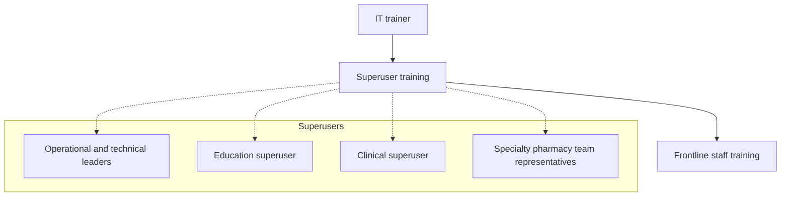

Yale New Haven Health logo

# Education and evaluation strategies to implement a new care management documentation system in a health system specialty pharmacy

Sarah E. Wright, PharmD, BCACP; Kimhouy Tong, PharmD, BCPS; Robin D. Cullen, PharmD, MHA; Bisni Narayanan, PharmD, MS; Andrew Cadorette, PharmD; Eric V. Buchsbaum, CPhT; Esther Nowak, CPhT; Terri Sue Rubino, PharmD, CSP; Vinay Sawant, RPh, MPH, MBA

## Background

* Since 2016, new drug approvals have favored specialty medications1

* As new medications are approved, health system specialty pharmacies face challenges as they strive to provide integrated and comprehensive services to patients across the continuum of care2

* Variations in clinical and operational workflows among pharmacy personnel is one challenge faced

* A new care management documentation system was implemented to expand comprehensive care with clinical and operational workflows in a health system specialty pharmacy3

* Several new electronic health record (EHR) tools and workflows were developed to aid staff with software implementation.

## Objective

* To develop and evaluate a robust education and training plan for onboarding pharmacy personnel to a new EHR application and specialty pharmacy workflow

## Methods

**Prepare**
* Dedicated workgroup

* Reviewed template education EHR resources

* Identified super users for clinical, educational, operational and technical leaders, and specialty pharmacy team representatives

**Customize**
* Detailed workflow guides

* Recorded workflow walkthroughs

* Cross-walked old to new terminology guides

**Train**
* Train-the-trainer model for application super users

* Pharmacist training for new clinical EHR tools

* Two training sessions over two months

**Assess**
* Surveys administered pre and post implementation using 6-point Likert scale

* Perceived utility of education tools and self-reported perception of preparedness

* Continuous variables presented as proportions; categorical variables presented as medians with interquartile range

## Results

### Train-the-Trainer Model

### Staff Rate Helpfulness by Training Type

| Training Type        | Pre-implementation | 1 week post | 3 month post |
| -------------------- | ------------------ | ----------- | ------------ |
| Workflow documents   | 4.5                | 5.0         | 5.5          |
| Recorded walkthrough | 4.5                | 5.5         | 5.8          |
| Live training        | 5.0                | 5.8         | 5.8          |
| Remote training      | 4.5                | 5.5         | 5.8          |
| Staff meeting        | 4.0                | 5.0         | 5.5          |
| Communications       | 4.0                | 5.0         | 5.5          |

### Education Tools

* **All staff** All staff icon
    * Overview guide
    * Medication Assistance Program guide
    * Navigating reports
    * Prior Authorization Guide
    * Program enrollment conversion guide
    * FAQ from live trainings for end users
    * Access to recorded workflows for post-training viewing

* **Liaison** Liaison icon
    * Workflow guide
    * Oncology Treatment Plan signature attempts

* **Pharmacist** Pharmacist icon
    * Workflow guide
    * Required clinical documentation guide for accreditation requirements

### Staff Testimonials

> I found it extremely helpful to utilize the pre-recorded videos

> The training document was fairly comprehensive and very useful to have as a guide when the transition occurred.

> I believe that as much training as could be reasonably completed was provided by the department and I feel that I was trained as best as I could be prior to using the program.

### Self-perceived Preparedness

| Task                                              | Pre-implementation | 1 week post-implementation | 3 months post-implementation |
| ------------------------------------------------- | ------------------ | -------------------------- | ---------------------------- |
| Coordinate patient care: pharmacist in clinic     | 40                 | 65                         | 75                           |
| Coordinate patient care: medication from pharmacy | 45                 | 75                         | 85                           |
| Documenting Medication Therapy Problem            | 40                 | 70                         | 75                           |
| Documenting Patient Education                     | 45                 | 75                         | 85                           |
| Clinical Assessment Prior to Therapy Start        | 40                 | 70                         | 85                           |
| Dashboards or Reporting Workbench                 | 35                 | 60                         | 75                           |
| Setting up Medication Delivery                    | 55                 | 90                         | 95                           |
| Status of Medication Assistance                   | 50                 | 80                         | 90                           |
| Call from a Patient                               | 50                 | 80                         | 90                           |
| Outbound Patient Outreach                         | 50                 | 80                         | 90                           |
| Enrolling a patient into a program                | 55                 | 90                         | 95                           |
| Managing Patients                                 | 50                 | 80                         | 90                           |

## Discussion

* Respondents reported feeling most prepared to set up medications for delivery and enroll a patient in a program by 1-week post-implementation

* By 3 months post-implementation, over 80% of respondents reported feeling prepared to document patient education, clinical assessment prior to therapy start in addition to coordinating patient care for those receiving medication from the pharmacy.

### Confounding factors to implementation

* Original go-live was delayed to allow for additional training time

* Staff transitioned from onsite to fully remote at the same time as implementation4

### Strengths

* Real time adjustments based on feedback in survey

    - Ex. received feedback that additional training was needed and provided another session closer to go-live for staff

* Dedicated resources such as

    - Information Technology pharmacist who provided superuser training onsite over several days

    - Technician Education Coordinators, Technician Supervisor and Pharmacy Operations Supervisor who dedicated eight weeks to provide training to front line staff

### Areas for improvement

* Better communication

    - Ex. feedback said recorded walkthroughs would have been helpful while in fact these were available to front line staff.

## Conclusion

Recorded walkthroughs, live training and remote training were the most useful training resources to educate specialty pharmacy staff on new care management documentation software.

## References

1. Assistant Secretary for Planning and Evaluation: Office of Science and Data Policy. Trends in Prescription Drug Spending, 2016-2021. 2022 Sept. Available from https://aspe.hhs.gov/sites/default/files/documents/88c547c976e915fc31fe2c6903ac0bc9/sdp-trends-prescription-drug-spending.pdf

2. Cesarz J, Canfield S. Aligning health systems for continued success in specialty pharmacy. Am J Health Syst Pharm. 2021 May 24;78(11):919. doi: 10.1093/ajhp/zxab113. PMID: 33770154.

3. Tong, et al. Implementation of a new patient case management system at a large health system specialty pharmacy. Poster presented at: NASP Annual Meeting & Expo, Sept 18-21, 2023; Grapevine, TX.

4. Kosarko, et al. Alternate work arrangement within specialty pharmacy. Poster presented at: NASP Annual Meeting & Expo, Sept 18-21, 2023; Grapevine, TX.

## Acknowledgements

We would like to thank Alijah Kosarko, CPhT, Michele Riccardi, PharmD, BCPS and Vincent Do, PharmD, BCPS, BCTXP for their contributions to the success for this project.

The authors of this presentation have nothing to disclose concerning possible financial or personal relationships with commercial entities that may have a direct or indirect interest in the subject matter of this presentation.

NASP Annual Meeting & Expo 2023. September 18-21, 2023

