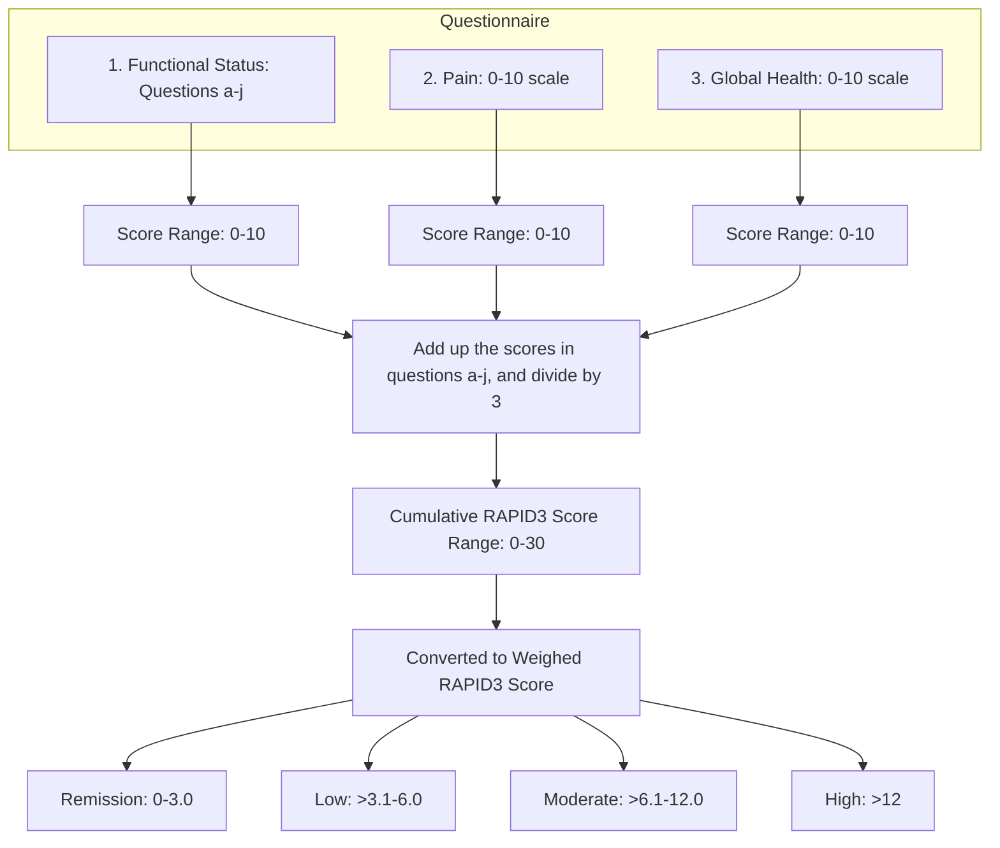

Clearway Health logo

# Values and Pitfalls of Using Routine Assessment of Patient Index Data 3 (RAPID3) Aggregate Scores in Making Clinical Interventions in Patients with Rheumatoid Arthritis

Amanuel Kehasse, PharmD, PhD1, Alexander Pham, PharmD1
1Clearway Health

## Introduction

Rheumatoid Arthritis (RA) is a systemic autoimmune disease that primarily involves synovial joints. The most common symptoms include joint pain and swelling, and morning stiffness.

The American College of Rheumatology (ACR) recommends a treat to target approach where the target is low disease activity or remission.

Among the several clinical and patient reported disease activity measures to assess therapeutic outcomes, Routine Assessment of Patient Index Data 3 (RAPID3) is one of the validated patient-reported outcome tools recommended for the assessment of disease activity in patients with RA.

This tool has three domains that assess patient’s functional status, pain level and overall well-being.

## Objective

The purpose of this study is to investigate alignment of scores of the three domains of RAPID3 with the aggregate score, and how this may be used in tailoring clinical intervention.

## Methodology

* Study Design: Multi-center, retrospective observational descriptive study

* Data Source: Data collected from a clinical and pharmacist intervention dashboard

* Study Population: Patients with RA enrolled in Clearway Health specialty care management program

* Inclusion: Patients were included for analysis if they were enrolled in one of our multi-site specialty pharmacy services program from January 1, 2024 to May 25, 2024

* Statistical Analysis: Descriptive Statistics

## RAPID-3 Questionnaire Scoring and Reference Range

## Results

| Disease Activity               | Percentage |
| ------------------------------ | ---------- |
| Low Disease Activity/Remission | 40.5       |
| Moderate Disease Activity      | 33.1       |
| Severe Disease Activity        | 26.4       |

More than 75% of patients with moderate to severe disease activity had little to no physical/functional disability

| Physical Function Assessment | With little to no difficulty | With much difficulty | Unable to do |
| ---------------------------- | ---------------------------- | -------------------- | ------------ |
| 0.0 - 3.3                    | 76.4                         | 23.6                 | 0            |
| 3.4 - 6.6                    |                              |                      |              |
| 6.7 - 10                     |                              |                      |              |

Quality of life assessment of patients with moderate to severe disease activity

| Metric                        | Without any difficulty | With some difficulty | With much difficulty | Unable to do |
| ----------------------------- | ---------------------- | -------------------- | -------------------- | ------------ |
| Depression                    | 35                     | 40                   | 20                   | 5            |
| Deal with feelings of anxiety | 30                     | 42                   | 23                   | 5            |
| Good night sleep              | 25                     | 38                   | 27                   | 10           |

> 48.5% patients with moderate to severe disease activity improved their RAPID3 score

## Discussion

Routine Assessment of Patient Index Data 3 (RAPID3) is a validated patient-reported outcome (PRO) instrument for RA disease activity assessment. The cumulative RAPID3 score is an aggregate score of the three domains of the questionnaire. Since domains 2 (overall pain score) and 3 (global health assessment) may not be specific to RA, the cumulative score may be skewed if RAPID3 score is not interpreted carefully.

Comparison of the individual domain scores with the cumulative score in patients with RAPID3 cumulative score of > 6 (moderate and high disease activity), shows out of the 33.1% and 26.4% patients with moderate to high disease activities scores, 76.4% had little to no physical function limitation. Closer inspection of the scores revealed more than 50% scored >5 on their pain and global assessment scores, not necessarily related to RA.

In conclusion, while RAPID3 is a validated and useful patient reported outcome tool to assess disease activity in patients with RA, the cumulative score should be interpreted carefully when being used for therapy optimization purposes. Patient’s pain and overall well-being from other comorbidities such as fibromyalgia may skew the results.

## References

1. American College of Rheumatology Guideline for the Treatment of Rheumatoid Arthritis: Arthritis Care Res (Hoboken). 2021 Jul;73(7):924-939

2. RAPID3 (Routine Assessment of Patient Index Data 3) on an MDHAQ: agreement with DAS28 and CDAI activity categories, scored in five versus more than ninety seconds: Arthritis Care Res (Hoboken). 2010 Feb;62(2):181-9

