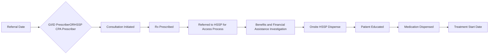

# Hepatitis C Linkage to Care Initiative

Trellis now part of CPS logo

Sandra Poon, PharmD, AAHIVP; Jessica Mourani, PharmD; Jennifer Savory, PharmD, AAHIVP, CSP; Noah Schumacher, PharmD Candidate

# PURPOSE/BACKGROUND

* In 2019, the American Association for the Study of Liver Diseases (AASLD) – Infectious Diseases Society of America (ISDA) updated their guideline recommendations advocating for a multidisciplinary team of providers involved in the treatment of Hepatitis C virus (HCV) to increase access to care.1

* This reframing of the HCV care continuum has compelled innovative practice models for clinical pharmacists. The current wait time for HCV treatment can take 6-12 weeks or longer from the time of provider referral to a gastroenterology appointment for HCV treatment consideration, resulting in delayed labs and therapy starts.

* Health system specialty pharmacies (HSSP) can bridge this gap by prescribing HCV treatment through collaborative practice agreements (CPAs).

# OBJECTIVES

Evaluate the impact of a HSSP CPA by decreasing the time to the start of treatment for HCV access to care.

# METHODS

## Study Design

This is a single-center, retrospective chart review from January 2021 – December 2021, comparing the average time from referral to treatment start date of patients that did or did not receive pharmacist-prescribed treatment from the HSSP.

## Subjects

The patients identified have either received HCV treatment through a HSSP CPA or received supportive pharmacist dispensing and monitoring services at the HSSP.

| INCLUSION CRITERIA                                                                                                                                                 | EXCLUSION CRITERIA                                                                                                                                                                                                                                  |
| ------------------------------------------------------------------------------------------------------------------------------------------------------------------ | --------------------------------------------------------------------------------------------------------------------------------------------------------------------------------------------------------------------------------------------------- |
| \* Patients identified as adults over 18 years old receiving HCV treatment dispensed through the HSSP, whether prescribed by HSSP CPA provider or non-CPA provider | \* Patient's only receiving non-dispensing HCV services at the HSSP (prior authorization support, treatment monitoring) \* Patients where HCV treatment was prescribed by a health system provider and received HCV medication through non-HSSP |

# DATA COLLECTION AND ENDPOINTS

* Arbor®, a proprietary health system specialty pharmacy technology platform, and the electronic healthcare record (EHR) were used by the pharmacist to collect data.

* Endpoints included CPA or non-CPA prescriber status, referral date and treatment start date.

# RESULTS

## Sample Characteristics

| CHARACTERISTICS          | HSSP CPA MEDIAN, N=12 | MD PRESCRIBED MEDIAN, N=33 |
| ------------------------ | --------------------- | -------------------------- |
| Female gender, n (%)     | 6 (50%)               | 15 (45.5%)                 |
| Age, median \[IQR]       | 60 \[43-73]           | 57 \[28-73]                |
| Race, white              | 10 (83.3%)            | 27 (81.8%)                 |
| Genotype                 |                       |                            |
| 1                        | 8 (66.7%)             | 20 (60.6%)                 |
| 2                        | 3 (25%)               | 8 (24.2%)                  |
| 3                        | 0                     | 4 (12.1%)                  |
| 4                        | 0                     | 1 (3%)                     |
| 5                        | 0                     | 0                          |
| 6                        | 0                     | 0                          |
| Unknown                  | 1 (8.3%)              | 0                          |
| Cirrhosis                |                       |                            |
| Noncirrhotic             | 9 (75%)               | 27 (81.8%)                 |
| Compensated Cirrhotic    | 3 (25%)               | 6 (18.2%)                  |
| Decompensated Cirrhotic  | 0                     | 0                          |
| Insurance                |                       |                            |
| Government Sponsored     | 12 (100%)             | 32 (97%)                   |
| Private/Commercial       | 0                     | 1 (3%)                     |
| Treatment                |                       |                            |
| Glecaprevir/Pibrentasvir | 4 (33.3%)             | 20 (60.6%)                 |
| Sofosbuvir/Velpatasvir   | 8 (66.7%)             | 13 (39.4%)                 |

* Forty-five patients were identified as receiving HCV treatment services at the specialty pharmacy for assessment.

* A total of 12 patients that received a referral to the HSSP-managed CPA program were assessed and received prescribing, monitoring and dispensing services for HCV medication by our HSSP pharmacists.

* In comparison, 33 patients had their HCV treatment prescribed by an MD and received only monitoring and dispensing services from the HSSP.

* One patient in the Sofosbuvir/Velpatasvir CPA cohort discontinued Glecaprevir/Pibrentasvir after 1 week due to drug intolerance and promptly started and completed treatment with Sofosbuvir/Velpatasvir.

# DISCUSSION AND CONCLUSIONS

## Days from Referral Date to Start Date

| Metric  | CPA Prescribed | MD Prescribed |
| ------- | -------------- | ------------- |
| Minimum | 22             | 15            |
| Q1      | 38             | 72            |
| Median  | 68             | 105           |
| Q3      | 104            | 141           |
| Maximum | 139            | 178           |

* The average number of days from referral date to start date was 68 [22-139] for CPA prescribed patients versus 105 [15–178] days for MD prescribed HCV therapy.

* The referral date to start date decreased by 33% for HCV treatment for HSSP CPA patients versus non-CPA prescribed patients.

* HSSP CPA patients receiving HCV treatment had a referral to start date of more than 35 days faster than non-CPA prescribed patients.

* HSSP CPA’s play a pivotal role in decreasing the treatment start times for HCV access to care, closing a current gap in care for HCV patients who would otherwise have to wait longer for treatment.

* A limitation to our evaluation is the small sample size. Larger follow-up studies are needed to evaluate the unique impact HSSP’s have on improving treatment access to care for HCV patients.

# HEPATITIS C THERAPY ACCESS PROCESS

# REFERENCES

1. AASLD-IDSA. Recommendations for testing, managing, and treating hepatitis C. http://www.hcvguidelines.org [accessed August 2, 2022].

® 2022 Trellis Rx

