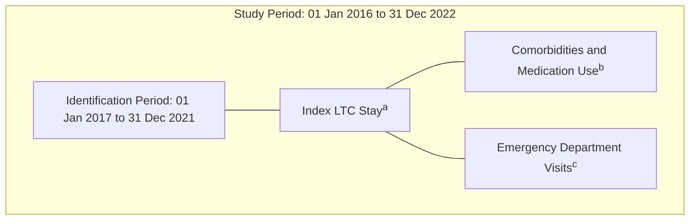

# Real-World Claims Analysis to Characterize the Burden of Tardive Dyskinesia in Long-term Care Settings

Morgan Bron,1 Gideon Aweh,2 Eric Jen,1 Amita Patel3,4

1Neurocrine Biosciences, Inc., San Diego, CA; 2STATinMED, LLC, Dallas, TX; 3Dayton Psychiatric Associations, Dayton, OH; 4Joint Township District Memorial Hospital, St. Marys, OH

## INTRODUCTION

* Tardive dyskinesia (TD) is a persistent and often debilitating movement disorder associated with prolonged exposure to antipsychotics1

* Older adults (≥60 years) are at an increased risk for TD and can develop TD after as little as 1 month of antipsychotic exposure2

* Older adults are particularly vulnerable to the burdens of TD (e.g., impaired balance, difficulty swallowing), which may complicate clinical management in long-term care (LTC) settings3

* However, there are limited data on the prevalence and burden of TD in LTC settings

* This real-world study of United States (US) claims data was designed to characterize demographic and clinical characteristics of patients with TD in LTC settings

## METHODS

* This study utilized the STATinMED Real-World Insights Database, which captures 80% of US claims data

* Adults who had any LTC stay and an ICD-10 code indicative of TD (G24.01) during the study period (Jan 2016-Dec 2022) were identified (Figure 1)

* Demographics, comorbidities, medication use, and healthcare visits were analyzed descriptively in a subset of patients who met the following criteria:

- ≥1 LTC stay during the identification period (Jan 2017-Dec 2021), with the first LTC stay defined as the index LTC stay

- An ICD-10 code of G24.01 (indicative of TD) diagnosed on or before the LTC index stay

- Continuous capture of medical and pharmacy benefits for ≥1 year pre-index LTC stay (admission date) and ≥1 year post-index LTC stay (discharge date)

* Mean values are presented with standard deviation (±SD); median values are presented with interquartile range (IQR)

## Figure 1. Study Design

aFirst LTC stay during the identification period.

bMedical and pharmacy benefits were captured for 1 year pre-LTC index stay (admission date) and 1 year post-index LTC stay (discharge date).

cEmergency department visits were captured for the total follow-up period post-index LTC stay.

LTC, long-term care.

## RESULTS

* Analysis of real-world claims data identified 20,176 patients who had an ICD-10 code consistent with TD (G24.01) and ≥1 LTC stay during the study period

* Of these, 2,294 had ≥2 years of continuous benefits and were included for analysis (Table 1)

- 64.6% were 65 years of age or older, and 67.3% were female

- 76.8% were enrolled in a Medicare plan, consistent with the prevalence of older adults in this population

- 83.9% had multiple LTC stays (i.e., had ≥1 additional stay after their index LTC stay) with a median (IQR) of 7 (15) additional stays/patient

## Table 1. Patient Characteristics

|                                                      | Analysis Population (N=2,294) |
| ---------------------------------------------------- | ----------------------------- |
| Age, n (%)                                           |                               |
| 18-34 years                                          | 22 (1.0)                      |
| 35-44 years                                          | 53 (2.3)                      |
| 45-54 years                                          | 189 (8.2)                     |
| 55-64 years                                          | 547 (23.8)                    |
| ≥65 years                                            | 1,483 (64.6)                  |
| Female, n (%)                                        | 1,544 (67.3)                  |
| Insurance plan type, n (%)                           |                               |
| Medicare                                             | 1,761 (76.8)                  |
| Medicaid                                             | 483 (21.1)                    |
| Commercial                                           | 50 (2.2)                      |
| Had ≥1 additional LTC stay after the index LTC staya | 1,924 (83.9)                  |
| Median number of additional LTC stays (IQR)a         | 7 (15)                        |

aBased on unique service dates, without consideration of time between each stay.
IQR, interquartile range (Q3–Q1); LTC, long-term care.

* Patients in this LTC population had substantial comorbidity burden (Figure 2)

- The mean Charlson Comorbidity Index (CCI) score was 3.72 (±4.2) [range: 0-20]

- 32.8% had a CCI score ≥4, indicating high comorbidity burden and increased mortality risk4

- Mood disorders (66.1%) and schizophrenia (38.8%) were the most prevalent comorbidities

- Sleep disorders (35.0%), substance abuse (28.4%), urinary tract infections (26.7%), dysphagia (18.5%), and dementia (15.7%) were also common

* Polypharmacy was also common in this patient population (Table 2)

- Antidepressants (56.1%), anticonvulsants (52.3%), antipsychotics (50.4%), and anticholinergics (50.0%) were the mostly widely used psychoactive medications

- 47.9% were prescribed ≥3 central nervous system (CNS) medications that might increase the risk of falls or cognitive impairment in elderly adults

## Figure 2. Comorbidity Burden

| CCI Scores (N=2,294) Score | CCI Scores (N=2,294) Patients, % |
| ------------------------------ | ------------------------------------ |
| 0                              | 22.7                                 |
| 1                              | 20.8                                 |
| 2                              | 15.0                                 |
| 3                              | 8.7                                  |
| 4-20\*                         | 32.8                                 |

*Higher score = greater comorbidity burden and increased mortality risk. *Maximum possible score is 20.

| Comorbidities (N=2,294) Comorbidity | Comorbidities (N=2,294) Patients, % |
| --------------------------------------- | --------------------------------------- |
| Mood disorders                          | 66.1                                    |
| Schizophrenia                           | 38.8                                    |
| Sleep disorders                         | 35.0                                    |
| Substance abuse                         | 28.4                                    |
| Urinary tract infections                | 26.7                                    |
| Dysphagia                               | 18.5                                    |
| Dementia                                | 15.7                                    |
| Urinary retention                       | 8.8                                     |
| Malnutrition                            | 7.5                                     |
| Agitation                               | 5.1                                     |

CCI, Charlson Comorbidity Index.

## Table 2. Medication Use

| Taking any of the following medications, n (%)    | Analysis Population (N=2,294) Taking any of the following medications, n (%) |
| ------------------------------------------------- | -------------------------------------------------------------------------------- |
| Antidepressants                                   | 1,287 (56.1)                                                                     |
| Anticonvulsants                                   | 1,199 (52.3)                                                                     |
| Antipsychotics                                    | 1,156 (50.4)                                                                     |
| Anticholinergics                                  | 1,147 (50.0)                                                                     |
| Antihypertensives                                 | 770 (33.6)                                                                       |
| Anxiolytics                                       | 745 (32.5)                                                                       |
| Antidiabetics                                     | 530 (23.1)                                                                       |
| Taking ≥3 medications with CNS properties, n (%)a | 1,099 (47.9)                                                                     |

aDefined as medications that might increase risk of falls or cognitive impairment in elderly adults (e.g., anticholinergics, anticonvulsants, antihistamines, benzodiazepines, sedative-hypnotics).
CNS, central nervous system.

* Emergency department (ED) visits were common (Table 3)

- 64.8% had ≥1 ED visit at any time in the post-index period (1 year or longer)

- 47.3% had ≥1 ED visit within the first year of the post-index period

## Table 3. Emergency Department Visits

|                                                                       | Analysis Population (N=2,294) |
| --------------------------------------------------------------------- | ----------------------------- |
| Had ≥1 ED visit at any time in the post-index period, n (%)           | 1,487 (64.8)                  |
| Number of ED visits, median (IQR)                                     | 4 (6)                         |
| Time to first ED visit, days, median (IQR)                            | 143 (358)                     |
| Had ≥1 ED visit within the first year of the post-index period, n (%) | 1,085 (47.3)                  |

ED, emergency department; IQR, interquartile range.

## DISCUSSION AND CONCLUSIONS

* In this analysis of real-world claims data, patients in LTC settings who had TD tended to be older and have high comorbidity burden and polypharmacy

* Mood disorders and schizophrenia were common in this patient population, corresponding to the prevalent use of medications that can cause TD (e.g., antipsychotics)1

* Moreover, 50.0% of patients were taking anticholinergic medications, which can cause cognitive impairment and other serious adverse events in older adults and worsen TD5

* ED visits were also common, with 47.3% of patients having ≥1 visit within 1 year after their index LTC stay

* These analyses may have been limited by the ICD code used for TD (G24.01) and the requirement for continuous data capture (1 year pre-index and 1 year post-index)

- With the exclusion of patients who had other ICD codes used for TD (e.g., G24.09) and/or had <2 years of continuous claims data (e.g., newly diagnosed), the prevalence of TD in LTC settings is likely underestimated

* Nonetheless, the data indicate a need for special attention to the clinical burdens of individuals in LTC settings, particularly older adults

* Moreover, they highlight the need for clear TD practice guidelines in LTC settings and for TD treatments that are supported by clinical trial data in elderly populations6 and can be administered in patients with dysphagia (e.g., crushed and mixed with soft foods or liquids7), which is an important consideration in LTC settings

* Further evaluation is needed to assess the impact of TD in this population, including the prevalence of slips and falls, healthcare resource utilization, and the appropriate use of approved TD treatments (i.e., vesicular monoamine transporter 2 [VMAT2] inhibitors)

## REFERENCES

1. Hauser R et al. CNS Spectr. 2022;27(2):208-17.

2. American Psychiatric Association. Diagnostic and Statistical Manual of Mental Disorders: DSM-5. 5th Edition Text Revision. 2022:doi.org/10.1176/appi.books.9780890425787.

3. Citrome L et al. Neuropsychiatr Dis Treat. 2021;17:3127-34.

4. Quan H et al. Am J Epidemiol. 2011;173(2):676-82.

5. Vanegas-Arroyave N et al. CNS Drugs. 2024;38(4):239-54.

6. INGREZZA® Prescribing Information. Neurocrine Biosciences, Inc.; San Diego, CA; August 2023.

7. Sajatovic M et al. Clin Ther. 2023;45(12):1222-7.

Disclosures: This study was supported by Neurocrine Biosciences, Inc. Editorial assistance was provided by Prescott Medical Communications Group, a Citrus Health Group, Inc., company (Chicago, Illinois). Please contact medinfo@neurocrine.com with any questions.

Comorbidities and Medication Use and Emergency Department Visits icons

PRESENTED AT THE NATIONAL ASSOCIATION OF SPECIALTY PHARMACY ANNUAL MEETING

OCTOBER 6-9, 2024; NASHVILLE, TN

©2024 Neurocrine Biosciences, Inc. All Rights Reserved.

Neurocrine Biosciences logo and QR code

