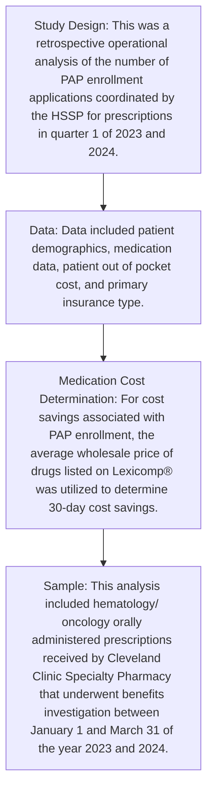

Cleveland Clinic logo

# Impact of the Inflation Reduction Act on Patient Assistance Program Enrollment for Oral Hematology and Oncology Medications Managed Through a Large Academic Medical Health System Specialty Pharmacy

Kristel Geyer, Pharm.D., BCOP, BCPS<sup>1</sup>; Rebecca Freedman, Pharm.D.

<sup>1</sup>Specialty Pharmacy, Cleveland Clinic

The investigators declare no conflicts of interest

Contact information:
Kristel Geyer, PharmD
9500 Euclid Ave. Cleveland, OH, 44195
Email: geyerk@ccf.org

## Background

**Introduction and Objectives**

* Specialty medications used to treat hematology and oncology conditions continue to grow in utilization, however the cost design of these therapies is often unaffordable, particularly in the Medicare population.<sup>1</sup>

* Literature cites that people with cancer are more likely to have financial toxicity than those without cancer, potentially leading to lower quality of life.<sup>2</sup>

* The Inflation Reduction Act (IRA) was signed into law in August 2022. Provisions affecting Medicare part D copays for patients took effect January 1, 2024. This new law lowers prescription drug costs for patients in a variety of ways including elimination of catastrophic copays and expansion of eligibility for low-income subsidy benefits.

* It is standard practice to assess patients for alternative copay assistance programs, however, grant funding for Medicare patients is criteria specific and contingent on availability.

* Patient assistance programs (PAP) provide a pathway for patients to receive medications and most health system specialty pharmacies (HSSP) help coordinate enrollment into these programs.

## Objectives

To describe the impact of the IRA on PAP enrollment for patients receiving specialty oral hematology/oncology medications through an HSSP.

## Methods



## Definitions

```mermaid
graph TD
    subgraph Specialty Pharmacy Workflow
    A[Prescription Received] --> B[Technician obtains insurance information and completes initial data review entry in system]
    B --> C[Benefits Investigation]
    C --> D1[Prior authorization]
    C --> D2[Appeal]
    C --> D3[Second level appeal / peer-to-peer]
    C --> D4[External appeal]
    D1 & D2 & D3 & D4 --> E[Cost Assessment and Assistance]
    E --> F1[Copay assistance availability and eligibility]
    E --> F2[Patient assistance availability and eligibility]
    E --> F3[Triage to alternate pharmacy]
    F2 --> G[Patient Assistance Program Enrollment]
    G --> H1[For uninsured and underinsured]
    G --> H2[Meets eligibility criteria  (different for each program)]
    G --> H3[Assist with application completion for first enrollment]
    end

    subgraph Inflation Reduction Act Medicare Part D Provisions Timeline
    T1[2023] --> T2[2024]
    T2 --> T3[2025]
    T1 --- D2023[Out-of-pocket spending threshold ~$3100  Catastrophic Coverage: 5% coinsurance  Low-Income Subsidy: 135% - 150% federal poverty level]
    T2 --- D2024[Out-of-pocket spending threshold ~$3250  Catastrophic Coverage 5% coinsurance eliminated  Low-Income Subsidy: 150% federal poverty level]
    T3 --- D2025[Medicare part D spending capped at $2000 out-of-pocket  Opportunity to "smooth" payments over the calendar year]
    end
```

## Results

| Table 1. Patient Assistance Enrollment | Table 1. Patient Assistance Enrollment<br/>Q1 2023 | Table 1. Patient Assistance Enrollment<br/>Q1 2024 | Table 1. Patient Assistance Enrollment |
| -------------------------------------- | -------------------------------------------------- | -------------------------------------------------- | -------------------------------------- |
| Overall # of enrollments               | 163                                                | 88                                                 | ↓ 46%                                  |
| Total Cost Savings                     | $2,866,341                                         | $1,758,536                                         | ↓ 39%                                  |
| Total Out-of-pocket cost               | $611,400                                           | $351,273                                           | ↓ 43%                                  |


| Table 2. Patient Assistance Enrollment Characteristics | Table 2. Patient Assistance Enrollment Characteristics<br/>Q1 2023 | Table 2. Patient Assistance Enrollment Characteristics<br/>Q1 2024 |
| ------------------------------------------------------ | ------------------------------------------------------------------ | ------------------------------------------------------------------ |
| Top 5 medications                                      |                                                                    |                                                                    |
| Apalutamide (Erleada)                                  | Lenvatinib (Lenvima)                                               |                                                                    |
| Venetoclax (Venclexta)                                 | Cabozantinib (Cabometyx)                                           |                                                                    |
| Enzalutamide (Xtandi)                                  | Everolimus (Afinitor)                                              |                                                                    |
| Ibrutinib (Imbruvica)                                  | Relugolix (Orgovyx)                                                |                                                                    |
| Acalabrutinib (Calquence)                              |                                                                    |                                                                    |
| Insurance Type Group                                   |                                                                    |                                                                    |
| Government                                             | 142 (87%)                                                          | 76 (86%)                                                           |
| Non-Government                                         | 2 (1%)                                                             | 2 (2%)                                                             |
| Uninsured                                              | 19 (12%)                                                           | 10 (11%)                                                           |
| Average Wholesale Price                                | $17,585                                                            | $19,983                                                            |
| Average Out-of-pocket Cost                             | $3,751                                                             | $3992                                                              |
| Average Out-of-pocket Cost (Medicare patients only)    | $2046                                                              | $2197                                                              |


Figure 1. Q1 2023 and Q1 2024 Coverage Type

| Coverage Type | Q1 2023 (N=2275) | Q1 2023 (%) | Q1 2024 (N=2573) | Q1 2024 (%) |
| ------------- | ---------------- | ----------- | ---------------- | ----------- |
| Commercial    | 654              | 29          | 746              | 29          |
| Medicaid      | 29               | 1           | 18               | 1           |
| Medicare      | 1388             | 61          | 1582             | 62          |
| Other         | 177              | 8           | 190              | 7           |
| Uninsured     | 27               | 1           | 37               | 1           |


| Table 3. Copay Assistance Characteristics<br/>Coverage Type | Table 3. Copay Assistance Characteristics<br/>Q1 2023 (%) | Table 3. Copay Assistance Characteristics<br/>Q1 2024 (%) |
| ----------------------------------------------------------- | --------------------------------------------------------- | --------------------------------------------------------- |
| Copay Assistance                                            | 607 (27% of all orders)                                   | 661 (26% of all orders)                                   |
| Grants and PAP\*                                            | 568 (41%)                                                 | 584 (37%)                                                 |
| Specialty Pharmacy Assisted Enrollments\*                   | 142 (10%)                                                 | 76 (5%)                                                   |
| Orders filled without any type of additional assistance\*^  | 637 (60%, n=1054)                                         | 810 (66%, n=1227)                                         |


\*Medicare patients only. For Q1 2023, 1388 orders were reviewed and for Q1 2024, 1582 orders were reviewed.
^All orders were reviewed for outcomes (Filled at internal specialty pharmacy, Other Pharmacy, Alternative Treatment, Patient Assistance)

## Conclusions

* This observational analysis demonstrates the impact the IRA had on patient assistance enrollment applications for the first quarter of 2024 at a single center large academic medical center specialty pharmacy.

* The percent of Medicare orders remained consistent in Q1 of 2023 and 2024, but the percentage of grants and patient assistance enrollments decreased and notably the amount of Medicare orders filled by the specialty pharmacy requiring no additional assistance increased from 60% to 66% of Medicare orders.

* Further elements of the IRA will go into effect January 1, 2025, with a yearly cap of $2000 on out-of-pocket drug costs. This may further decrease the number of patient assistance program enrollments.

* Although this analysis indicates patients may have been able to afford their medication due to the changes resulting from the IRA, future investigation into the abandonment of therapy in Medicare patients resulting from financial toxicity would be beneficial to observe a more detailed picture of the full effects of IRA on patient access to medication.

## References

1. National Cancer Institute. "Financial Toxicity (Financial Distress) and Cancer Treatment (PDQ®)–Patient Version - National Cancer Institute." Www.cancer.gov, 29 June 2017, www.cancer.gov/about-cancer/managing-care/track-care-costs/financial-toxicity-pdq.
2. Longo CJ. Linking Intermediate to Final "Real-World" Outcomes: Is Financial Toxicity a Reliable Predictor of Poorer Outcomes in Cancer?. Curr Oncol. 2022;29(4):2483-2489. Published 2022 Apr 2. doi:10.3390/curroncol29040202
3. Centers for Medicare & Medicaid Services. "Inflation Reduction Act and Medicare | CMS." Www.cms.gov, 12 Sept. 2023, www.cms.gov/inflation-reduction-act-and-medicare.
4. "Anniversary of the Inflation Reduction Act: Update on CMS Implementation | CMS." Www.cms.gov, 16 Aug. 2023, www.cms.gov/newsroom/fact-sheets/anniversary-inflation-reduction-act-update-cms-implementation.


