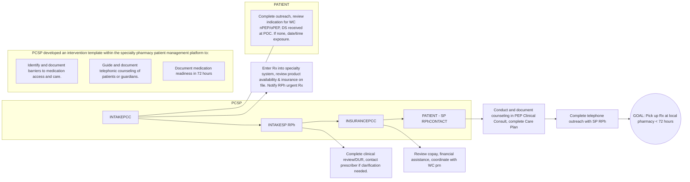

Price Chopper logo Price Chopper logo

# Achieving Quality Pharmacy Care for HIV Post Exposure Prophylaxis (PEP) Therapy

University of Rochester logo

J. Cerulli1, A. Harris1, D. Morse2, S. Przybyla3, J. Cullen2, A. Roberts4, S. Guisinger4, C. Cerulli2

1Price Chopper Specialty Pharmacy, 2 University of Rochester, 3 University at Buffalo, 4 Northeast Shared Services

## BACKGROUND

* The Centers for Disease Control & Prevention (CDC) recommends starting Post-Exposure Prophylaxis (PEP) therapy within 72 hours of possible HIV exposure to reduce risk of contracting HIV.

* Price Chopper Specialty Pharmacy (PCSP) provides centralized services such as prescription processing, insurance benefit assistance and medication counseling to patients receiving PEP medications dispensed from 75 community pharmacy/supermarket locations.

* PCSP identified patients not receiving PEP therapy within the critical 72-hour window of time and implemented a Performance Improvement Program (PIP) to ensure medication readiness.

## OBJECTIVES

* To conduct a PIP to ensure PEP medication readiness within 72 hours.

* To identify barriers to PEP medication access and care.

## PATIENT DEMOGRAPHICS (n=40)

| Age, average years (± SD) \[3 subjects < 18 years]              | 31.8 (±12)                                                                                                                                             |
| --------------------------------------------------------------- | ------------------------------------------------------------------------------------------------------------------------------------------------------ |
| Gender Identified as female on Rx, n (%)                        | 29 (73)                                                                                                                                                |
| PEP Indication (nPEP/oPEP) included on Rx or notes, n (%)       | 12 (30)                                                                                                                                                |
| oPEP Indication, n (%)                                          | 17 (42.5) 9 Health care works 2 police/corrections 6 not disclosed                                                                         |
| nPEP Indication, n (%)                                          | 22 (55) 11 not disclosed 7 unwanted sexual contact 2 consensual sexual contact 1 physical assault 1 accidental needle stick (peds) |
| Medication Prescribed, n (%)                                    |                                                                                                                                                        |
| Emtricitabine / Tenofovir + Raltegravir                         | 32 (80)                                                                                                                                                |
| Emtricitabine / Tenofovir + Dolutegravir                        | 5 (12.5)                                                                                                                                               |
| Prescriber type, n (%)                                          |                                                                                                                                                        |
| ED                                                              | 22 (55)                                                                                                                                                |
| PCP/Family Medicine                                             | 6 (15)                                                                                                                                                 |
| ID/HIV                                                          | 5 (12.5)                                                                                                                                               |
| Urgent care                                                     | 3 (7.5)                                                                                                                                                |
| Health care center                                              | 2 (5)                                                                                                                                                  |
| Pediatrics                                                      | 2 (5)                                                                                                                                                  |
| Dispensed Medication at POC, n (%)                              | 29 (72.5)                                                                                                                                              |
| Dx nPEP unwanted sexual contact provided 7 DS at POC\*\*, n (%) | 5 (71.4)                                                                                                                                               |

\*\* 1 provided two DS (not ED), 1 provided one DS (POC = ED\*\*). NYS: Section 2805-i Public Health Law/ Executive Law Section 631 require hospitals to offer & make available 7-day DS HIV PEP to survivors of sexual assault who are > 18 years of age; the full 28-DS if < than 18 years of age.

## REFERENCES

1. https://www.cdc.gov/hiv/basics/pep/paying-for-pep.html

2. https://publications.aap.org/pediatrics/article/149/6/e20210534 58/187003/State-by-State-Variability-in-Adolescent-Privacy

## PEP Performance Improvement Program Workflow

**KEY**
* **oPEP**: occupational PEP
* **PCC**: Patient Care Coordinator
* **Rx**: Prescription
* **WC**: Worker compensation
* **POC**: Point of Care
* **nPEP**: non-occupational
* **SP RPh**: Specialty Pharmacist
* **PEP**: Post-exposure prophylaxis
* **DS**: Days Supply
* **DUR**: Drug Utilization Review

## RESULTS, CHALLENGES & NEXT STEPS

| CHALLENGES | INTAKE PCC: • Lack of nPEP/oPEP on Rx (37) • Insufficient DS at POC after assault (2) • Asking date time of exposure causes patient recall of event • Regimen checks (4) | INTAKE SP RPh Clarifications (26): • Medication requires 30DS full bottle (18) • Pediatric dose check (3) | INSURANCE PCC WC billing delay (4) • pharmacy provided a few DS of medication to avoid patient missing 72-hour window • Distraught patients/caregivers | PATIENT CONTACT/PICK UP: • Brand/generic confusion (1) • WC cost misconception (1) • Delayed access medical care (1 WC, 1 assault) |
| ---------- | ---------------------------------------------------------------------------------------------------------------------------------------------------------------------------------------- | --------------------------------------------------------------------------------------------------------------------- | -------------------------------------------------------------------------------------------------------------------------------------------------------------- | ---------------------------------------------------------------------------------------------------------------------------------------------- |

**Rx Ready within 72 hours of exposure**
**90% (36) met goal**
* 2 Rxs transferred to pharmacy with med in stock
* 2 patients accessed medical care outside >72 hours (1 assault, 1 oPEP could not see PCP with WC)
* 2 patients late picking up Rx (missed 1 dose each, had started POC therapy).

While the project’s workflow was successful ensuring 90% of patients received medications within 72 hours, the team uncovered challenges providing patient care in addition to the barriers noted above. Next steps include educating prescribers on use of Rx notes, working with WC, and providing team development regarding trauma-informed care and self-care using a multi-disciplinary team.

### Prescriber Notes on Rx & DS Provided at POC

* For patients not provided a DS, if meds not in stock, the pharmacy must ascertain date/time of exposure to ensure medication access within 72 hours. Event recall could trigger an emotional patient response.

* Prescribers can help expedite care by adding notes on Rx during the electronic prescribing including: nPEP vs oPEP, date/time of exposure, weight for pediatric patient, number of DS provided at POC (if any).

* Ensure written discharge plan includes to take multiple medications, provide brand & generic names.

* While 29 (72.5%) patients were dispensed medication at POC, the DS varied and 1 assault victim was not provided enough POC medication. Retrospective review is unable to determine if ED was aware of event, patient shared with store team pharmacist demonstrating important connection of local pharmacists.

### WC delays

* If pharmacy did not provide some medication prior to WC claim approval, start of therapy would be > 72 hours. By opening the bottle without a paid claim, the pharmacy takes financial risk.

### Providing Trauma Informed Care and Self Care

* Pharmacists and the pharmacy team did not always feel confident communicating with patients that had experienced a traumatic event and are overwhelmed such as when the patient experienced an assault, learned their new partner has HIV after sex, or they are caring for a child who obtained a needle stick.

* Pharmacists need assistance guiding conversations with patients and providing state-of-the-art information and referrals (i.e to sex assault forensic nurse evaluators, confidential sex assault advocacy organizations).

* Pharmacy staff became emotionally depleted after these conversations indicating a need for self-care.

* Pediatric patients provided other challenges to the team beyond pediatric dose/weight checks. As laws vary by state regarding a minor’s ability to consent for various medical services without parental consent, pharmacists can not counsel the parent/guardian in all cases.2

* As part of this PIP, an opportunity arose to collaborate with a multi-disciplinary team well-equipped to provide resources that pharmacy teams can use to provide trauma-informed care, gain knowledge of adolescent legal rights and perform routine self care.

* We have created a flowchart for PCSP-patient interaction and will be conducting pharmacy interviews and educational programs. For more information, contact Catherine_Cerulli@URMC.Rochester.edu

