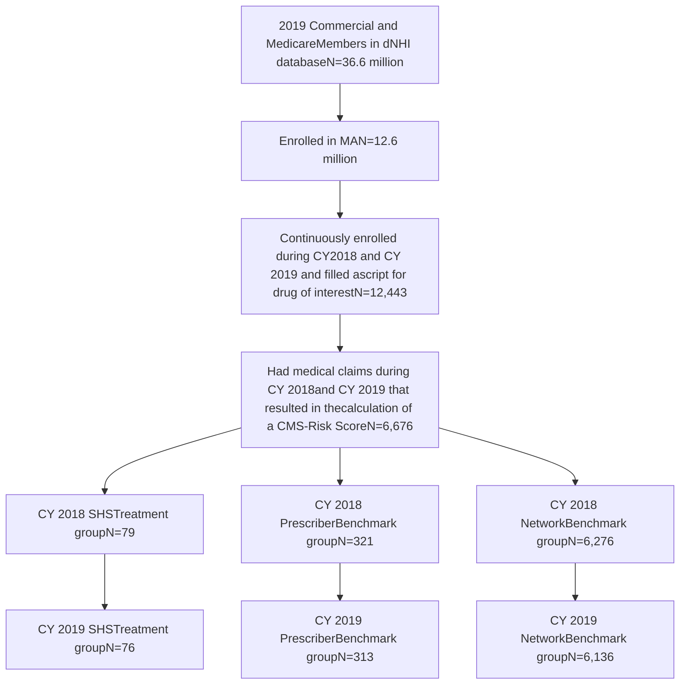

SHIELDS HEALTH SOLUTIONS logo

# Integrated Specialty Model Lowers Pharmacy Expense

Martha Stutsky, PharmD; Dale Fasching, PharmD, MBA; Carolkim Huynh, PharmD; Jennifer L. Donovan, PharmD; Brian S. Smith, PharmD

QR code to scan for more information

Virtual Poster at NASP 2022 Annual Meeting

## Background

* Specialty drugs contribute disproportionately to costs, representing greater than 50% of pharmacy spend.1

* Integrated Health System Specialty Pharmacies (HSSPs) have shown improved outcomes2-4 and lower medical expenses5 yet are largely excluded from restricted drug and payer networks. A group of HSSPs implemented a comprehensive patient care model for several specialty disease states.

* A previous analysis of a national health insurer’s de-identified claims database demonstrated that the HSSP group was associated with significantly less total medical expense among the population of patients filling self-administered oncology drugs as compared to the Network ($3,738 vs. $4,648, respectively; p<0.05).6

* The objective was to evaluate pharmacy and medical expenses among non-oncology specialty pharmacy patients in a HSSP group care model versus a national Network.

## Methods

* A national health insurer de-identified database of 12.6 million Medicare Advantage (MA) members was used to identify patients filling self-administered specialty medications for HIV, cardiovascular conditions, multiple sclerosis (MS), inflammatory conditions, and transplant from 2018 to 2019.

* The HSSP group included members enrolled in the specialty care model who filled at the participating HSSP group pharmacies with prescribers integrated into the care model and was compared to Network members using pharmacies in the same geographic area.

* The standard actuarial method of using CMS-HCC (Centers for Medicare & Medicaid Services Hierarchical Condition Categories) risk scores for normalizing cost and utilization data was employed:

* CMS-HCC Adjusted Cost = Total Cost / (Patient Months * CMS-HCC Risk Score)

* CMS-HCC Adjusted Utilization = Total Utilization / (Patient Months * CMS-HCC Risk Score)

| Study Outcomes    | Study Outcomes                                                    |
| ----------------- | ----------------------------------------------------------------- |
| Primary Outcome   | Mean per member per month (PMPM) total medical and pharmacy costs |
| Secondary Outcome | Mean healthcare utilization per member per year (PMPY)            |

## Results

All cost and utilization comparisons between HSSP and Network groups were not statistically significant in the baseline year; costs and utilization were reviewed in the follow up year.

Figure 1: Study Inclusion Determination

Figure 2: Follow Up Year Risk Adjusted Cost

| Expense Category              | Network (N=6,136) | ShieldsRx (N=76) |
| ----------------------------- | ----------------- | ---------------- |
| PMPM Total Healthcare Expense | 8500              | 8200             |
| PMPM Pharmacy Expense\*       | 5000              | 4100             |
| PMPM Medical Expense          | 3500              | 4100             |

\*Statistically significant p=0.05

**$903 PMPM Reduction**
In pharmacy expense (HSSP compared to Network)

Figure 3: Follow Up Year Risk Adjusted Utilization

| Utilization Category        | ShieldsRx (N=76) | Network (N=6,136) |
| --------------------------- | ---------------- | ----------------- |
| Mean PMPY ER Visits\*       | 0.3              | 0.65              |
| Mean PMPY Outpatient Visits | 7.3              | 7.7               |

\*Statistically significant p<0.05

## Discussion

* The HSSP care model within a population of HIV, cardiovascular, MS, inflammatory, and transplant patients was associated with significantly less pharmacy expense with a small but non-significant increase in total medical expense.

* By contrast, the previous analysis of oncology patients managed within a HSSP group demonstrated significantly lower total medical expense with a slight increase in pharmacy expense when compared to the network group.

* Future research is needed to gain insight into these differences.

## DISCLOSURES

The authors of this presentation have nothing to disclose concerning possible financial or personal relationships with commercial entities that may have a direct or indirect interest in the subject matter of this presentation.

## REFERENCES

1. CVS Drug Trend Report. Accessed: August 11, 2022. Available online: https://payorsolutions.cvshealth.com/insights/2019-drug-trend-report

2. Barnes E, Zhao J, Giumenta A, Johnson M. The effect of an integrated health system specialty pharmacy on HIV antiretroviral therapy adherence, viral suppression, and CD4 count in an outpatient infection disease clinic. Journal of Managed Care & Specialty Pharmacy. 2020;26(2)95-102.

3. Reynolds VW, Chinn ME, Jolly JA, et al. Integrated specialty pharmacy yields high PCSK9 inhibitor access and initiation rates. Journal of Clinical Lipidology. 2019;13(2):254-264.

4. Shah NB, Mitchell, RE, Proctor, ST, et al. High rates of medication adherence in patients with pulmonary arterial hypertension: an integrated specialty pharmacy approach. PLoS ONE. 2019;14(6):e0217798.

5. Soni A, Smith BS, Scornavacca T, et al. Association of use of an integrated specialty pharmacy with total medical expenditures among members of an accountable care organization. JAMA Network Open. 2020;3(10):e2018772.

6. Fasching D, Donovan JL, Smullen K, et al. Improved Oncology Total Medical Expense Associated with the Use of Integrated Health System Specialty Pharmacy Care Model. Poster presented at the ASHP Summer Meeting, July 2021.

