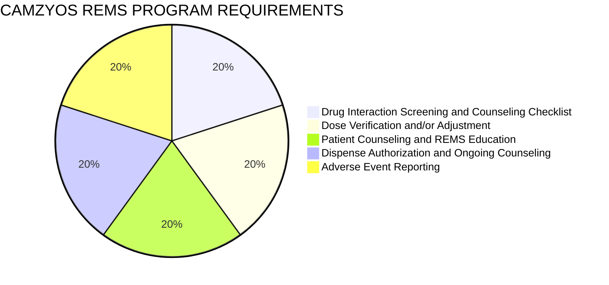

SHIELDS HEALTH SOLUTIONS logo NYULangone Health logo

# Clinical and Quality Outcomes of a Hypertrophic Cardiomyopathy Management Program within an Integrated Health System Specialty Pharmacy Model

Veronica Sozio, PharmD, BCPS; Martha Stutsky, PharmD, BCPS; Kerry Mello-Parker, PharmD, MBA; Robin Anderton, RN, MSN; Kate Smullen, PharmD, MSCS, Tatyana Cohen, PharmD, AE-C, IgCP; Shreevidya Periyasamy, MS, HIA; Ameet Wattamwar, PharmD; Kenny Yu, PharmD, MBA, ACE

QR code
SCAN ME icon

2023 NASP Annual Meeting & Expo

## Background

* Mavacamten (Camzyos) is a first-in-class, selective inhibitor of cardiac myosin ATPase that targets the underlying pathophysiology of hypertrophic cardiomyopathy (HCM), a myocardial disorder characterized by hypertrophy of the left ventricle and interventricular septum.<sup>1</sup>

* Due to the risk of heart failure from systolic dysfunction, mavacamten is only available through a Risk Evaluation and Mitigation Strategy (REMS).<sup>2</sup>

* The objective was to evaluate clinical and quality outcomes of a hypertrophic cardiomyopathy program led by an ambulatory care pharmacist within an Integrated Health System Specialty Pharmacy Model (HSSP).

### Figure 1: HCM Ambulatory Pharmacist Workflow

```mermaid
graph LR
    A[1st DispenseREMS ScreeningMonth 0] --> B[MonthlyREMS RefillScreeningMonth 1]
    B --> C[MonthlyREMS RefillScreeningMonth 2-5]
    C --> D[MonthlyREMS RefillScreeningMonth 6]
    D --> E[MonthlyREMS RefillScreeningMonth 7-11]
    E --> F[MonthlyREMS RefillScreeningMonth 12]

    A1[Prescreen &Initial Assessment] --- A
    A2[First CycleClinical Assessment] --- A
    D1[ClinicalReassessment] --- D
    F1[Annual ClinicalReassessment(Every 10 Months)] --- F
```

## Methods

* Retrospective analysis of adult patients receiving two or more mavacamten dispenses from a HSSP between May 2022 and March 2023

* Data collected: number and outcomes of pharmacist interventions, incidence of unplanned emergency department (ED) or hospital visits, adverse events, medication adherence measured by the proportion of days covered (PDC), and relevant operational metrics

## Results

From May 2022 to March 2023, 30 adult patients receiving two or more mavacamten dispenses were included for analysis, with a mean duration of therapy of 4 months for patients new to therapy.

### Figure 2: REMS Coordination Wheel



* Checkmark icon REMS Certified Prescriber

* Checkmark icon REMS Certified Pharmacy

* Checkmark icon REMS Enrolled Patient

* Checkmark icon Manufacturers Support & Engagement

Table 1: Clinical Interventions

| Intervention Category                                        | Number of Interventions (n=30) |
| ------------------------------------------------------------ | ------------------------------ |
| Drug safety (drug interaction, side effect management, etc.) | 15                             |
| Drug therapy appropriateness                                 | 6                              |
| Drug therapy effectiveness                                   | 3                              |
| Drug therapy adherence                                       | 1                              |
| Preventative education/Other                                 | 6                              |


### Figure 3: Program Outcomes

**Program Outcomes**

* Healthcare icon 100% Opt-in rate for pharmacist-led HCM care model

* Pill icon 97% Medication adherence rate (PDC)

* Hospital icon Zero ED/Hospitalizations related to HCM

* Heart icon No permanent discontinuation of therapy due to systolic heart failure

* Checklist icon Fully compliant Camzyos REMS desktop audits

* X icon 4 Adverse events reported

## Conclusions

* A HCM patient management program led by an ambulatory pharmacist was implemented in a HSSP model and demonstrated effective management of mavacamten therapy and REMS program requirements.

* This ambulatory model can be adopted within other HSSPs to provide expanded access to this limited distribution medication.

## DISCLOSURES

The authors of this presentation have nothing to disclose concerning possible financial or personal relationships with commercial entities that may have a direct or indirect interest in the subject matter of this presentation.

## REFERENCES

1. Reyes KRL, Bilgili G, Rader F. Mavacamten: A First-in-class Oral Modulator of Cardiac Myosin for the Treatment of Symptomatic Hypertrophic Obstructive Cardiomyopathy. Heart Int. 2022;16(2):91-98. Published 2022 Oct 5. doi:10.17925/HI.2022.16.2.91.

2. US Food and Drug Administration. "Approve Risk Evaluation and Mitigation Strategies (REMS)." Accessed: 8/11/2023.


