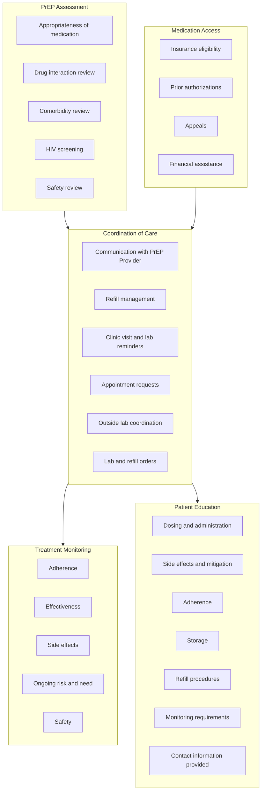

726 Melrose Avenue Nashville, TN 37211
Email: kristen.w.whelchel@vumc.org
Tel: 615.875.6131 Fax: 615.875.0666

# PERSISTENCE TO HIV PRE-EXPOSURE PROPHYLAXIS FILLED THROUGH AN INTEGRATED HEALTH-SYSTEM SPECIALTY PHARMACY COMPARED WITH EXTERNAL PHARMACIES

VANDERBILT UNIVERSITY MEDICAL CENTER logo

KRISTEN WHELCHEL, PHARMD, CSP1, AUTUMN D. ZUCKERMAN, PHARMD, BCPS, AAHIVP, CSP1, JOSH DECLERCQ, MS2, LEENA CHOI, PHD2; SEAN G. KELLY, MD3
1VANDERBILT SPECIALTY PHARMACY, VANDERBILT UNIVERSITY MEDICAL CENTER, 2DEPARTMENT OF BIOSTATISTICS, VANDERBILT UNIVERSITY MEDICAL CENTER, 3DEPARTMENT OF MEDICINE, VANDERBILT UNIVERSITY MEDICAL CENTER

## BACKGROUND

Persistence to HIV pre-exposure prophylaxis (PrEP) during times of increased HIV acquisition risk is integral to preventing new HIV acquisitions. Previous studies have shown real-world PrEP persistence is low and additional insight is needed into PrEP delivery strategies that improve persistence.

**Objective**: To measure persistence to HIV PrEP medication when filled through an integrated health-system specialty pharmacy (HSSP) compared with external pharmacies.

## METHODS

* **Design**: Single-center, retrospective, cohort study comparing HIV PrEP persistence in patients with prescriptions filled by an integrated HSSP to those with prescriptions filled by an external pharmacy
* **Sample**: Adult patients initiating PrEP with emtricitabine-tenofovir disoproxil fumarate in the Vanderbilt PrEP Clinic
* **Study Period**: Enrollment 9/1/2016 to 3/31/2019 with outcomes reported through 10/31/2020
* **Primary Outcome**: Persistence measured as time from first prescription generated to either patient reported discontinuation or last prescription generated plus prescription day supply
* **Secondary Outcomes**: Proportion of Days Covered (PDC) measured using date prescription refills were prescribed and quantity provided by prescription, reasons for non-persistence, and patient reported reasons for discontinuation

## Figure 1. Vanderbilt Specialty Pharmacy Services

## Table 1. Patient Characteristics at Baseline (n=103)

| Characteristic (Number (%))                    | HSSP (n=69) | Non-HSSP (n=34) | Total (n=103) |
| ---------------------------------------------- | ----------- | --------------- | ------------- |
| Age at PrEP start \[years; median (IQR)]       | 34 (28, 46) | 32 (29, 42)     | 34 (29, 46)   |
| Gender, male                                   | 66 (96)     | 30 (88)         | 96 (93)       |
| Race                                           |             |                 |               |
| White                                          | 56 (81)     | 24 (71)         | 80 (78)       |
| Insurance Type                                 |             |                 |               |
| Commercial                                     | 65 (94)     | 32 (94)         | 97 (94)       |
| Other                                          | 4 (6)       | 2 (6)           | 6 (6)         |
| Indication for PrEP                            |             |                 |               |
| MSM at high risk                               | 53 (77)     | 19 (56)         | 72 (70)       |
| MSM (known serodifferent partner)              | 9 (13)      | 8 (24)          | 17 (17)       |
| Number of sexual partners in the last 6 months |             |                 |               |
| 0-1                                            | 21 (30)     | 13 (38)         | 34 (33)       |
| 2-5                                            | 23 (33)     | 8 (24)          | 31 (30)       |
| 5                                              | 14 (20)     | 8 (24)          | 22 (21)       |
| Not reported                                   | 11 (16)     | 5 (15)          | 16 (16)       |
| Reported baseline condom use                   |             |                 |               |
| Consistent (100%)                              | 10 (15)     | 6 (18)          | 16 (16)       |
| Inconsistent (<100%)                           | 46 (67)     | 17 (50)         | 63 (61)       |
| No condom use                                  | 5 (7)       | 2 (6)           | 7 (7)         |
| Not reported                                   | 8 (12)      | 9 (27)          | 17 (17)       |

HSSP, health-system specialty pharmacy; IQR, interquartile range; MSM, men who have sex with men; PrEP, pre-exposure prophylaxis

## Figure 2. Adherence

| Group    | Median PDC (IQR) |
| -------- | ---------------- |
| HSSP     | 99% (96%-100%)   |
| Non-HSSP | 97% (95%-100%)   |

## RESULTS

## Figure 3. Persistence

| Months                       | 0  | 6  | 12 | 18 |
| ---------------------------- | -- | -- | -- | -- |
| HSSP (Number on therapy)     | 69 | 60 | 52 | 44 |
| Non-HSSP (Number on therapy) | 34 | 22 | 14 | 11 |

* HSSP median days on treatment: 675 (IQR 308, 994)

* Non-HSSP median days on treatment: 222 (IQR 90, 580)

## Figure 4. Risk of Non-persistence

| Variable                                               | Hazard ratio |
| ------------------------------------------------------ | ------------ |
| Age (50 vs. 30 Years)                                  | \~0.7        |
| HSSP fill (No vs. Yes)                                 | \~2.7        |
| Partners in last 6 months (More than 5 vs. 0 to 1)     | \~1.2        |
| Partners in last 6 months (2 to 5 vs. 0 to 1)          | \~1.1        |
| Reported condom use (Consistent vs. None/Inconsistent) | \~0.9        |

\*\*\*Non-HSSP **2.7 times more likely** to be non-persistent\*\*\*

## Figure 5. Non-persistence and Discontinuation Reasons (n=67 of 103 total patients)

**HSSP (n=39 of 69 total patients)**
* Transferred care: n=12 (30.8%)
* Lost to follow-up: n=12 (30.8%)
* Discontinued: n=15 (38.5%)
    * <u>Reasons for discontinuation</u>
    * Perceived lack of risk: 73% (n=11)
    * Adverse effects: 13% (n=2)
    * Logistical barriers: 7% (n=1)
    * Unreported: 7% (n=1)

**Non-HSSP (n=28 of 34 total patients)**
* Transferred care: n=4 (14.3%)
* Lost to follow-up: n=10 (35.7%)
* Discontinued: n=14 (50.0%)
    * <u>Reasons for discontinuation</u>
    * Perceived lack of risk: 50% (n=7)
    * Adverse effects: 29% (n=4)
    * Logistical barriers: 21% (n=3)

## CONCLUSIONS

* Patients receiving PrEP in a multidisciplinary clinic with prescriptions filled by the integrated HSSP had significantly higher rates of persistence.

* Patients were better maintained on PrEP therapy when their prescriptions were filled with the integrated HSSP compared to external pharmacies.

Coy KC, Hazen RJ, Kirkham HS, Delpino A, Siegler AJ. Persistence on HIV preexposure prophylaxis medication over a 2-year period among a national sample of 7148 PrEP users, United States, 2015 to 2017. J Int AIDS Soc. ;22(2):e25252. doi:10.1002/jia2.25252

