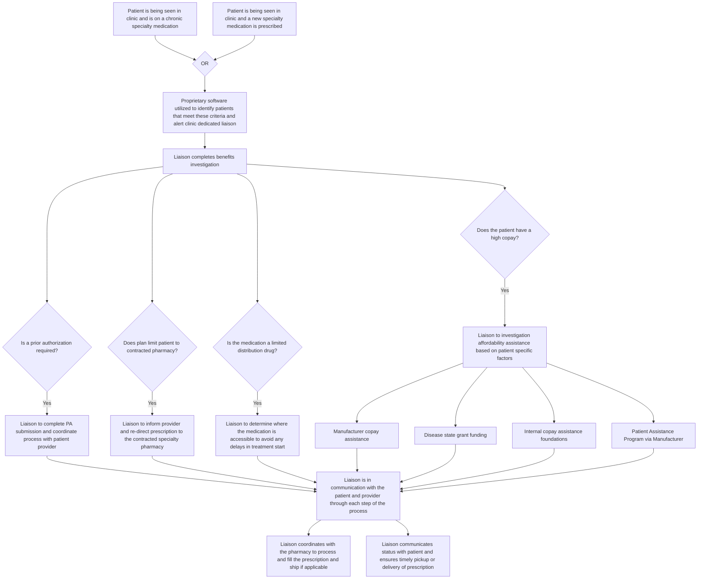

Clearway Health logo Clearway Health logo

# Measuring prescription turnaround times in an integrated health system specialty pharmacy setting

Geri Buderwitz MBA, PharmD1, Leandra Battisti PharmD1, Benjamin Mohr MHA1
1Clearway Health

icon

## BACKGROUND

Patients receiving specialty medications often require prompt initiation and management of many conditions. However, this is often complicated by complex, high-cost medications with significant administrative barriers that may result in delayed starts to therapy.

The average turnaround time (TAT) for specialty prescriptions varies greatly by prescription type, specifically those requiring and not requiring intervention. In a study published by the *Journal of Managed Care + Specialty Pharmacy* (JMCP), payer-associated and IDN specialty pharmacies reported an average TAT of 2 to 3 days for a clean prescription, and approximately 5 days if an intervention was needed (e.g., clinical coordination, prior authorization).1 Retail pharmacies reported 2 days and 5 to 6 days for prescriptions not requiring vs. requiring a pharmacy intervention prior to fulfillment, respectively.1 Independent specialty pharmacies reported an average TAT of approximately 7 days overall.1 Improving the TAT of specialty pharmacy prescriptions ensures patients receive necessary treatments to minimize delays in care and improve health outcomes.

## METHODOLOGY

* **Study Design**: Quantitative retrospective cohort study.

* **Data Source**: 3,532 prescriptions leveraging Clearway Health's patient management platform and health system claims adjudication data from October 2021 to March 2023.

* **Study Population**: 1,817 unique specialty pharmacy patients across two unique health systems.

* **Exclusion**: Any prescriptions that were not initial fills (refills), scripts where the written to fill date was greater than 30 days.

* **Statistical Analysis**: Descriptive statistics were utilized to evaluate turnaround times from when prescriptions were written to when prescriptions were filled.

## CLEARWAY HEALTH PRESCRIPTION ORDER TO FILL WORKFLOW

## DISCUSSION

Delayed treatment time is associated with worsened outcomes in many disease categories, including rheumatology, cancer, and HIV, among others.2,3,4 While initial prescription fill date does not equate to exactly when a patient receives medication, or if they actually take it, it is a crucial step to ensure the fulfillment of critical therapies to begin treatment as quickly as possible.

Integrated health system pharmacies benefit from close coordination with care teams that are aligned from point of prescription order to point of prescription fill. While there is limited research around average prescription turnaround times specific to specialty medications, available research to-date shows that the average of 2.9 days is aligned with the top-end average for retail and payor-associated IDN specialty pharmacies—when prescriptions are clean and not intervention-requiring.1

We found that within two integrated health system specialty pharmacies, 55.2% of specialty prescriptions were filled on the same day, 73% were filled within one day, and 80.5% were filled within three days. For oncology medications, 46% were filled on the same day, and 78.4% were filled within three days. We did not find a significant difference in turnaround time from the Community Health System specialty pharmacy compared to the NCI-Designated Cancer Center pharmacy. However, the Cancer Center pharmacy had a high percentage of oncology medications, which can require more prior authorizations and more preparation time.

Clearway Health liaisons complete a comprehensive evaluation to ensure prescriptions are as clean as possible when sent to the pharmacy for fulfillment, including coordinating prior authorizations, communicating with pharmacy-embedded staff members, and communicating with patients when prescriptions are available for pick-up. Through proprietary software, liaisons are notified either at the point of a newly prescribed specialty medication, or at the point of a specialty clinic appointment for a patient who is already established on treatment. Upon notification, the liaisons ensure the prescription is affordable for the patient, in order to remove any addressable barriers to treatment. This may include manufacturer copay assistance, disease state grant funding, internal copay assistance foundations, and patient assistance programs via the manufacturer. This level of coordination to remove barriers to medication access while maintaining consistent communication with the patient and the clinical care teams leads to decreased turnaround times and more rapid initiation of critical treatments.

### Locations of Integrated Health System Specialty Pharmacies in Study

Map of the United States highlighting locations in Massachusetts and Connecticut

## CLEARWAY HEALTH RESULTS

Average Rx Written to Rx Filled Turnaround Time (Days)

| Specialty Drug Category | Average Turnaround Time (Days) |
| ----------------------- | ------------------------------ |
| Pulmonary               | 1.3                            |
| Biologics               | 2.4                            |
| Other                   | 2.4                            |
| Hematology/Oncology     | 3.0                            |
| Endocrine               | 3.3                            |
| Cardiology              | 3.5                            |
| Infectious Disease      | 3.6                            |
| TOTAL                   | 2.9                            |

n = 3,532 Scripts

% of Rx’s Filled Within Time Frame – All Drug Categories

| Time Frame    | Percentage (%) |
| ------------- | -------------- |
| Same Day      | 55.2%          |
| Within 1 Day  | 73.0%          |
| Within 2 Days | 76.8%          |
| Within 3 Days | 80.5%          |

% of Rx’s Filled Within Time Frame – Hematology/Oncology

| Time Frame    | Percentage (%) |
| ------------- | -------------- |
| Same Day      | 46.0%          |
| Within 1 Day  | 68.9%          |
| Within 2 Days | 73.8%          |
| Within 3 Days | 78.4%          |

Average Rx Written to Rx Filled Turnaround Time (Days)

| Health System Type           | Average Turnaround Time (Days) | Sample Size       |
| ---------------------------- | ------------------------------ | ----------------- |
| Community Health System      | 2.8                            | n = 1,357 Scripts |
| NCI-designated Cancer Center | 3.0                            | n = 2,175 Scripts |

## REFERENCES

1. https://www.jmcp.org/doi/10.18553/jmcp.2022.28.11.1244

2. Guidelines for managing advanced HIV disease and rapid initiation of antiretroviral therapy (who.int)

3. Treatment strategies in early rheumatoid arthritis and prevention of rheumatoid arthritis - PubMed (nih.gov)

4. Time to initial cancer treatment in the United States and association with survival over time: An observational study - PubMed (nih.gov)

## ACKNOWLEDGMENTS

1. Clearway Health Client Services team, including pharmacy liaisons, specialty pharmacists, ambulatory clinical pharmacy specialists, and pharmacy and operational leadership

