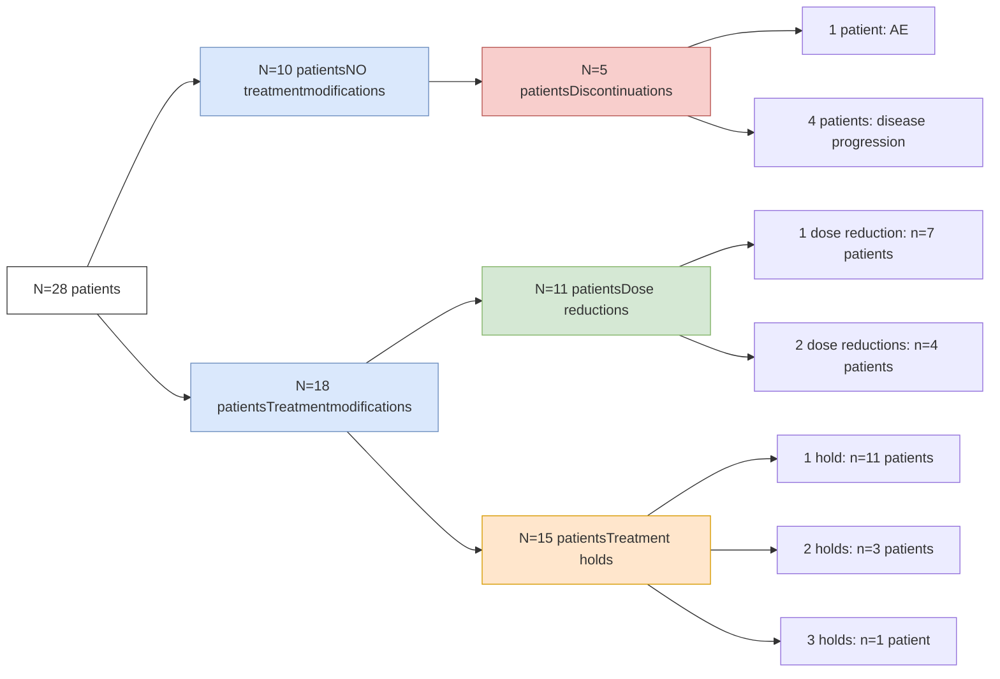

# POLY (ADP - RIBOSE) POLYMERASE INHIBITOR (PARPI) THERAPY: RETROSPECTIVE ANALYSIS OF ADVERSE EVENTS AND TREATMENT MODIFICATIONS DURING THE FIRST 90 DAYS OF THERAPY

VANDERBILT UNIVERSITY MEDICAL CENTER

Stephanie G. White, PharmD1 | Nisha B. Shah, PharmD1 | Ryan Moore, MS2 | Autumn D. Zuckerman, PharmD, BCPS, AAHIVP, CSP1 | Leena Choi, PhD2 | Matthew J. Brown, MS1 | Shivani Vora, PharmD3 | Paul Hueseman, PharmD, MS3 | Brooke D. Looney, PharmD, CSP1

1Vanderbilt Specialty Pharmacy, Vanderbilt University Medical Center 2Department of Biostatistics, Vanderbilt University Medical Center 3AstraZeneca, Inc.

## BACKGROUND

Poly (ADP-ribose) polymerase inhibitor (PARPi) therapy is used to treat various cancers, but patients often encounter frequent and challenging adverse events (AEs) in the first several months after initiating therapy that may lead to treatment modifications.

## OBJECTIVES

**PRIMARY**: Identify the type and frequency of AEs and the corresponding rate of treatment modifications (holds, dose reductions, discontinuations) related to AEs in patients initiating PARPi therapy

**SECONDARY**: Measure adherence to PARPi therapy

## METHODS

**DESIGN**: Single-center retrospective cohort analysis. Patients were followed for 90 days from medication initiation.

**INCLUSION**: Patients initiating olaparib, rucaparib, niraparib or talazoparib therapy for an FDA-approved indication from November 2017 through October 2019.

**EXCLUSION**: Clinical trial participation

## RESULTS

### TABLE 1. COHORT CHARACTERISTICS (N=28)

| Characteristic                         | n (%)         |
| -------------------------------------- | ------------- |
| Age, years - median (IQR)              | 62 (53-72)    |
| Gender, female                         | 27 (96)       |
| Race                                   |               |
| White                                  | 23 (82)       |
| Black or African American              | 4 (14)        |
| Asian                                  | 1 (4)         |
| Body mass index - median (IQR)         | 30 (25-35)    |
| Insurance                              |               |
| Commercial                             | 13 (46)       |
| Medicare                               | 12 (43)       |
| Medicaid                               | 1 (4)         |
| Tricare                                | 1 (4)         |
| None                                   | 1 (4)         |
| Disease duration, years - median (IQR) | 1.8 (1.4-3.6) |
| Total previous chemotherapies          |               |
| 1                                      | 5 (18)        |
| 2                                      | 12 (43)       |
| 3                                      | 4 (14)        |
| 4                                      | 4 (14)        |
| 5                                      | 1 (4)         |
| 6                                      | 2 (7)         |

IQR = interquartile range

### Table 2. MEDICATION BY CANCER TYPE (N=28)

| Cancer Type                         | olaparib % (n) N=25 | rucaparib % (n) N=2 | talazoparib % (n) N=1 |
| ----------------------------------- | --------------------------- | --------------------------- | ----------------------------- |
| Breast cancer                       | 8 (2)                       | --                          | 100 (1)                       |
| Ovarian cancer                      | 84 (21)                     | 100 (2)                     | --                            |
| \\\* 1st line maintenance tx, BRCA+ | 29 (6)                      | --                          | --                            |
| \\\* Maintenance tx, recurrent      | 57 (12)                     | --                          | --                            |
| \\\* Tx refractory, BRCA+           | 14 (3)                      | 100 (2)                     | --                            |
| Pancreatic cancer                   | 4 (1)                       | --                          | --                            |
| Prostate cancer                     | 4 (1)                       | --                          | --                            |

\* % based on N=21 for olaparib and N=2 for rucaparib

### FIGURE 1. FREQUENCY OF ADVERSE EVENTS

| Adverse event       | Week 1 | Week 2 | Week 3 | Week 4 | Week 5 | Week 6 | Day 60 | Day 90 |
| ------------------- | ------ | ------ | ------ | ------ | ------ | ------ | ------ | ------ |
| Fatigue             | 3      | 1      | 2      | 6      | 1      | 4      | 4      | 4      |
| Nausea              | 4      | 3      | 3      | 4      | 2      | 3      |        | 3      |
| Anemia              | 1      | 2      |        | 4      | 3      | 1      | 4      | 3      |
| Vomiting            | 1      |        | 2      | 1      | 1      |        | 3      |        |
| Elevated creatinine |        | 1      | 1      | 4      | 2      | 1      | 2      | 3      |
| Arthralgia/myalgia  | 1      |        |        |        | 2      | 1      | 2      |        |
| Thrombocytopenia    |        |        |        | 2      | 2      | 2      | 1      |        |
| Decreased appetite  | 1      | 1      |        |        | 1      | 1      | 1      | 3      |
| Headache            |        |        | 1      |        | 1      | 3      | 1      |        |
| Edema               | 1      |        | 1      | 1      |        |        | 2      | 1      |
| Shortness of breath |        |        |        |        |        | 1      | 2      | 2      |
| Weakness            |        | 1      |        |        | 1      | 1      |        | 1      |
| Dizziness           |        |        |        | 1      |        |        |        | 1      |
| Dysgeusia           | 1      |        |        | 1      |        | 1      | 1      |        |
| Constipation        | 1      |        |        |        |        |        | 1      | 2      |
| Diarrhea            |        |        | 2      |        |        |        |        | 1      |
| Dehydration         |        | 1      | 1      |        |        |        |        |        |
| Hypomagnesia        | 1      |        |        |        |        |        |        |        |
| Cough               |        |        |        |        |        | 1      |        |        |
| Neutropenia         |        |        |        | 2      |        |        |        |        |
| Other               |        | 1      | 1      | 1      | 4      | 1      | 1      | 3      |

* Most common AEs reported were fatigue, nausea, anemia and vomiting, which occurred throughout the first 90 days

* All patients experienced at least one AE during the first 90 days

### FIGURE 2. TREATMENT MODIFICATION

Patients' treatment modifications are not mutually exclusive.

### FIGURE 3. FREQUENCY OF TREATMENT MODIFICATION

| Time   | Discontinuation | Dose Reduction | Treatment Hold |
| ------ | --------------- | -------------- | -------------- |
| Week 1 |                 |                | 2              |
| Week 2 | 1               |                |                |
| Week 3 |                 | 1              | 4              |
| Week 4 | 1               | 1              | 1              |
| Week 5 | 1               |                | 2              |
| Week 6 | 1               | 3              | 7              |
| Day 60 | 3               | 3              | 4              |
| Day 90 | 5               |                |                |

* Treatment modifications commonly occurred between week 6 and day 90 of therapy

### FIGURE 4. TIME TO DISCONTINUATION

Line chart showing proportion on medication over 90 days

### TABLE 3. ADHERENCE (N=24)

| Metric            | Value             |
| ----------------- | ----------------- |
| PDC               | 97% (IQR 92-100)  |
| Hold Adjusted PDC | 100% (IQR 96-100) |

PDC = proportion of days covered
Hold adjusted PDC: removed medically-advised treatment hold days from PDC denominator
Four records were excluded from PDC analysis (filled externally).

* High patient-level adherence ( $\ge$ 97%) was seen in patients that remained on therapy, despite treatment modifications

## CONCLUSIONS

* In patients initiating PARPi therapy, rates of AE were similar to previous literature.1

* Though treatment modifications were common in the first 90 days of therapy, patients achieved high medication adherence rates.

* The subsequent prospective phase will evaluate the integrated specialty pharmacist role in AE mitigation including patient education & providing supportive therapy.

1. LaFargue CJ, Dal Molin GZ, Sood AK, Coleman RL. Exploring and comparing adverse events between PARP inhibitors. Lancet Oncol. 2019 Jan;20(1):e15-e28. doi: 10.1016/S1470-2045(18)30786-1. PMID: 30614472; PMCID: PMC7292736. This study was supported by AstraZeneca and Merck Sharp & Dohme Corp., a subsidiary of Merck & Co., Inc., Kenilworth, NJ, USA, who are codeveloping olaparib.

