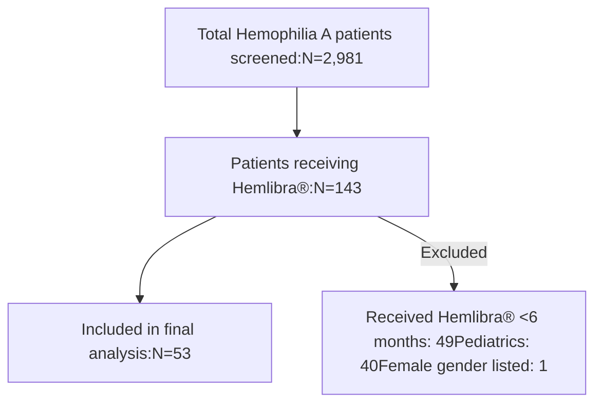

CVS Health logo CVS specialty logo

# Utilization of standard half-life or extended half-life products in members with Hemophilia A prescribed Hemlibra®

Natalie Watkins, PharmD; Cliff Rutter, PharmD, PhD; Elisea Avalos-Reyes, PhD; Kelly McAuliff, PharmD; Chen Liu, PhD; Rashmi Grover, PharmD; Lucia Feczko, RPh; Dorothea Verbrugge, MD; Kjel Johnson, PharmD

## Background

* Prophylaxis with factor or nonfactor products, such as Hemlibra®, is the current standard of care to reduce bleeding events in members with severe hemophilia A

* Despite the efficacy of Hemlibra®, members should always have factor product on-hand for prompt self-management of any breakthrough bleeds

* Treatment of an acute bleed can be accomplished with either standard half-life (SHL) or an extended half-life (EHL) factor product

## Objective

* Assess how frequently members with hemophilia A who were prescribed Hemlibra® fill prescriptions for factor products

* Report the percent of members filling prescriptions for SHL and EHL factor products

* Evaluate the annualized bleed rate (ABR) by SHL and EHL

* Report the number of specialty pharmacy (SP) dispenses by SHL and EHL

## Methods

* A cohort of hemophilia A members from a large national healthcare payor in the US were observed from 3/31/20 to 3/31/23

* Eligibility criteria included males >18y who received Hemlibra® for at least 6 months and had continuous plan enrollment for at least 6 months after the first Hemlibra® dose

* Annualized bleeding rate (ABR) was defined as the number of bleeding episodes/number of person-years observed

* Factor utilization was defined as the number of SP dispenses/number of person-months observed

* Charlson Comorbidity Index (CCI) was used to adjust for comorbidities

* Student’s t and Chi-square tests assessed differences between groups; p-value ≤ 0.05 was significant

## Results

* Mean (standard deviation (SD)) age was 32.2 (10.9) years

* Most members (38/53, 71.7%) filled a factor product; 71.1% (27/38) filled an SHL product

* Members filling factor products had higher comorbidities compared to members not filling factor products (1.7 vs 0.3 p =0.009)

* Overall, the ABR was low with less than 1 (0.95 [95% confidence interval (CI) 0.79-1.13]) bleeding episode per person year

* While prescribed Hemlibra®, the ABR was significantly higher in the SHL (1.02 (0.75-1.36)) group compared to the EHL (0.34 (0.15-0.67)) group (p=0.002)

* There were no differences in SP dispenses between members filling EHL versus SHL products (3.0 (4.0) vs 1.9 (4.7), p=0.5)

## Figure 1: Study Inclusion Flowchart

## Table 1: Cohort demographics

| Variable                                                            | Overall N=53      | No Factor N=15 (28.3%) | Factor N=38 (71.7%) | P-Value |
| ------------------------------------------------------------------- | ----------------- | ---------------------- | ------------------- | ------- |
| Age, mean (SD)                                                      | 32.2 (10.9)       | 31.1 (7.4)             | 32.6 (12.0)         | 0.569   |
| Age, median \[Q1,Q3]                                                | 30.0 \[24.0,38.0] | 30.0 \[25.5,35.5]      | 30.5 \[24.0,38.75]  | 0.913   |
| Years of observation, mean (SD)                                     | 2.6 (1.1)         | 2.3 (1.1)              | 2.7 (1.1)           | 0.225   |
| Years of observation, median \[Q1,Q3]                               | 2.8 \[1.5,3.6]    | 2.6 \[1.0,3.2]         | 3.0 \[1.7,3.8]      | 0.112   |
| Years of observation prior to first Hemlibra® dose, mean (SD)       | 0.88 (0.93)       | 0.84 (0.96)            | 0.89 (0.93)         | 0.863   |
| Years of observation prior to first Hemlibra® dose, median \[Q1,Q3] | 0.41 \[0.1,1.57]  | 0.37 \[0.11,1.40]      | 0.458 \[0.09,1.51]  | 0.836   |
| Years of observation after first Hemlibra® dose, mean (SD)          | 1.73 (0.77)       | 1.46 (0.80)            | 1.84 (0.75)         | 0.132   |
| Years of observation after first Hemlibra® dose, median \[Q1,Q3]    | 1.63 \[1.01,2.55] | 1.12 \[0.77,2.24]      | 1.64 \[1.18,2.61]   | 0.058   |
| New Hemlibra® patient, n (%)\*                                      | 15 (62.5)         | 3 (50.0)               | 12 (66.7)           | 0.635   |
| Total Hemlibra® fills, mean (SD)                                    | 22.4 (12.0)       | 18.0 (9.3)             | 24.1 (12.6)         | 0.062   |
| Total Hemlibra® fills, median \[Q1,Q3]                              | 20.0 \[13.0,28.0] | 14.0 \[11.5,21.0]      | 22.0 \[16.25,28.75] | 0.051   |

\*29 excluded due to lookback period; SD: Standard Deviation; Q1: first quartile; Q3: third quartile

## Table 2: Comorbidities

| Variable                           | Overall   | No Factor | Factor    | P-Value |
| ---------------------------------- | --------- | --------- | --------- | ------- |
| Charlson score, mean (SD)          | 1.3 (2.7) | 0.3 (0.6) | 1.7 (3.1) | 0.009   |
| Charlson score, median \[Q1,Q3]    | 0 \[0,1]  | 0 \[0,0]  | 0 \[0,1]  | 0.333   |
| PVD, n (%)                         | 2 (3.8)   |           | 2 (5.3)   | 1       |
| CVD, n (%)                         | 1 (1.9)   |           | 1 (2.6)   | 1       |
| COPD, n (%)                        | 1 (1.9)   | 1 (6.7)   |           | 0.283   |
| Diabetes, n (%)                    | 2 (3.8)   | 1 (6.7)   | 1 (2.6)   | 0.49    |
| Diabetes with complications, n (%) | 1 (1.9)   | 1 (6.7)   |           | 0.283   |
| Renal disease, n (%)               | 1 (1.9)   |           | 1 (2.6)   | 1       |
| Liver disease (mild), n (%)        | 6 (11.3)  | 1 (6.7)   | 5 (13.2)  | 0.662   |
| Liver disease, n (%)               | 1 (1.9)   |           | 1 (2.6)   | 1       |
| AIDS, n (%)                        | 8 (15.1)  |           | 8 (21.1)  | 0.088   |
| Cancer, n (%)                      | 2 (3.8)   |           | 2 (5.3)   | 1       |

No patients had: Acute MI, history of MI, CHF, dementia, paralysis, ulcers, rheumatic disease, and metastatic cancer; SD: Standard Deviation; Q1: first quartile; Q3: third quartile; PVD: peripheral vascular disease; CVD: cardiovascular disease; COPD: chronic obstructive pulmonary disease; AIDS: Acquired immunodeficiency syndrome; MI: myocardial infarction; CHF: congestive heart failure

## Table 3: Factor utilization by post-Hemlibra® factor status

| Variable             | Overall    | No Factor | Factor     | P-Value |
| -------------------- | ---------- | --------- | ---------- | ------- |
| Pre-Hemlibra®        |            |           |            |         |
| SHL use, n (%)       | 16 (30.2)  | 5 (33.3)  | 11 (28.9)  | 0.751   |
| SHL fills, mean (SD) | 4.1 (8.7)  | 4.3 (8.2) | 4.0 (9.0)  | 0.89    |
| EHL use, n (%)       | 9 (17.0)   | 2 (13.3)  | 7 (18.4)   | 1       |
| EHL fills, mean (SD) | 2.5 (11.8) | 0.3 (0.9) | 3.3 (13.9) | 0.196   |
| Post-Hemlibra®       |            |           |            |         |
| SHL use, n (%)       | 27 (50.9)  |           | 27 (71.0)  |         |
| SHL fills, mean (SD) | 2.2 (3.7)  |           | 3.0 (4.0)  |         |
| EHL use, n (%)       | 11 (20.8)  |           | 11 (28.9)  |         |
| EHL fills, mean (SD) | 1.4 (4.0)  |           | 1.9 (4.7)  |         |

EHL: Extended half-life factor; SHL: Standard half-life factor; SD: standard deviation

## Table 4: Factor utilization in utilizers in both periods

| Variable                                 | Pre-Hemlibra® N=12    | Post-Hemlibra® N=12 | P-value |
| ---------------------------------------- | --------------------- | ------------------- | ------- |
| Number factor fills, mean (SD)           | 21.8 (22.1)           | 7.6 (7.5)           | 0.054   |
| Person Months observed, mean (SD)        | 24.7 (7.0)            | 19.0 (8.0)          | 0.077   |
| Factor fills per person month, mean (SD) | 0.9 (0.8)             | 0.4 (0.3)           | 0.051   |
| Fill rate (Fills per person month)       | 0.884 (0.78 - 1.0)    | 0.4 (0.32 - 0.49)   |         |
| IRD                                      | -0.485 (-0.63, -0.34) |                     | <0.0001 |
| IRR                                      | 0.452 (0.35 - 0.58)   |                     | <0.0001 |

IRD: Incidence rate difference; IRR: Incidence rate ratio; SD: standard deviation

## Table 5: Bleeding events by factor use and period

| Variable                          | Overall     | No Factor   | Factor      | P-Value |
| --------------------------------- | ----------- | ----------- | ----------- | ------- |
| Any bleed, n (%)                  | 24 (45.3)   | 7 (46.7)    | 17 (44.7)   | 1       |
| Number of bleeds, mean (SD)       | 2.5 (5.8)   | 3.3 (5.6)   | 2.2 (5.9)   | 0.528   |
| Any Major bleed, n (%)            | 13 (24.5)   | 3 (20.0)    | 10 (26.3)   | 0.736   |
| Number of major bleeds, mean (SD) | 0.38 (1.0)  | 0.2 (0.4)   | 0.45 (1.2)  | 0.271   |
| Pre-Hemlibra® period              |             |             |             |         |
| Any bleed, n (%)                  | 12 (22.6)   | 4 (26.7)    | 8 (21.1)    | 0.722   |
| Number of bleeds, mean (SD)       | 1.0 (3.2)   | 1.7 (3.7)   | 0.7 (2.9)   | 0.378   |
| Number of major bleeds, mean (SD) | 0.07 (0.27) | 0.07 (0.26) | 0.08 (0.27) | 0.879   |
| Hemarthrosis, mean (SD)           | 0.04 (0.19) | 0.0 (0.0)   | 0.05 (0.23) | 0.16    |
| Joint pain, mean (SD)             | 0.91 (3.0)  | 1.6 (3.5)   | 0.6 (2.8)   | 0.348   |
| Effusion, mean (SD)               | 0.02 (0.14) | 0.07 (0.26) | 0.0 (0.0)   | 0.334   |
| Hemorrhage, mean (SD)             | 0.02 (0.14) | 0.0 (0.0)   | 0.03 (0.16) | 0.324   |
| Post-Hemlibra® period             |             |             |             |         |
| Any bleed, n (%)                  | 19 (35.8)   | 6 (40.0)    | 13 (34.2)   | 0.938   |
| Number of bleeds, mean (SD)       | 1.5 (3.6)   | 1.6 (3.9)   | 1.4 (3.5)   | 0.897   |
| Number of major bleeds, mean (SD) | 0.3 (1.0)   | 0.1 (0.3)   | 0.4 (1.2)   | 0.278   |
| Hemarthrosis, mean (SD)           | 0.2 (0.85)  | 0.0 (0.0)   | 0.24 (1.0)  | 0.152   |
| Joint pain, mean (SD)             | 1.2 (3.3)   | 1.5 (4.0)   | 1.1 (3.1)   | 0.737   |
| Effusion, mean (SD)               | 0.04 (0.19) | 0.0 (0.0)   | 0.05 (0.23) | 0.16    |
| Hemorrhage, mean (SD)             | 0.09 (0.35) | 0.13 (0.35) | 0.08 (0.36) | 0.618   |

SD: Standard Deviation; Q1: first quartile; Q3: third quartile

## Table 6: Annualized bleeding rates by factor use and period

| Variable                                   | Overall          | No Factor              | Factor           | P-Value |
| ------------------------------------------ | ---------------- | ---------------------- | ---------------- | ------- |
| Total Person Years Observed                | 138.2            | 34.5                   | 103.6            |         |
| Total Person Years Observed pre-Hemlibra®  | 46.4             | 12.6                   | 33.8             |         |
| Total Person Years Observed post-Hemlibra® | 91.7             | 21.9                   | 69.8             |         |
| Total Bleeds                               | 131              | 49                     | 82               |         |
| ABR                                        | 0.95 (0.79-1.12) | 1.42 (1.05-1.87)       | 0.79 (0.63-0.98) |         |
| IRD                                        |                  | -0.627 (-1.00, -0.252) |                  | 0.0011  |
| IRR                                        |                  | 0.558 (0.387-0.812)    |                  | 0.0017  |
| Total bleeds pre-Hemlibra®                 | 52               | 25                     | 27               |         |
| ABR                                        | 1.12 (0.84-1.47) | 1.98 (1.28-2.93)       | 0.8 (0.53-1.16)  |         |
| IRD                                        |                  | -1.19 (-1.87, -0.5)    |                  | 0.0007  |
| IRR                                        |                  | 0.4 (0.22-0.72)        |                  | 0.0014  |
| Total bleeds post-Hemlibra®                | 79               | 24                     | 55               |         |
| ABR                                        | 0.86 (0.68-1.07) | 1.09 (0.7-1.63)        | 0.79 (0.59-1.03) |         |
| IRD                                        |                  | -0.3 (-0.75 - 0.14)    |                  | 0.1794  |
| IRR                                        |                  | 0.72 (0.44-1.22)       |                  | 0.1878  |

ABR: Annualized bleeding rate; IRD: Incidence rate difference; IRR: Incidence rate ratio

## Table 7: Annualized bleeding rates by factor type utilized

| Variable                                   | Overall          | EHL              | SHL                | p-value |
| ------------------------------------------ | ---------------- | ---------------- | ------------------ | ------- |
| Total Person Years Observed                | 103.6            | 31.0             | 72.6               |         |
| Total Person Years Observed post-Hemlibra® | 69.8             | 23.6             | 46.1               |         |
| Total Bleeds                               | 82               | 10               | 72                 |         |
| ABR                                        | 0.79 (0.63-0.98) | 0.32 (0.15-0.59) | 0.99 (0.78 - 1.25) |         |
| IRD                                        |                  | 0.67 (0.29-1.04) |                    | 0.0005  |
| IRR                                        |                  | 3.07 (1.58-6.68) |                    | 0.0002  |
| Total bleeds post-Hemlibra®                | 55               | 8                | 47                 |         |
| ABR                                        | 0.79 (0.59-1.03) | 0.34 (0.15-0.67) | 1.02 (0.75-1.36)   |         |
| IRD                                        |                  | 0.68 (0.24-1.12) |                    | 0.0025  |
| IRR                                        |                  | 3.01 (1.41-7.37) |                    | 0.0014  |

ABR: Annualized bleeding rate; IRD: Incidence rate difference; IRR: Incidence rate ratio

## Conclusions

* When prescribed Hemlibra®, most members filled a factor product (more filled SHL products than EHL products) and had low ABR

* We observed a higher ABR in those who filled an SHL product versus an EHL product, however the sample size is a limitation of this study as well as other underlying confounders

Point of Contact: Natalie Watkins, PharmD
Email: natalie.watkins@cvshealth.com

Presented at 2023 National Association of Specialty Pharmacies Annual Meeting. September 19-21, 2023. Grapevine TX.

© 2023 CVS Health and/or one of its affiliates. All rights reserved. This document contains proprietary information and cannot be reproduced, distributed or printed without written permission from CVS Health. Data use and disclosure is subject to applicable law, corporate information firewalls and client contractual limitations.

