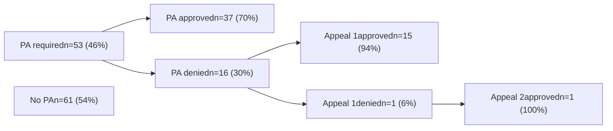

# DELAY IN INSURANCE APPROVAL OF BIOLOGIC THERAPY DOSE ESCALATION IS ASSOCIATED WITH INCREASED DISEASE ACTIVITY IN PATIENTS WITH INFLAMMATORY BOWEL DISEASE
QR Code Vanderbilt University Medical Center logo
## MEDICAL CENTER

Nisha B. Shah, PharmD1 | Josh DeClercq, MS2 | Laura Cherry, PharmD3 | Autumn D. Zuckerman, PharmD, BCPS, AAHIVP, CSP1 | Praveen Vimathalas4 | Leena Choi, PhD2 | Charles Donoho, BSPharm1 | Baldeep S. Pabla, MD, MSCI5 | Elizabeth A. Scoville, MD, MSCI5 | Robin L. Dalal, MD5 | Dawn B. Beaulieu, MD5 | David A. Schwartz, MD5 | Sara N. Horst, MD, MPH5

1Vanderbilt Specialty Pharmacy, Vanderbilt University Medical Center 2Department of Biostatistics, Vanderbilt University Medical Center, 3Lipscomb University, 4Vanderbilt University, 5Vanderbilt Inflammatory Bowel Disease Clinic, Vanderbilt University Medical Center

## BACKGROUND

* A complex prior authorization process is usually required to secure insurance approval of alternate (non-Food and Drug Administration-approved) biologic dosing, often needed to manage inflammatory bowel disease (IBD). We previously reported a delay for some patients as a result.1

* C-reactive protein (CRP) is used as a biomarker of inflammation in patients with IBD and can help assess disease activity.

## OBJECTIVE

To evaluate the impact of time to dose escalation insurance approval on disease activity in patients with IBD at a tertiary care center with an integrated specialty pharmacy.

## METHODS

**DESIGN**: Single-center retrospective cohort analysis

**INCLUSION**: Adult patients prescribed dose escalation of adalimumab, ustekinumab, certolizumab or golimumab from January to December 2018

**EXCLUSION**:
* Prior authorization (PA) process not completed by center's specialty pharmacy
* Medication fulfilled through manufacturer or under medical benefit

**PRIMARY OUTCOME**: CRP measurement at follow-up, defined as the first measurement after 45 days following provider decision to escalate dose

**SECONDARY OUTCOME**: Patient-reported disease activity evaluated using Harvey Bradshaw Index (HBI)

## COHORT CHARACTERISTICS

### Table 1. Demographics (n=114)

|                                        | n (%)    |
| -------------------------------------- | -------- |
| Age, years (mean ± standard deviation) | 40 ± 14  |
| Gender, female                         | 60 (53)  |
| Race                                   |          |
| White                                  | 109 (96) |
| Black or African American              | 5 (4)    |
| Crohn's disease                        | 100 (88) |
| Insurance type, commercial             | 95 (83)  |

### Table 2. Biologic therapy dosing regimens

|                                   | n (%)   |
| --------------------------------- | ------- |
| Adalimumab                        |         |
| 40 mg weekly                      | 42 (37) |
| 40 mg every 10 days               | 1 (<1)  |
| 40 mg or 80 mg alternating weekly | 1 (<1)  |
| Ustekinumab                       |         |
| 90 mg every 6 weeks               | 50 (44) |
| 90 mg every 4 weeks               | 16 (14) |
| Golimumab                         |         |
| 100 mg every 2 weeks              | 2 (2)   |
| Certolizumab                      |         |
| 200 mg every 2 weeks              | 1 (<1)  |

## RESULTS

### Figure 1. Insurance approval pathway

Median time from provider decision to escalate dose of biologic therapy to insurance approval was 5 days (IQR 1 – 12).

### Table 3. Baseline and follow-up CRP (n=114) and HBI (n=62) values

|               | Median \[interquartile range (IQR)] |
| ------------- | ----------------------------------- |
| Baseline CRP  | 4.2 mg/dL (1.3 – 9.7)               |
| Follow-up CRP | 4.5 mg/dL (1.4 – 9.8)               |
| Baseline HBI  | 3 (1 – 7)                           |
| Follow-up HBI | 4 (2 – 6)                           |

Follow-up median CRP was evaluated at a median of 92 days (IQR 72 – 119) and follow-up median HBI was evaluated at a median of 95 days (IQR 89 – 118) following dose escalation.

### Figure 2. Regression analysis of follow-up CRP as function of time from decision to treat to insurance approval

| Time from decision to treat to insurance approval | Follow-up CRP (mg/dL) |
| ------------------------------------------------- | --------------------- |
| 0                                                 | 3                     |
| 10                                                | 10                    |
| 20                                                | 12                    |
| 30                                                | 13                    |

In this cohort, 20% (n=23) of patients experienced a delay of greater than 14 days in securing insurance approval.

A longer time to insurance approval significantly decreased the likelihood of CRP improvement (p = .019).

Delays in recommended change of biologic dosing because of insurance barriers can impact clinical outcomes.

### Figure 3. Change in CRP from baseline to follow-up

| Timepoint | Delay ≤ 14 days (mg/dL) | Delay > 14 days (mg/dL) |
| --------- | ----------------------- | ----------------------- |
| Baseline  | 10                      | 15                      |
| Follow-up | 10                      | 20                      |

Patients who experienced a delay in insurance approval (n=23, 20%) had higher follow-up CRP levels compared to patients with no delay (n=91, 80%).

### Figure 4. Change in HBI from baseline to follow-up

| Timepoint | Delay ≤ 14 days | Delay > 14 days |
| --------- | --------------- | --------------- |
| Baseline  | 5               | 5               |
| Follow-up | 5               | 4               |

Time to insurance approval did not have a significant impact on HBI outcomes.

## CONCLUSIONS

* Our findings suggest that a longer time to secure insurance approval of dose-escalated biologic therapy is associated with worse CRP outcomes.

* This highlights that the complex dose escalation process of biologic therapy can negatively impact clinical outcomes and supports the benefit of having an integrated specialty pharmacy team to ensure timely completion of prior authorization +/- appeals.

1. Coe C, Cherry L, Shah N, et al. Alternative subcutaneous biologic dosing in inflammatory bowel disease is delayed depending on insurance approval requirements. American J Gastroenterol 2020;115:S45

