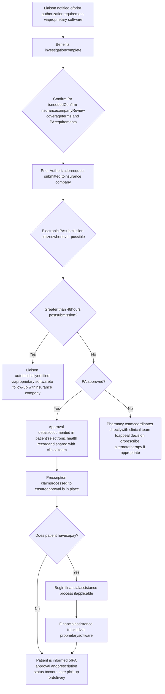

Clearway Health logo Clearway Health logo

# Evaluating prior authorization turnaround times for integrated health system specialty pharmacy patients

Benjamin Mohr MHA1, Geri Buderwitz MBA PharmD1, Leandra Battisti PharmD1,
1Clearway Health

## BACKGROUND

Prior authorizations (PAs) are a process used by insurance companies to manage costs by requiring physicians and other healthcare providers to obtain advanced approval from a patient’s health plan for a specific service or medication to qualify for payment coverage before it can be delivered to the patient. PAs have a significant patient impact, with 94% of providers associating PAs with care delay and 80% associating them with patients abandoning treatment.1 PAs also represent a burden for providers while increasing costs.2 In 2021, 88% of providers rated prior authorization requirements as very or extremely burdensome, an increase from both previous years.2

Obtaining PAs for specialty pharmacy medications represents a common and significant step in a patient’s journey towards obtaining the therapy they need. In CoverMyMeds’ 2021 Medication access report, one in four patients reported delays due to their medication requiring a PA.3 The lengthy time it can take to obtain specialty prescription prior authorization has been well documented. In a recent study, a provider office averaged nearly 21 days.4

### Patient impact

Care delays associated with PA
Q: For those patients whose treatment requires PA, how often does this process delay access to necessary care?

| Category                                                  | Percentage |
| --------------------------------------------------------- | ---------- |
| Care delays associated with PA (Always, Often, Sometimes) | 94         |

\*Percentages sum to 94% due to rounding

Abandoned treatment associated with PA
Q: How often do issues related to the PA process lead to patients abandoning their recommended course of treatment?

| Category                                                          | Percentage |
| ----------------------------------------------------------------- | ---------- |
| Abandoned treatment associated with PA (Always, Often, Sometimes) | 80         |

## METHODOLOGY

* **Study Design**: Population-based retrospective cohort study.

* **Data Source**: PA submission data from Clearway Health’s patient management platform covering 1,744 total PA submissions from September 2021 through February 2023.

* **Study Population**: Specialty pharmacy patients across seven unique health systems who had PAs supported by Clearway Health (CH).

* **Exclusion**: PA resubmissions (non-initial PAs), PAs where submission to decision date was >90 days, PAs with a missing creation date, submission date, or decision date.

* **Statistical Analysis**: Descriptive statistics were utilized to evaluate the PA turnaround times from submission to decision and from PA notification to decision dates.

## CLEARWAY HEALTH PRIOR AUTHORIZATION WORKFLOW

## CLEARWAY HEALTH RESULTS

| Primary Clinic      | Average PA Notification to Decision Date (Days) | Average PA Submission to Decision Date (Days) |
| ------------------- | ----------------------------------------------- | --------------------------------------------- |
| Other               | 0.4                                             | 0.4                                           |
| Rheumatology        | 0.9                                             | 0.7                                           |
| Hematology/Oncology | 0.9                                             | 0.7                                           |
| Pulmonology         | 1.4                                             | 1.3                                           |
| Infectious Disease  | 1.5                                             | 1.2                                           |
| Cardiology          | 2.2                                             | 2.2                                           |
| Dermatology         | 2.7                                             | 2.3                                           |
| Multi-specialty     | 2.9                                             | 2.8                                           |
| Primary Care        | 2.9                                             | 2.6                                           |
| Gastroenterology    | 3.5                                             | 3.3                                           |
| Neurology           | 3.6                                             | 3.3                                           |
| Endocrinology       | 5.0                                             | 4.3                                           |
| **TOTAL**           | **2.3**                                         | **2.1**                                       |

1,744 Total PA Submissions Across 12 Clinical Areas

Clinical Area
Endocrinology
Primary Cary
Cardiology
Hematology/Oncology
Neurology
Multi-specialty
Infectious Disease
Rheumatology
Gastroenterology
Dermatology
Pulmonology
Other

| 91% of PAs were submitted on the same day of notification | 97% of PAs were submitted within one day of notification |
| --------------------------------------------------------- | -------------------------------------------------------- |
| 91%                                                       | 97%                                                      |

91% and 97% donut charts

## DISCUSSION

Obtaining prior authorization remains a critical step for patients to acquire specialty medications, which are often life-changing treatments. Clearway Health partners with health systems to provide this service by leveraging clinic-embedded and remote patient liaisons.

Clearway Health’s goal is to eliminate the significant burden on health systems to provide this service, and provide expedited turnaround times through subject-matter experts that are dedicated to the specialty pharmacy space. Clearway Health liaisons complete a proactive benefits investigation for patients who are being seen in a specialty clinic or who are newly prescribed specialty treatment. When a PA is needed, they are notified via proprietary patient management software. They then leverage an electronic PA platform when possible to submit PAs with the necessary payor-required content. Clearway Health liaisons are notified via the proprietary software to follow up if they have not yet received a response from the insurance company within 48 hours. Once the PA is approved, they evaluate the out of pocket expense to the patient to determine if affordability assistance is needed. They then coordinate directly with the patient and provider to ensure the prescription is obtainable and picked up or delivered shortly thereafter so that therapy may be initiated.

For chronic specialty medications, the proprietary software provides an automatic reminder to liaisons 30 days before the PA is set to expire. This ensures that liaisons are able to proactively request PA renewals prior to when the patient is due for their refill.

Through this retrospective cohort study across 1,744 total submissions, we found that the average PA turnaround time from submission to decision date for specialty medications was 2.1 days. While there are several sources documenting the challenges and lengthy time to obtain PAs, there is limited research on best practices and interventions to minimize that time, or statistical results.

Clearway Health’s result of 2.1 days appears to be strong compared to the research and publication on this subject that is available today. In a recent article from the Pharmacy Times, prescribers and pharmacists believe it should take one to two weeks to get patients on specialty therapies, and that this timeline is not currently met- with prior authorization being the top impediment.5

## REFERENCES

1. AMA prior authorization (PA) physician survey | AMA (ama-assn.org)

2. MGMA-Annual-Regulatory-Burden-Report-October-2021.pdf.aspx

3. CMM_77721_MedicationAccessReport21_FINAL__1_.pdf (ctfassets.net)

4. Analysis of prior authorization success and timeliness at a community-based specialty care pharmacy - Journal of the American Pharmacists Association (japha.org)

5. Accelerating Specialty Prescribing Through Automation (pharmacytimes.com)

## ACKNOWLEDGMENTS

1. Clearway Health Client Services team, including pharmacy liaisons, specialty pharmacists, ambulatory clinical pharmacy specialists, and pharmacy and operational leadership

