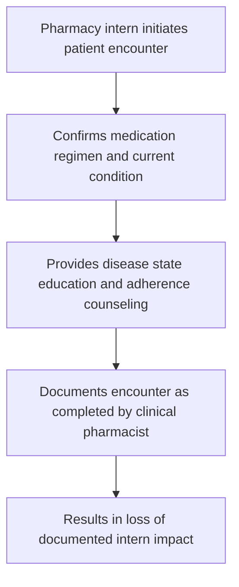

Yale NewHaven Health logo

# Impact of Pharmacy Interns in Medication Therapy Management at an Integrated Health System Specialty Pharmacy

speaker icon

Rebecca Rakiec, BSPharm; Raye J. Mutcherson II, BSPharm, PhD; Lauren Voide, PharmD, MBA; Athena Peterson, PharmD, MBA; Bisni Narayanan, PharmD, MS, MBA; Mitchell DelVecchio, PharmD, CSP; Terri Sue Rubino, PharmD, CSP

## Background

speaker icon

* The Centers for Medicare and Medicaid Services (CMS) created medication therapy management (MTM) for Medicare Part D beneficiaries under the Medicare Modernization Act.

* In June of 2023, the HSSP implemented an MTM program with two specialty clinical pharmacists that expanded to include interns.

* Studies have reported pharmacy technician utilization to support MTM services through medication reconciliation, and documentation assistance.

* However, the role of pharmacy interns in the provision of MTM services at the HSSP is not well understood.

* In 2023, the MTM program was expanded at the HSSP to integrate pharmacy interns into the process.

## Objective

speaker icon

* To demonstrate the pharmacy intern's value in the provision of MTM services within a HSSP.

## Methods

training icon Two interns were trained through modules and by two specialty clinical pharmacists in all MTM interventions for one month, with additional training on new tasks.

EMR icon Interns utilized the health system’s electronic medical record to complete medication reconciliations, identify medication related problems, and communicate with providers and patients.

CMR icon Interns delivered comprehensive medication reviews (CMR) with patients and communicated with providers any safety, efficacy, and adherence concerns.

review icon The MTM pharmacists reviewed and co-signed all intern notes and communications with patients and their providers, and supervised interactions.

## Results

speaker icon

### Total MTM Encounters

| Series           | Value |
| ---------------- | ----- |
| Pharmacists      | 743   |
| Pharmacy Interns | 129   |

Total n = 872

### Comprehensive Medication Reviews

| Series           | Value |
| ---------------- | ----- |
| Pharmacists      | 122   |
| Pharmacy Interns | 25    |

Total n = 147

### Patient Encounter Model

### MTM Patient Encounters

| Category              | Pharmacists | Pharmacy Interns |
| --------------------- | ----------- | ---------------- |
| Needs Refill          | 75          | 30               |
| 90 and 100 Day Refill | 48          | 10               |
| Monitoring Checkpoint | 65          | 33               |

## Discussion

* Patients eligible for clinical interventions are loaded into the online MTM platform, on a calendar year basis.

* Pharmacy interns utilize the Pharmacists’ Patient Care Process across all patient encounters, aiming to enhance health outcomes.

* Interns completed 25 of the 147 Comprehensive Medication Reviews (CMRs), accounting for 17% of the total. Their involvement in training clinical pharmacist in the MTM process also contributed to an overall increase in CMR completion, raising the total to 26.6%.

* Common obstacles to completing MTM include time constraints and insufficient staffing. Pharmacy interns can help address these challenges, allowing pharmacists to focus on the clinical aspects of MTM reviews.

## Barriers/Limitations

* Although interns performed various interventions, only medication refills and Comprehensive Medication Reviews (CMRs) were directly documented and attributed to them.

* Unable to directly measure patient health outcomes related to completed encounters.

## Future Directions

speaker icon

* Continued development and expansion of the MTM services to include additional interns and pharmacy liaisons.

* Development of a patient questionnaire focusing on their attitudes toward their medications and satisfaction with MTM services.

* Establish standardized methods for documentation and patient follow-up across the health system.

## Conclusion

speaker icon

* Pharmacy interns can play an integral role in the provision of MTM services within an HSSP.

## Reference

* Gernant SA, Nguyen MO, Siddiqui S, Schneller M. Use of pharmacy technicians in elements of medication therapy management delivery: A systematic review. Res Social Adm Pharm. 2018;14(10):883-890

The authors of this presentation have nothing to disclose concerning possible financial or personal relationships with commercial entities that may have a direct or indirect interest in the subject matter of this presentation. NASP Annual Meeting & Expo 2024. October 6-9, 2024.

