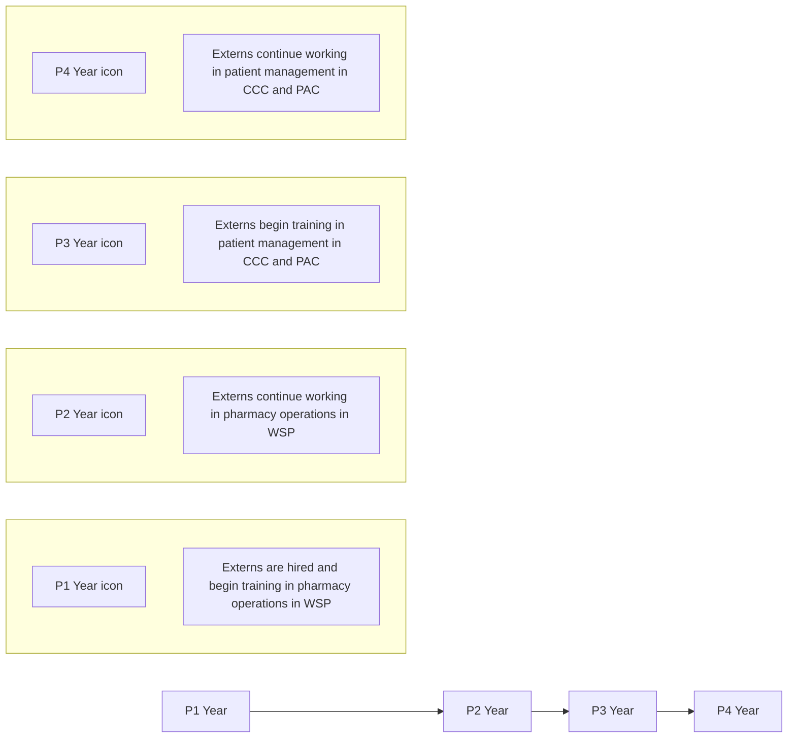

# Opportunities Provided to Students through a Specialty Pharmacy Externship Program

Lauren Moy, BS, PharmD Candidate; Nehrin Khamo, PharmD, CSP; Michael Eagon, PharmD; Karen Thomas, PharmD, PhD, MBA
University of Illinois Chicago, University of Illinois Hospital and Health Sciences System (UI Health) Specialty Pharmacy Services (SPS)

UNIVERSITY OF UIC ILLINOIS CHICAGO logo

UNIVERSITY OF ILLINOIS Hospital & Health Sciences System logo

College of Pharmacy

## Background

* The University of Illinois (UI) Health Specialty Pharmacy Services (SPS) externship program was created in 2013 for students to gain hands on training experience in health system specialty pharmacy (HSSP) operations.

* There is a need for pharmacists to develop skills necessary to practice in specialty pharmacy as the field continues to grow.

* The goal of the program is to become an established pipeline in preparing student pharmacists for a role in specialty pharmacy practice post-graduation.

## Objective

* To describe the development and expansion of the UI Health SPS externship program for student learning experiences and post-graduate destinations of externs in the program.

## Reference

Fava JP, Zofchak KM, Jedinak TJ, Erickson SR. Student perspectives regarding specialty pharmacy within doctor of pharmacy curricula. Journal of Managed Care & Specialty Pharmacy. 2019;25(11):1255-1259. doi:10.18553/jmcp.2019.25.11.1255

## Description

**Operational Externs work alongside specialty staff to complete:**

|             | Wood Street Pharmacy (WSP)                                                                                                                     | Clinical Care Center (CCC)                                                                                                                                   | Patient Access Center (PAC)                                                                                       |
| ----------- | ---------------------------------------------------------------------------------------------------------------------------------------------- | ------------------------------------------------------------------------------------------------------------------------------------------------------------ | ----------------------------------------------------------------------------------------------------------------- |
| Daily Tasks | • Process and fill medication orders • Package medication deliveries for daily shipping logs • Conduct hand-off with delivery services | • Conduct monthly refill surveys via phone • Escalate potential medication or disease-related issues to pharmacists • Schedule medication deliveries | • Conduct benefit verifications • Submit prior authorizations • Contact insurance companies for PA status |
| Projects    | • Perform temperature-controlled shipping validation • Assemble welcome packets for newly initiated patients                               | • Automate monthly refill surveys through EPIC MyChart • Conduct therapy assessments                                                                     | • Capture new patients for SPS enrollment                                                                         |

**Quality Projects**

**Admin Extern Responsibilities**

| icon | Prepare monthly and quarterly metric reports for external stakeholders | icon | Develop productivity, quality, and phone performance dashboards |
| ---- | ---------------------------------------------------------------------- | ---- | --------------------------------------------------------------- |
| icon | Use automated and statistical tools to analyze and visualize trends    | icon | Maintain revenue reports and financial projections              |

## Evaluation

Externs aid in projects to expand clinical knowledge, optimize operations workflow, and promote professional development.

Number of Externs Over the Years

| Year | Number of Externs |
| ---- | ----------------- |
| 2013 | 3                 |
| 2014 | 3                 |
| 2015 | 3                 |
| 2016 | 3                 |
| 2017 | 3                 |
| 2018 | 4                 |
| 2019 | 4                 |
| 2020 | 7                 |
| 2021 | 8                 |
| 2022 | 10                |
| 2023 | 11                |

Post-Graduate Achievement (n = 19)

| Category   | Percentage |
| ---------- | ---------- |
| Fellowship | 10         |
| Retail     | 32         |
| Residency  | 58         |

| Post-Graduate Achievement |                    | # Externs |
| ------------------------- | ------------------ | --------- |
| Residency                 | Specialty Pharmacy | 9         |
|                           | Community Pharmacy | 1         |
|                           | PGY1 Pharmacy      | 1         |
|                           | 11                 |           |
| Retail                    | Community Pharmacy | 4         |
|                           | Specialty Pharmacy | 2         |
|                           | 6                  |           |
| Fellowship                |                    | 2         |

> “The UIC Specialty Pharmacy externship was instrumental in building my foundation of specialty pharmacy allowing me to help advance the practice and HSSP’s through health economics and outcomes research.”

> “The UIC Specialty Pharmacy externship introduced me to specialty pharmacy and showed me the value of high touch patient care and the positive impact pharmacists have.”

> ”The UIC Specialty Pharmacy externship provides opportunities to engage in various projects. The dynamic environment allows for learning and professional development and creates a rewarding experience for a student pharmacist.”

## Conclusions

* The UI Health SPS externship program has provided opportunities for students to gain exposure in the field of specialty pharmacy over the past 10 years.

* Future directions for the externship program include:

- Refinement of the structured learning experience progression system

- Expansion of student-driven projects for in-depth professional development

