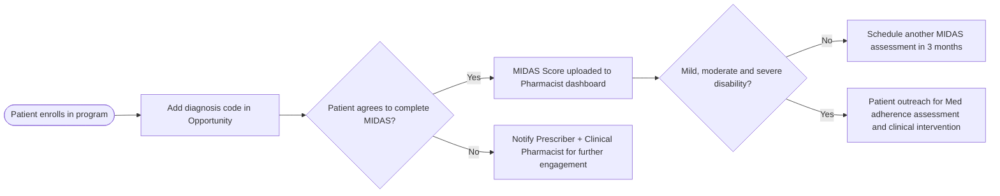

Clearway Health logo

# Leveraging Migraine Patient Reported Outcomes Data to Develop Targeted Pharmacist Interventions

Shawn Stanford1, PharmD, Amanuel Kehasse, PharmD, PhD1
1Clearway Health

## MIDAS data collection and pharmacist intervention workflow

## Introduction

* Migraine is a type of headache characterized by recurrent attacks of moderate to severe throbbing and pulsating pain on one side of the head.

* Managing migraines often requires a multidisciplinary approach, and coordinating care between different healthcare providers can be complex.

* Health System Specialty Pharmacists have more touch points with patients in between their provider visits to assess medication adherence, assess therapy outcomes and provide interventions.

* Migraine Disability Assessment (MIDAS) questionnaire is a validated tool used to assess patients' disability due to migraines.

## Objective

The Purpose of this study is to describe the value of Migraine Disability Assessment (MIDAS) based targeted pharmacist interventions in migraine treatment outcomes.

## Methodology

* **Study Design:** Multisite, retrospective observational descriptive study

* **Data Source:** Patient Reported Outcome (PRO) and pharmacist intervention dashboard

* **Study Population:** Total of 132 adults with at least one migraine medication followed by Clearway Health Specialty team from January 1st to May 15th, 2024 across multiple health systems

* **Inclusion:** Patients were included in the analysis if they had at least one documented MIDAS score

* **Statistical Analysis:** Descriptive statistics were used to calculate the proportion of patients in each disease activity category

## Migraine treatment outcome monitoring

| Category                  |
| ------------------------- |
| Patient Reported Outcomes |
| Physician Assessment      |
| Medication Adherence      |

## MIDAS Score Range and Disability Grade

| Grade I                 | Grade II                | Grade III               | Grade IV                |
| ----------------------- | ----------------------- | ----------------------- | ----------------------- |
| Little or no disability | Little or no disability | Little or no disability | Little or no disability |
| 0-5                     | 6-10                    | 10-20                   | >20                     |

## Results

| Outcome Category                        | Percentage |
| --------------------------------------- | ---------- |
| MIDAS Score Improved                    | 48         |
| Maintained at Little to No Disability   | 24         |
| No Change - Moderate Disability         | 12         |
| No Change - Severe Disability           | 8          |
| Worsened: Moderate to Severe Disability | 8          |

56% icon **56%** of patients enrolled in Clearway Health Specialty Management have achieved little to no or mild disability status within the 4.5 months of this study period.

## Discussion

With access to EMR and pharmacy records, Health System Specialty Pharmacists are uniquely positioned to support patients and care teams and improve access to care and therapy outcomes. Specialty pharmacists have more touch points with patients in between their provider visits. This allows them to assess medication adherence, barriers to medication access and assess therapy outcomes via validated patient reported outcome questionnaires.

This is an ideal approach to screen for suboptimal treatment outcomes and then provide a more tailored intervention to improve outcomes.

Tailored pharmacist interventions over a period of 4.5 months resulted in a 48.0% improvement in MIDAS scores, while only 8% showed an increase in their MIDAS score. Overall data analysis shows 56% of patients enrolled in this program have achieved little to no or mild disability status within 4.5 months.

This study demonstrates the value and clinical impact of patient-reported outcomes based on clinical interventions by pharmacists, which can lead to better clinical outcomes.

## Limitations

We were not able to present pharmacist interventions due to lack of discrete data to pull from EMR.

## Acknowledgment

Special thanks to Clearway Health Pharmacists and liaisons who helped to complete MIDAS scores and data collection.

