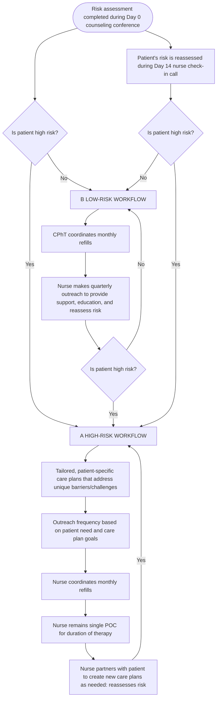

# Individualized Care Plans’ Effect on Therapy Adherence for Patients Prescribed Olaparib

Biologics By McKesson logo
Yoona Kim, PharmD, PhD1; Denise Tran, PharmD1; Jordon Rabey, MS1; Elaine Murphy, BS2; Benjamin Matherne, MBA3; Daniel Weaver, BSN, RN3
1. Arine, San Francisco, CA; 2. McKesson Corp., Dallas, TX; 3. Biologics by McKesson, Cary, NC
arine logo

## Background

### Importance of Symptom Management in Cancer Care

* Among patients with cancer, symptom management is an important part of maintaining quality of life and managing levels of physical and psychological distress.1

* Patients with cancer can receive uncoordinated and fragmented care across several health professionals and settings, which can leave symptoms under-detected and under-treated.2

* Studies have shown that approximately 50% of patients with cancer experience symptoms of fatigue, pain, or distress but largely do not communicate this to their providers.3

* When symptoms go undetected and unmanaged, the result can be medication nonadherence, early discontinuation, and poor health outcomes.4

### Role of Specialty Pharmacy in Cancer Care

* Hospital-based, nurse-led case management has been shown to improve health-related quality of life and reduce healthcare utilization and costs among patients with cancer.2,5,6

* Little is known about the effects of nurse-led case management provided by specialty pharmacies, in the delivery and coordination of complex care in oncology.

* More patients are receiving cancer treatment at home due to rapid adoption of oral oncology medications, such as poly (adenosine diphosphate ribose) polymerase (PARP) inhibitors.

* Thus, it is important to understand whether and to what extent nurse-led case management provided by specialty pharmacies improves treatment continuation.

## Risk-Based Care Program

Biologics by McKesson, a specialty pharmacy, implemented a Risk-Based Care (RBC) program in January 2020. Risk-Based Care is a personalized healthcare approach that leverages a nurse-patient relationship, to create tailored Care Plans that focus on every patient’s unique challenges and barriers. In the Risk-Based Care model, clinicians conduct risk assessments to identify barriers to medication adherence and to better understand a patient’s symptoms or concerns.

Per the risk assessment, patients who are at high-risk for medication nonadherence are automatically enrolled into the RBC program and are given increased support and intervention by a dedicated nurse who serves as their point of contact throughout their course of treatment. High-risk patients in the RBC program are eligible to receive personalized, symptom-focused Care Plans from a nurse. The nurse communicates with the patient as often as they need (e.g., weekly, monthly).

## Objectives

1. To evaluate the effects of a nurse-led personalized Care Plan on Time on Therapy (TOT) for patients on olaparib who are at high-risk of medication nonadherence (high-risk Care Plan patients)

2. Among high-risk Care Plan patients, to explore differences in TOT in the following subgroups:

* Patients who received a dose reduction vs. patients who did not

* Patients who were identified as having a Care Plan symptom resolution vs. no resolution

## Methods

### Intervention

All high-risk patients (n=560) taking olaparib in the RBC program were eligible to receive personalized, symptom-focused Care Plans from a nurse. Of these, n=163 received at least one Care Plan (high-risk Care Plan group) and n=397 did not receive any Care Plans (control group).

### Data

Data from January 2020 to June 2022 were obtained from an independent specialty pharmacy (Biologics by McKesson), including demographic characteristics, olaparib prescriptions dispensed, indication for olaparib, risk level, Care Plan status\*, Care Plan details (e.g., symptoms, resolution)\*, treatment discontinuation\*, and adverse events\*.

### Study Design

* A retrospective cohort study design was used to compare the duration of olaparib therapy for patients in the high-risk Care Plan group and the control group.

* The date of the first dispense of olaparib was defined as the index date. Patients were followed up from the index date until treatment discontinuation or the end of the study period, whichever occurred first.

* TOT was compared between Care Plan and control groups using Mann-Whitney U test. Within the Care Plan group, TOT was compared among subgroups who had at least one dose reduction or symptom resolution.

### Outcomes

* TOT of olaparib therapy, defined as the number of days between the first fill and the last fill, plus the days’ supply of the last fill

* Differences in the TOT between groups

### Inclusion Criteria

* Age $\ge$18 years

* High-risk for medication nonadherence, as assessed using a survey administered during the pharmacy intake process

* Filled $\ge$1 olaparib prescription

\*Data documented by a clinician

## Results

### Demographic and Clinical Characteristics

| Demographic and Clinical Characteristics | Demographic and Clinical Characteristics All (n=560) | Demographic and Clinical Characteristics Care Plan (n=163) | Demographic and Clinical Characteristics No Care Plan (n=397) | Demographic and Clinical Characteristics p-value |
| ---------------------------------------- | -------------------------------------------------------- | -------------------------------------------------------------- | ----------------------------------------------------------------- | ---------------------------------------------------- |
| Age, mean (SD), years                    | 61.7 (12.8)                                              | 62.2 (12.9)                                                    | 61.5 (12.8)                                                       | 0.574                                                |
| Median Age \[IQR], years                 | 62.0 \[54.0-71.0]                                        | 61.0 \[53.0-70.0]                                              | 63.0 \[55.5-71.0]                                                 | 0.252                                                |
| Sex, n (%)                               |                                                          |                                                                |                                                                   |                                                      |
| Female                                   | 473 (84.8%)                                              | 146 (89.6%)                                                    | 327 (82.8%)                                                       | 0.058                                                |
| Male                                     | 85 (15.2%)                                               | 17 (10.4%)                                                     | 68 (17.2%)                                                        |                                                      |
| Caregiver, n (%)                         |                                                          |                                                                |                                                                   |                                                      |
| Yes                                      | 474 (84.6%)                                              | 133 (81.6%)                                                    | 341 (85.9%)                                                       | 0.249                                                |
| No                                       | 86 (15.4%)                                               | 30 (18.4%)                                                     | 56 (14.1%)                                                        |                                                      |
| Cancer Type, n (%)                       |                                                          |                                                                |                                                                   |                                                      |
| Breast                                   | 69 (12.3%)                                               | 15 (9.2%)                                                      | 54 (13.6%)                                                        | 0.156                                                |
| Female reproductive organ (non-ovarian)  | 37 (6.6%)                                                | 10 (6.1%)                                                      | 27 (6.8%)                                                         |                                                      |
| Gastrointestinal                         | 17 (3.0%)                                                | 6 (3.7%)                                                       | 11 (2.8%)                                                         |                                                      |
| Ovarian                                  | 271 (48.4%)                                              | 93 (57.1%)                                                     | 178 (44.8%)                                                       |                                                      |
| Pancreatic                               | 16 (2.9%)                                                | 3 (1.8%)                                                       | 13 (3.3%)                                                         |                                                      |
| Prostate                                 | 51 (9.1%)                                                | 10 (6.1%)                                                      | 41 (10.3%)                                                        |                                                      |
| Other cancer or not specified            | 99 (17.6%)                                               | 26 (16.0%)                                                     | 73 (18.5%)                                                        |                                                      |
| Average Daily Olaparib Dose, n (%)       |                                                          |                                                                |                                                                   |                                                      |
| <600 mg                                  | 194 (34.6%)                                              | 98 (39.9%)                                                     | 129 (32.5%)                                                       | 0.116                                                |
| 600 mg                                   | 366 (65.4%)                                              | 65 (60.1%)                                                     | 268 (67.5%)                                                       |                                                      |

### Differences in TOT between high-risk patients with vs. without a Care Plan (n=560)

|                                            | Care Plan (n=163) | No Care Plan (n=397) | Differences in restricted mean survival time (95% CI)b | P-valuea |
| ------------------------------------------ | ----------------- | -------------------- | ------------------------------------------------------ | -------- |
| Duration of therapy, median \[IQR], months | 6.7 \[2.5-14.3]   | 4.9 \[1.9-10.4]      | 2.9 \[2.3-3.4]                                         | <0.001   |

aMann-Whitney test was used to compare duration of olaparib therapy between patients with vs. without a resolved symptom or dose modification.

bRestricted mean difference was compared duration of olaparib therapy between patients with vs. without a symptom resolution or dose decrease.

Abbreviation: IQR, interquartile range.

### Care Plan vs. No Care Plan\*

| Time on Therapy (Months) | High Risk and Care Plan (N=163) | High Risk No Care Plan (N=397) |
| ------------------------ | ------------------------------- | ------------------------------ |
| 0                        | 1.0                             | 1.0                            |
| 10                       | 0.4                             | 0.3                            |
| 20                       | 0.25                            | 0.15                           |
| 30                       | 0.15                            | 0.1                            |
| 40                       | 0.1                             | 0.05                           |
| 50                       | 0.05                            | 0.0                            |

\*Kaplan-Meier Survival Curves describing percentage of patients remaining on olaparib therapy among patients with cancer at high risk of medication nonadherence with vs. without a care plan (n=560)

### Subgroup analysis: TOT by symptom resolution or dose (n=163)

| High-Risk Care Plan subgroup         | Duration of therapy, median \[IQR], months | Differences in restricted mean survival time (95% CI)b | P-valuea |
| ------------------------------------ | ------------------------------------------ | ------------------------------------------------------ | -------- |
| At least one symptom resolved (n=86) | 10.3 \[4.8-19.0]                           | 8.1 \[7.1-9.3]                                         | <0.001   |
| No symptom resolved (n=77)           | 3.9 \[1.9-11.4]                            |                                                        |          |
| Dose decrease (n=50)                 | 11.9 \[6.7-17.8]                           | 8.3 \[7.2-9.4]                                         | <0.001   |
| No dose decrease (n=113)             | 4.7 \[1.9-11.8]                            |                                                        |          |

aMann-Whitney test was used to compare duration of olaparib therapy between patients with vs. without a resolved symptom or dose modification.

bRestricted mean difference was compared duration of olaparib therapy between patients with vs. without a symptom resolution or dose decrease.
Abbreviation: IQR, interquartile range.

### Dose decrease vs. No dose decreasea | Resolution vs. No resolutionb

| Time on Therapy (Months) | High Risk and Dose Decrease (N=50) | High Risk Care Plan No Dose Decrease (N=113) |
| ------------------------ | ---------------------------------- | -------------------------------------------- |
| 0                        | 1.0                                | 1.0                                          |
| 10                       | 0.6                                | 0.3                                          |
| 20                       | 0.4                                | 0.15                                         |
| 30                       | 0.25                               | 0.1                                          |
| 40                       | 0.15                               | 0.05                                         |
| 50                       | 0.1                                | 0.0                                          |

| Time on Therapy (Months) | High Risk and Care At Least One Problem Resolved (N=86) | High Risk Care Plan No Problems Resolved (N=77) |
| ------------------------ | ------------------------------------------------------- | ----------------------------------------------- |
| 0                        | 1.0                                                     | 1.0                                             |
| 10                       | 0.5                                                     | 0.3                                             |
| 20                       | 0.35                                                    | 0.15                                            |
| 30                       | 0.2                                                     | 0.1                                             |
| 40                       | 0.15                                                    | 0.05                                            |
| 50                       | 0.1                                                     | 0.0                                             |

aKaplan-Meier Survival Curves describing percentage of patients remaining on olaparib therapy by dose decrease or symptom resolution and bby symptom resolution among high-risk Care Plan patients (n=163)

## Conclusion

* The Care Plan group had statistically significantly longer TOT (6.7 vs. 4.9 months, p<0.001) and lower risk of discontinuing treatment (aHR 0.77, 95% CI 0.64-0.94) compared with the control group.

* The effect on TOT was more apparent among patients in the Care Plan group who experienced symptom resolution or dose modification.

* These findings suggest the effectiveness of a nurse-led, personalized care approach for increasing TOT among patients receiving olaparib for treatment of cancer.

## References

1. Steinhauser KE, Christakis NA, Clipp EC, McNeilly M, McIntyre L, Tulsky JA. Factors considered important at the end of life by patients, family, physicians, and other care providers. JAMA : the journal of the American Medical Association. Nov 15 2000;284(19):2476-82. doi:10.1001/jama.284.19.2476

2. Joo JY, Liu MF. Effectiveness of Nurse-Led Case Management in Cancer Care: Systematic Review. Clin Nurs Res. Nov 2019;28(8):968-991. doi:10.1177/1054773818773285

3. Vogelzang NJ, Breitbart W, Cella D, et al. Patient, caregiver, and oncologist perceptions of cancer-related fatigue: results of a tripart assessment survey. The Fatigue Coalition. Semin Hematol. Jul 1997;34(3 Suppl 2):4-12.

4. Anhang Price R, Elliott MN, Zaslavsky AM, et al. Examining the role of patient experience surveys in measuring health care quality. Med Care Res Rev. Oct 2014;71(5):522-54. doi:10.1177/1077558714541480

5. Wulff CN, Vedsted P, Sondergaard J. A randomised controlled trial of hospital-based case management to improve colorectal cancer patients' health-related quality of life and evaluations of care. BMJ open. 2012;2(6)doi:10.1136/bmjopen-2012-001481

6. Wu C, Bannister W, Schumacker P, Rosen M, Ozminkowski R, Rossof A. Economic value of a cancer case management program. J Oncol Pract. May 2014;10(3):178-86. doi:10.1200/JOP.2014.001384

