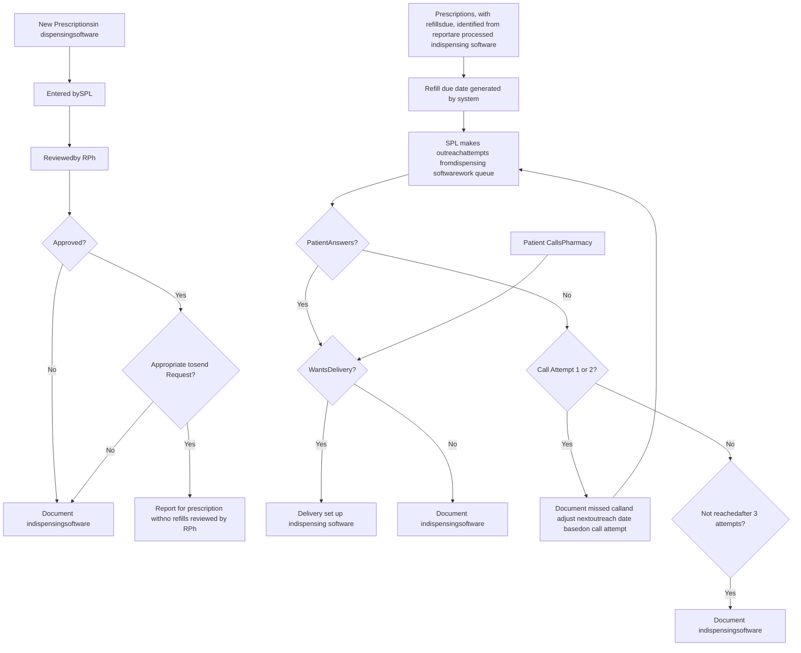

Yale New Haven Health logo

# Development of a Workflow to Manage Non-specialty Medications at a Specialty Pharmacy

Mitchell DelVecchio, PharmD, CSP, Francesca Amici, PharmD, John Fitzgerald, PharmD, Alexandra Gianazza, PharmD, BCGP, Natalia Krupski, PharmD, Terri Sue Rubino, PharmD, CPS

## Background

* Specialty pharmacy services encompasses the fulfillment and patient care support services of specialty medications.

* Specialty pharmacy documentation software is designed specifically to manage the fulfillment and patient care support of specialty medications.

* Patients on specialty medications often have complex treatment regimens which include non-specialty medications. For a specialty pharmacy to offer comprehensive patient care, fulfillment of non-specialty medications is also required.

* Specialty pharmacy documentation software is not designed to support the fulfillment of non-specialty medications therefore creating a need to develop a separate workflow for non-specialty medications.

* An analysis of our health system’s specialty pharmacy monthly dispense history from April 2023 showed a split of 41% versus 59% corresponding to specialty and non-specialty medications, respectively.

## Objective

Develop a workflow to manage the non-specialty medications for patients serviced by the specialty pharmacy utilizing the data available from dispensing software used by the specialty pharmacy,

## Description

A new workflow for non-specialty medications was created to reduce unnecessary documentation that was designed for specialty medication management within the electronic health record (EHR). Several reports were required to support this workflow. We created a report identifying the non-specialty prescriptions with active refills due for a refill in the next five days. The pharmacy supervisor reviewed the work volume statistics and initiated the fulfillment process in the dispensing software. The pharmacy dispensing software was programmed to assign the work to five teams based on the patient’s specialty medication disease state. Specialty pharmacy liaisons (SPLs) made the outreach calls from the five patient outreach queues in the dispensing software. A separate report was developed for non-specialty prescriptions with inactive refills. A specialty pharmacist (RPh) reviewed this report daily to determine the appropriateness of requesting a refill.

## Workflow For Managing Non-specialty Medications

Turnaround Time for Representative\* Non-specialty Medications

| Month | Turnaround Time 2022 (Days) | Turnaround Time 2023 (Days) | Number of Dispenses 2022 (n) | Number of Dispenses 2023 (n) |
| ----- | --------------------------- | --------------------------- | ---------------------------- | ---------------------------- |
| April | 4.5                         | 3.0                         | 350                          | 400                          |
| May   | 4.8                         | 3.2                         | 380                          | 450                          |
| June  | 4.2                         | 3.5                         | 360                          | 480                          |
| July  | 4.5                         | 3.8                         | 390                          | 500                          |

\*Medications to treat hyperlipidemia

## Delivery of a “clean” non-specialty medication\*

| Workflow steps (n)          | Old Workflow | New Workflow |
| --------------------------- | ------------ | ------------ |
| Workflow steps (n)          | 6            | 3            |
| Documentation steps (n)     | 4            | 1            |
| Documentation locations (n) | 3            | 1            |

(n) assumes the patient was reached on first attempt. Additional documentation required for unsuccessful attempts
\* clean: no prior authorization or copay assistance required

## Discussion

* Specialty pharmacies can offer comprehensive patient care, including the fulfillment of non-specialty medications.

* A non-specialty workflow should work in tandem with a specialty workflow to minimize outreach calls to patients and maximize the number of prescription delivered at a given time.

* Collaboration between health system specialty pharmacies and health system Information Technology (IT) is necessary to development and implement new workflows.

* Evaluation of the impact on this new workflow is complicated by complementary quality improvement initiatives aimed to improve operational efficiency.

* The new workflow may have contributed to improved prescription turnaround time, despite increased volume of non-specialty medications.

## Conclusion

Our health system specialty pharmacy successfully manages patients on specialty and non-specialty medications to ensure complete and comprehensive care.

This workflow can be adopted by other health system specialty pharmacies using similar electronic medical records and dispensing software.

## Further Direction

* Collaboration with IT to develop a dashboard to monitor non-specialty workflow progress and efficiency.

* Automation into various steps in the process such as patient outreach, prescription processing, and delivery set up.

* Integration with patient portals to allow for patients to request prescription refills for non-specialty medications.

* Further evaluation including comparative time studies of new workflow, and assessment of customer and provider complaints.

The authors of this presentation have nothing to disclose concerning possible financial or personal relationships with commercial entities that may have a direct or indirect interest in the subject matter of this presentation.

