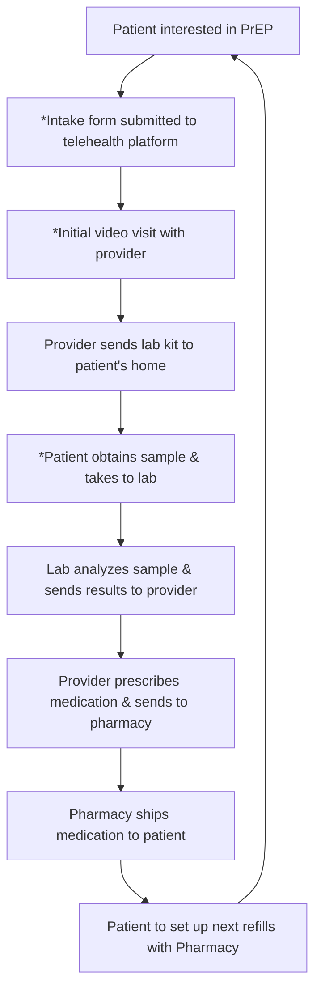

# Assessing the Efficacy of “Mind The Gap” Tool and Playbook on Patient Adherence for HIV Treatment and Prevention Telehealth Services

RAVIN CONSULTANTS logo

This study evaluates the "Mind The Gap" (MTG) tool, which aims to improve adherence to HIV treatment and PrEP by monitoring lab completions and telehealth visits. Through compassionate outreach, the tool addresses barriers to care and identifies socioeconomic factors affecting patient adherence.

QR Code

## AUTHORS

**Dhvani Derasari, PharmD**  **Robert Ferraro, PharmD**

Director of Compliance  Chief Operating Officer

**Kirsty Gutierrez, MHA**

Director of Quality & Development

## BACKGROUND

The United States has a goal to reduce new HIV infections by 90% by 2030, for which the US Dept of Health and Human Services has implemented the Ending the HIV Epidemic in the US initiative. In response, this research seeks to contribute to the “Treat” and “Prevent” pillars by improving adherence to HIV treatment and Pre-Exposure Prophylaxis for HIV prevention (PrEP).

The key to effective HIV prevention with PrEP is maintaining complete adherence to the medication regimen. This study utilizes a proprietary reporting and scripting outreach tool, called “Mind The Gap” (MTG), to monitor the completion of labs and visits among tele-health patients on HIV treatment or PrEP, and identify/address barriers to care. It is also expected that the MTG tool will create a trusted point of contact with the patient to answer any questions they may have regarding therapy and educate the patient on the importance of adherence.

## ELIGIBILITY CRITERIA FOR PRE-EXPOSURE PROPHYLAXIS (PREP) MEDICATIONS

1. Have a sexual partner with HIV (especially if the partner has an undetectable viral load)

2. Consistently not using a condom

3. Diagnosed with a sexually transmitted infection (STI) in the past 6 months

4. IV Drug user

5. Injection partner with HIV

6. Share needles, syringes, or other equipment to inject drugs

7. Reports risk behavior

8. Used multiple courses of post-exposure prophylaxis (PEP)

## METHODOLOGY

The MTG tool and playbook is used within STD and or HIV clinics to combat the HIV epidemic by ensuring that tele-health patients are completing laboratory testing and attending medical appointments for continued access to treatments that prevent the spread of the HIV virus among patients living with and at-risk for HIV. Linkage Specialists use the tool to verify patient submission of labs and attendance at tele-health appointments with their medical provider and conduct outreach to non-compliant patients to determine the cause of non compliance, address barriers to care, and assist with re-engaging the patient in treatment.

Templated reports are built in the clinic’s tele-health platforms and automated into a custom template to produce two individual call lists.

**There are two scenarios for this list:**

No Labs icon

**No Labs Call List:** The patient self-collected, but the specimen was invalid. The patient didn’t attempt or submit specimen self-collection.

No Tele-visit icon

**No Tele-visit Call List:** Identifies patients whose lab results have been received, but no follow-up tele-visit has been scheduled, or the patient missed their tele-visit.

Linkage Specialists conduct outreach on either call list every 10 days, utilizing the custom scripting included in the MTG Tool. The goal is for the patient to complete their labs and/or schedule or re-schedule their necessary tele-health appointment by providing compassionate care and identifying and addressing barriers to care.

## LEARNING OBJECTIVE

1 icon

Determine efficacy of adherence-based patient outreach using Ravin Consultants’ proprietary ‘Mind The Gap Adherence Tool & Playbook’, with patients actively taking antiretroviral medications for HIV treatment or as Pre-Exposure Prophylaxis (PrEP).

2 icon

Identify social-economic barriers that negatively impact adherence rates for observed HIV+ and at-risk patients.

## PLAYBOOK STEPS

\*Notates where patients often fail to take this next step. The Mind The Gap adherence tool targets these points and helps adherence rates to medications and PrEP initiation and continuation therapy.

## CITATIONS

1. ClinicalInfo. (2023, July 28). Adherence to the continuum of care. U.S. Department of Health and Human Services. <u>Research is often built on something that is already out there. Cite key references that you looked at while conducting your study.</u>

2. HIV.gov. (n.d.). U.S. statistics. <u>Research is often built on something that is already out there. Cite key references that you looked at while conducting your study.</u>

3. National Institutes of Health. (2021, August 12). HIV treatment adherence. HIVinfo. <u>Research is often built on something that is already out there. Cite key references that you looked at while conducting your study.</u>

4. World Health Organization. (2024). HIV data and statistics. <u>Research is often built on something that is already out there. Cite key references that you looked at while conducting your study.</u>

## CONTRIBUTORS

DeAnna Dale, Marketing Manager
Creative/Design

