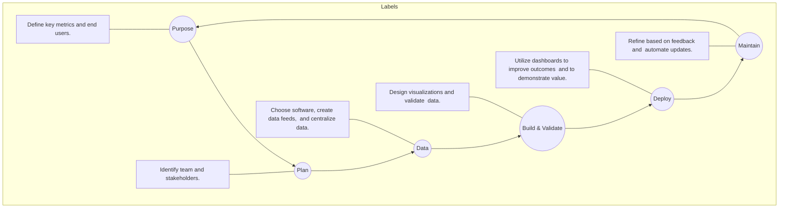

SHIELDS HEALTH SOLUTIONS logo

# Enhancing Specialty Pharmacy Care through Data-Driven Insights: The Value of Clinical Outcomes Dashboards in Health System Specialty Pharmacy

Carolkim Huynh, PharmD, CSP; Diana Miller; Shreevidya Periyasamy, MS HIA; Caleb Chun, MA; Patrick Ryan, PharmD, BCCCP; Martha Stutsky, PharmD, BCPS; Kate Smullen, PharmD, CSP, MSCS; Christopher Barr

QR code with "SCAN ME" text

## Background

Integrated health system specialty pharmacies (HSSPs) are increasingly utilized to improve patient care and reduce costs for complex diseases requiring specialty medications. Clinical outcomes (CO) dashboards are crucial tools for tracking and analyzing patient-centered measures that reflect the true quality and value of HSSP services.

Automated dashboards facilitate integration and accessibility of data in real-time. However, creation of these platforms is challenging. Comprehensive clinical dashboards incorporating key metrics present an opportunity to enhance HSSP practices by understanding and optimizing their impact.

## Description

Best practices for developing CO dashboards in HSSPs were identified through literature review and committee input. We collected data on:

*   Disease Specific Clinical Outcomes (Fig. 2)

*   Clinical Interventions (Fig. 3)

*   Medication Efficacy Status (Fig. 4)

*   Medication Discontinuation (Fig. 5)

Clear inclusion/exclusion criteria for each CO calculation. Working with our clinical analytics team, we created real-time outcome tracking dashboards using de-identified data. After validation, we applied appropriate filters and graphics to highlight key findings and enhance user experience. **Figure 1** illustrates the process used for CO dashboard development.

Figure 1: CO Dashboard Development Process

## Evaluation

Dashboards that include a comprehensive set of metrics, such as clinical outcomes (disease-specific lab values, corresponding benchmarks), clinical interventions and cost avoidance (e.g., drug safety, effectiveness, appropriateness, acceptance rate), medication efficacy measures, and rates of medication discontinuation provide a more comprehensive assessment of HSSP performance when used in conjunction with traditional operational metrics. Implementation of CO dashboards allow for enhanced real-time monitoring, improved interdisciplinary communication, and quality improvement, ultimately leading to a more comprehensive understanding of the value of HSSP services. These dashboards support multiple objects, including facilitating research, analyzing outcomes data, and showcasing impactful patient journeys.

## Figure 2: Disease Specific Clinical Outcomes Dashboard

Screenshot of Disease Specific Clinical Outcomes Dashboard

## Figure 3: Clinical Interventions Dashboard

Screenshot of Clinical Interventions Dashboard

## Figure 4: Medication Efficacy Status Dashboard (UPI = Unique Patient Identifier)

Screenshot of Medication Efficacy Status Dashboard

## Figure 5: Medication Discontinuation Dashboard

Screenshot of Medication Discontinuation Dashboard

## Conclusions

Clinical outcome dashboards are crucial for HSSPs to track and evaluate the quality and value of their care models. By incorporating diverse clinical, humanistic, and economic metrics, these dashboards provide a comprehensive view of HSSP performance, enabling data-driven decision-making, optimization of patient care, and overall organizational performance and capabilities.

## Disclosures

The authors of this presentation have nothing to disclose concerning possible financial or personal relationships with commercial entities that may have a direct or indirect interest in the subject matter of this presentation.

**References**
Refer to QR code QR code for references

