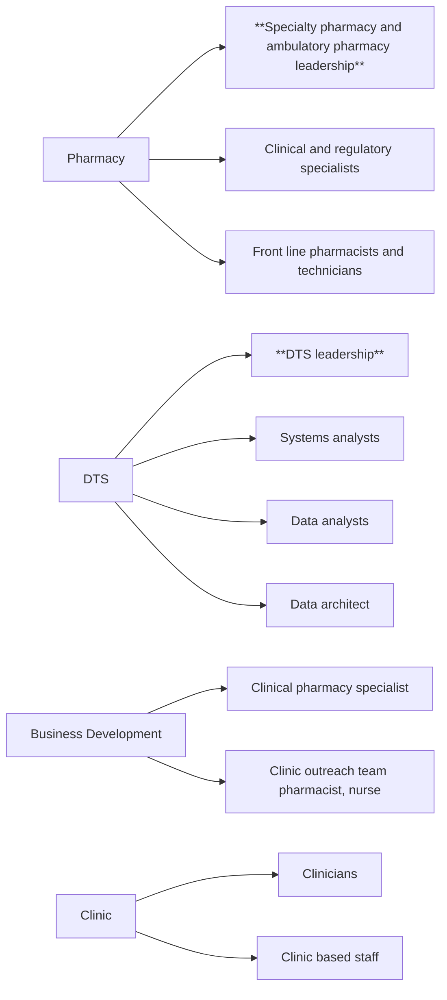

Yale New Haven Health logo

# Implementation of a new patient case management system at a large health system specialty pharmacy

Kimhouy Tong, PharmD, BCPS; Terri Sue Rubino, PharmD; Andrew Cadorette, PharmD;

Michele Riccardi, PharmD, BCPS; Sarah E. Wright, PharmD; BCACP; Vincent Do, PharmD, BCPS, BCTXP; Vinay Sawant, RPh, MBA

## Background

* Outpatient Pharmacy Services (OPS) at Yale New Haven Health is a health system specialty pharmacy (HSSP) that serves patients on specialty medications across a wide spectrum of clinical areas.

* To manage current and planned growth, OPS transitioned from an in-house electronic health record (EHR) documentation platform to Epic Systems’ new case management application Compass Rose.

## Objective

* Implement a new patient management application that facilitates care across a broad scope of specialty conditions, medications, and services with minimal disruption to patient care.

## Methods

* Champions were identified from leaders within ambulatory and specialty pharmacy, prior authorization and medication assistance teams, and the YNHH information technology team, Digital and Technology Solutions (DTS) (Figure 1).

* Workgroups co-led by DTS and pharmacy created new technology infrastructure, workflows, documentation templates, reports, and education to meet project deliverables and timelines (Table 1).

* Project health and escalated issues were reported weekly to project champions (Figure 1, bold).

* Dispensing efficiency (number of specialty medication dispenses per 100 refill outreach calls), call center efficiency (speed of answer and abandonment rate), and customer service complaints were used to assess disruptions to patient care.

* Utilization of quality management tools and documentation of clinical care were measured to evaluate impacts of Compass Rose on potential to improve clinical patient management program.

## Results

Table 1. Project Milestone Timeline

| Project Milestone                                | Target Time to Completion | Target Completion | Actual Completion |
| ------------------------------------------------ | ------------------------- | ----------------- | ----------------- |
| Project Kick Off                                 | \~                        | August 2022       | August 2022       |
| Core Compass Rose Build and Workflow             | 12 weeks                  | December 2022     | December 2022     |
| Complete Compass Rose Build and Workflow         | 6 weeks                   | January 2023      | January 2023      |
| Initial validation                               | 3 weeks                   | December 2022     | December 2022     |
| Large scale validation                           | 4 weeks                   | February 2023     | February 2023     |
| Training curriculum development                  | 8 weeks                   | February 2023     | **March 2023**    |
| Superuser training                               | 1 week                    | February 2023     | **March 2023**    |
| End User Training                                | 4 weeks                   | March 2023        | **May 2023**      |
| Clinic Education                                 | 4 weeks                   | March 2023        | **April 2023**    |
| Conversion Run Through                           | 4 weeks                   | March 2023        | **April 2023**    |
| Compass Rose Subproject: Non-specialty Workflow¹ | 4 weeks                   | April 2023        | April 2023        |
| Go-Live                                          | 8 months (from Kick Off)  | April 2023        | **May 2023**      |

**Bold**= delayed deliverable

Figure 2. Dispensing efficiency

Monthly Comparison of Specialty Dispenses

| Month    | 2022  | 2023   |
| -------- | ----- | ------ |
| January  | 43.35 | 58.59  |
| February | 42.58 | 50.15  |
| March    | 39.32 | 50.45  |
| April    | 50.58 | 74.33  |
| May      | 54.10 | 109.68 |
| June     | 54.44 | 113.18 |

Figure 3. Call Center Efficiency

Speed of Answer- Quarterly Comparison

| Quarter | Speed of Answer (%) |
| ------- | ------------------- |
| Q1      | 27.96               |
| Q2      | -102.31             |
| Q3      | -130.24             |

Abandonment Rate- Quarterly Comparison

| Quarter | Abandonment Rate (%) |
| ------- | -------------------- |
| Q1      | 20.75                |
| Q2      | -62.35               |
| Q3      | -56.15               |

Table 2. Quality Assurance Measurements

| Quality Assurance Metric                               | Pre-Implementation | Post-Implementation |
| ------------------------------------------------------ | ------------------ | ------------------- |
| Clinical audits (n per month)                          | 10                 | 10                  |
| Regulatory audits (n per month)                        |                    | 30                  |
| Clinical interventions documented (n per 100 patients) | 19.25              | 28.87               |
| Customer complaints (n per 1000 specialty dispenses)   | 1.49               | 2.32                |

Figure 1. Key Stakeholders Identified During Project Planning

## Discussion

* Documentation for non-specialty medications was streamlined through implementation of a new workflow outside of Compass Rose prior to its implementation.1

* Compass Rose may have contributed to observed post-implementation increases in dispensing efficiency, independent of staffing volume (Figure 2).

* Compass Rose implementation may have contributed in part to improvements in call center efficiency in FY2023 Q2 and Q3 relative to FY2022 (Figure 3).

* The observed increase in customer service complaints may be confounded by a concomitant influx in newly hired staff and an initiative to increase deliveries by mail over courier (Table 2).

* The new system was designed to support more efficient and specific auditing, thereby leading to a four-fold total increase in regulatory and clinical quality assurance audits (Table 2).

* Transition from i-Vent to Medication Therapy Problem (MTP) documentation workflow in Compass Rose increased volume of documented clinical interventions (Table 2).

## Conclusion

* Implementation of the new case management application contributed to increased operational efficiency, eased barriers to clinical documentation, and improved clinical and regulatory oversight.

## Barriers/Limitations

* Project benefitted from resources of large health system with integrated EHR and dispensing system.

* Additional time was allocated for training based on feedback from front line staff.3

## Future Directions

* Enhancements to reduce duplicate documentation in Compass Rose and the dispensing system.

* Evaluation of patient and provider complaints pre and post Compass Rose implementation.

* Creation of quality assurance tools to guide clinical, regulatory, and operational adherence.

## References

1. DelVecchio M et al. Development of a workflow to manage non-specialty medications at a specialty pharmacy. Poster presented at: NASP Annual Meeting & Expo, Sept 18-21, 2023; Grapevine, TX.

2. Riccardi M et al. Developing a disease state specific patient management program at an integrated health system specialty pharmacy. Poster presented at: NASP Annual Meeting & Expo, Sept 18-21, 2023; Grapevine, TX.

3. Wright S et al. Education and evaluation strategies to implement a new care management documentation system in a health system specialty pharmacy. Poster presented at: NASP Annual Meeting & Expo, Sept 18-21, 2023; Grapevine, TX.

## Acknowledgements

* Many thanks to YNHH project champions and workgroup leads (Mitch DelVecchio, Bisni Narayanan, Robin Cullen, Alijah Kosarko, Jessi Bootle, Marie Renauer, Chris Hausser, Sean Damon, Phil Sicoli, Lena DeVietro, Kimberly Tynik); the pharmacists in the call center of Outpatient Pharmacy Services at Yale New Haven Health, and external consultants (Jessica Noble, OSU; Dickson Yeh) for their contributions to this project.

The authors of this presentation have nothing to disclose concerning possible financial or personal relationships with commercial entities that may have a direct or indirect interest in the subject matter of this presentation.

NASP Annual Meeting & Expo 2023. September 18-21, 2023

