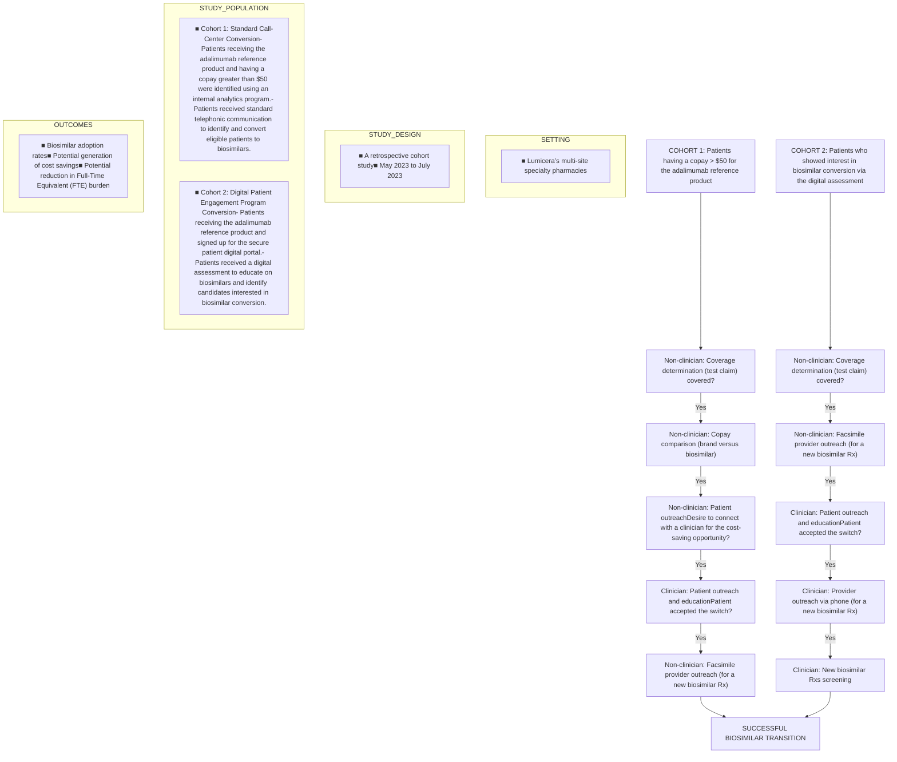

Lumicera Health Services logo

# Digital Patient Engagement and Improved Biosimilar Adoption Outcomes in Specialty Pharmacy

Georgina N Masoud, RPh, MS; Miranda Fortier, PharmD, Chelsea Hustad, PharmD, CSP, Eric Huckins, PharmD, CSP, MBA; Albert Wertheimer, PhD, MBA; Collin Wolf, PharmD

NASP logo

## BACKGROUND

* The projected US savings to the health care system from biosimilars are estimated to be $38.4 billion from 2021 to 2025.1

* The adalimumab reference product is one of the largest contributors to biologic drug spend hitting $21 billion in global sales in 2021.1

* In 2023, nine adalimumab biosimilars launched into the market resulting in additional treatment options for patients and the potential for cost savings.

* Lumicera Health Services recognized this opportunity by implementing an adalimumab biosimilar adoption program using two different methodologies: conventional telephone outreach and digital patient engagement.

## OBJECTIVES

To analyze the impact of different patient engagement strategies on biosimilar adoption and pharmacy operation outcomes within a specialty pharmacy setting.

## METHODS

## LIMITATIONS

* The study design was retrospective and limited in duration.

* Small patient sample size which may have impacted the conclusions drawn from the study.

## CONCLUSIONS

The results of this study demonstrated that the deployment of digital patient engagement services within a specialty pharmacy adalimumab biosimilar adoption program, achieved significantly higher biosimilar conversion rates resulting in cost savings and a decrease in FTE burden compared to conventional non-digital methods.

## FUTURE DIRECTIONS

* Expand this initiative to other adalimumab biosimilars within the formulary.

* Leverage the digital engagement services to other biologic biosimilars coming in the pipeline.

## RESULTS

The successful biosimilar transition at the cohort level was normalized to 100 patients and data were summarized in the tables below:

### TABLE 1: NORMALIZED CONVERSIONS & SAVINGS COMPARED BETWEEN COHORT 1 & 2

| Metric                                                    | Cohort 1 | Cohort 2 | Improvement |
| --------------------------------------------------------- | -------- | -------- | ----------- |
| Conversions (out of 100)                                  | 3.6      | 7.5      | 109.5%      |
| Savings (High Concentration adalimumab reference product) | $433,498 | $910,711 | $477,212    |
| Savings (Low Concentration adalimumab reference product)  | $156,509 | $328,800 | $172,291    |
| Cost per Conversion                                       | $194.80  | $77.60   | 251%        |
| Estimated FTE Time Savings (scaled to 100 patients)       | -        | $11,720  | -           |

Results are based on actual WAC prices for Adalimumab Reference Product and Biosimilar for High and Low concentrations.

### TABLE 2: DIFFERENCES IN LABOR & FTE COST FOR SUCCESSFUL CONVERSION TO BIOSIMILARS BETWEEN COHORT 1 & 2

| Group                | Cohort 1  | Cohort 2  | Improvement |
| -------------------- | --------- | --------- | ----------- |
| Low-Cost Labor       | 9.3 Hours | 1.1 Hours | 8.2 Hours   |
| High-Cost Labor      | 0.3 Hours | 0.9 Hours | -0.6 Hours  |
| Total Labor          | 9.6 Hours | 2 Hours   | 7.6 Hours   |
| Total FTE/Conversion | $194.80   | $77.60    | $117.2      |

FTE Costs for Lower-Cost labor are estimated to be $18.17/Hr and $63.84/Hr for Higher-Cost labor.2,3

### FIGURE 1: COHORT 2 OUTCOMES (NORMALIZED TO 100 PATIENTS)

| Metric                                   | Value    |
| ---------------------------------------- | -------- |
| Increase in Patient Conversion Rates     | 109.5%   |
| FTE Savings Labor Hours / 100 Patients   | 760      |
| Projected Net Cost Savings (HC, ADA-REF) | $477,212 |
| Projected Net Cost Savings (LC, ADA-REF) | $172,291 |

\*ADA-REF: adalimumab reference product; HC: high concentration; LC: low concentration.

## REFERENCES

1. Mulcahy A, Buttorff C, Finegold K, et al. Projected US Savings From Biosimilars, 2021-2025. The American Journal of Managed Care. 2022;28(7). https://www.ajmc.com/view/projected-us-savings-from-biosimilars-2021-2025

2. "Pharmacy Technicians". Occupational Outlook Handbook, Bureau of Labor Statistics, Department of Labor, United States, 6 Sep. 2023, www.bls.gov/ooh/healthcare/pharmacy-technicians.htm

3. "Pharmacists". Occupational Outlook Handbook, Bureau of Labor Statistics, Department of Labor, United States, 6 Sep. 2023, www.bls.gov/ooh/healthcare/pharmacists.htm

© 2024 Lumicera Health Services. All rights reserved.

