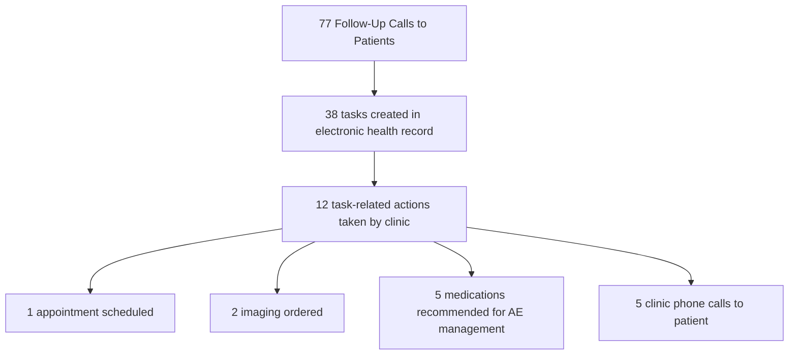

# Oral oncology adverse event reporting via text messaging integrative collaboration between specialty pharmacy and oncology provider clinic

Optum logo

Meagan Pawlak, PharmD | Jessica Vinckier, PharmD CSP | Lauren Lawler, PharmD, CSP | Helen Kim, PharmD, BCGP
Jessica Lynton, PharmD, BCPS | Marwa Noureldin, PharmD, PhD, MS, BCGP | Kelly Mathews, PharmD, CSP

## Background

* The cost of care in cancer treatment increases substantially when adverse effects (AEs) occur.1,2

* Lack of system integration between specialty pharmacies and clinics presents collaboration and data challenges.3

* In specialty pharmacy, reliance on phone and fax communication related to oncology patient AEs is potentially inefficient and ineffective.

* Additionally, reliance on phone calls limits the ability to connect with modern patients who increasingly prefer digital methods.4

* Optum Specialty Pharmacy, in collaboration with Optum Care Cancer Center, designed a pilot program with an objective to reduce AE severity via early intervention with pharmacist counseling and triage for medical management.

## Goals

* Reduce potentially preventable ER or hospitalization via proactive screening, adverse effect counseling, and triage via real time electronic health record task communication.

* Mitigate the worsening of an AE while also providing the opportunity for in-clinic management and influence decision making regarding emergency care and subsequent inpatient care decisions.

## Methods

* Design:

  * Eligible patients were offered option to complete AE screening via text messages

    * Tool: PRO-CTCAE5

    * Frequency: baseline and biweekly for 10 weeks total

    * AEs assessed: nausea, vomiting, constipation, diarrhea, pain, shortness of breath, cough, and fatigue

    * Program was offered by phone for those not able to text

  * Interventions: specialty pharmacy team triaged patients based on severity of AE reported

    * Low severity: phone consultation by specialty pharmacist

    * Moderate to high severity: triage to the clinic plus addition of task to oncologist in partner clinic electronic health record (EHR)

* Inclusion Criteria: new to therapy with oral oncolytic from Optum Care Cancer Center and dispensed by Optum Specialty Pharmacy

* Timeframe: 90-day enrollment period

* Statistical analysis: descriptive statistics were used to report patient demographics, surveys completed, and healthcare cost avoidance

## Results

| Table 1. Demographics | Table 1. Demographics |
| --------------------- | --------------------- |
| Eligible patients, n  | 143                   |
| Enrolled patients, n  | 35                    |
| Text enrollment, %    | 77                    |
| Female sex, %         | 47                    |
| Average age, years    | 66                    |

## Figure 1. Adverse Events

| AE Severity Grade                          | Number reported |
| ------------------------------------------ | --------------- |
| Grade 4 (life-threatening or disabling AE) | 18              |
| Grade 3 (severe and undesirable AE)        | 24              |
| Grade 2 (moderate AE)                      | 33              |
| Grade 1 (mild AE)                          | 20              |
| Grade 0 (no AE or within normal limits)    | 13              |

## Figure 2. Task Outcomes

## Table 2. Potential Healthcare Cost Avoidance6

| Adverse Event Managed | Potential Healthcare Cost Avoidance per Incident | Total Potential Healthcare Cost Avoidance during Pilot |
| --------------------- | ------------------------------------------------ | ------------------------------------------------------ |
| Pain                  | $4,756                                           | $14,268                                                |
| Cough                 | $576                                             | $576                                                   |
| Nausea                | $1,965                                           | $1,965                                                 |
| Diarrhea              | $3,265                                           | $3,265                                                 |
| Nausea and Vomiting   | $2,860                                           | $2,860                                                 |
|                       |                                                  | $22,934                                                |

## Discussion

* This novel pilot successfully enrolled 24.5% of eligible patients with 31% of participants reporting moderate to high severity AEs.

* Of EHR tasks entered, 31.6% resulted in actions taken by the clinic allowing for early intervention and potential healthcare cost avoidance.

* Total potential cost avoidance during the pilot period was $22,934.

* Expansion of this program to a larger patient population over a longer period could result is significant cost avoidance.

## Limitations

* This short time period and small sample size represents a partnership with only one pharmacy and one clinic. Results may vary in other settings.

## References

1. Liang L. Costs of Emergency Department Visits in the United States, 2017. HCUP Statistical Brief #268. December 2020. Agency for Healthcare Research and Quality, Rockville, MD. Accessed April 27, 2023. www.hcup-us.ahrq.gov/reports/statbriefs/sb268-ED-Costs-2017.pdf

2. Roemer M. Cancer-Related Hospitalizations for Adults, 2017. HCUP Statistical Brief #270. January 2021. Agency for Healthcare Research and Quality, Rockville, MD. Accessed April 27, 2023. www.hcupus.ahrq.gov/reports/statbriefs/sb270-Cancer-Hospitalizations-Adults-2017.pdf

3. Managed Healthcare Executive. Healthcare leaders say lack of communication between prescribers, pharmacists is biggest issue in medication management. Accessed August 16, 2023. https://www.managedhealthcareexecutive.com/view/healthcare-leaders-say-lack-of-communication-between-prescribers-pharmacists-is-biggest-issue-in-medication-management

4. Business Wire. 80% of patients prefer to use digital communications to interact with healthcare providers and brands. Published December 7, 2021. Accessed August 16, 2023. https://www.businesswire.com/news/home/20211207005040/en/80-of-Patients-Prefer-to-Use-Digital-Communication-to-Interact-with-Healthcare-Providers-and-Brands

5. Patient-Reported Outcomes version of the Common Terminology Criteria for Adverse Events (PRO-CTCAE®). National Cancer Institute: Division of Cancer Control and Population Sciences. Accessed August 14, 2023. https://healthcaredelivery.cancer.gov/pro-ctcae/.

6. Wong W, Yim YM, Kim A, Cloutier M, Gauthier-Loiselle M, Gagnon-Sanschagrin P, Guerin A. Assessment of costs associated with adverse events in patients with cancer. PLoS One. 2018 Apr 13;13(4):e0196007. doi: 10.1371/journal.pone.0196007. PMID: 29652926; PMCID: PMC5898735.

## Disclosures / Contact

* Authors of this presentation have the following to disclose: Authors are employees of Optum

* For more information please contact: Optum Specialty Pharmacy

* Email: optumspecialtyheor@optum.com

Optum is a registered trademark of Optum, Inc. in the U.S. and other jurisdictions. All other brand or product names are the property of their respective owners. Because we are continuously improving our products and services, Optum reserves the right to change specifications without prior notice. Optum is an equal opportunity employer. © 2023 Optum, Inc. All rights reserved.

