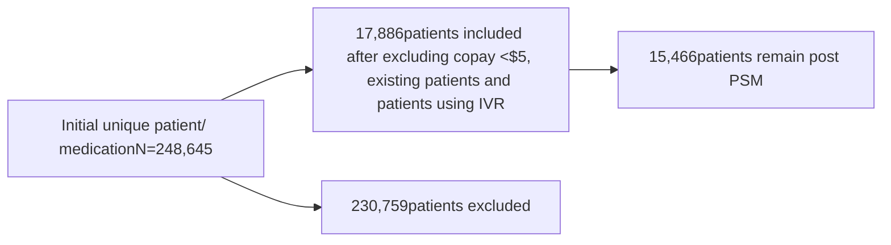

# Impact of automated financial assistance enrollment at a large mail-order specialty pharmacy on patient outcomes

Optum logo

Lillianne Do, Pharm. D.; Austin Sadnick, MBA; Melissa Mays; Clarisse Purvis, Ph.D.; Kelly Mathews, Pharm. D., CSP; Jessica Lynton, Pharm. D., BCPS, CSP
Optum Specialty Pharmacy

## Background

Specialty drugs are more expensive than their traditional counterparts, often costing more than $2,000 per month per patient.1 The consequence of prescription abandonment can lead to increased disease complications, frequent hospital visits, higher mortality rates, and overall cost to health care system increases. Financial assistance from manufacturer copay cards and coupons, foundation grants, and nonprofit organizations help patients cover the cost of prescription drugs, lower abandonment rates, and improve adherence.2,3

OSIQ technology automatically matches eligible patients with financial assistance, copay cards, and various financial resources to reduce out of pocket (OOP) medication copay costs. Benefits are precisely verified to help achieve the best financial scenario for every patient.

The purpose of this study is to determine if oncology, multiple sclerosis (MS), and autoimmune (AI) patients who get automated financial assistance through the Optum Savings IQ (OSIQ) program will have improved clinical outcomes compared to pre-implementation OSIQ.

## Endpoints

**Primary endpoints**: Average OOP copay, turnaround time
**Secondary endpoint**: Patient assistance department (PAD) hold times

## Methods

**Study design**: Single-centered, retrospective cohort study (pre/post-implementation of OSIQ) at Optum Specialty Pharmacy

**Inclusion criteria**: Patients of all ages who are treatment naïve as identified based on a new prescription within the last 365 days for oncology, MS and AI disease states

**Exclusion criteria**: Patients with an OOP copay after primary insurance of < $5, patients utilizing the interactive voice response (IVR) systems to process prescription refills, and patients whose health plans prohibit copay cards for nonpreferred products

**Data source**: Data was collected from the pharmacy prescription processing system

**Study time frame**: Pre-OSIQ cohort: 1/1/2023 – 3/31/2023
Post-OSIQ implementation: 1/1/2024 – 3/31/2024

**Statistical analysis**: Descriptive statistics were used to report patient demographics, Propensity score matching (PSM), Wilcoxon signed rank and Chi-square test with alpha set at 0.05 with a p-value of < 0.05 considered statistically significant

## Results

Figure 1. Pre-implementation OSIQ cohort 1/1/23 - 3/31/23
Mediations included were from oncology, MS and AI disease states

Figure 1. Post-implementation OSIQ cohort 1/1/24 - 3/31/24

Table 1. Baseline demographics for study population, post PSM

| Variables         | Control (N=15,466) | Participant (N=15,466) |
| ----------------- | ------------------ | ---------------------- |
| Median age, years | 53.2               | 53.0                   |
| Gender            |                    |                        |
| Male, N (%)       | 6,696 (43.3)       | 6,696 (43.3)           |
| Female, N (%)     | 8,202 (56.7)       | 8,202 (56.7)           |

Table 2. Median turnaround time and patient out-of-pocket copay per fill

|                              | Control (N=15,466) | Participant (N=15,466) | P-value  |
| ---------------------------- | ------------------ | ---------------------- | -------- |
| Copay per fill, $            | 12.4               | 5.0                    | < 0.0001 |
| Turnaround time (TAT), hours | 112.0 (4.7 days)   | 118.0 (4.9 days)       | 0.56     |

Table 3. Median PAD hold time

|                      | Control (N=586) | Participant (N=600) | P-value  |
| -------------------- | --------------- | ------------------- | -------- |
| PAD hold time, hours | 41.0            | 23.0                | < 0.0001 |

## Discussion

* OSIQ utilization had a significant reduction in copay per fill without delaying time to care
* The cumulative out-of-pocket copay cost per fill was 60% less for patients engaged in the OSIQ versus those who were not
* Patient's PAD hold time was reduced by 44%, showing more efficiency in financial assistance processing

## Strengths

Sample size for primary endpoint met power

## Limitations

* Single-center design conducted within a large specialty mail-order pharmacy may restrict the generalizability of findings to other health care settings
* Focus on patients with only oncology, MS and autoimmune disease states may not be applicable to broader patient cohorts with different medical conditions and copay financial assistance resources
* Short duration of 3 months limited the ability to calculate additional patient outcomes such as adherence and persistence over a longer follow-up period

## Future considerations

1. Assess conversion rate for new prescriptions

2. Examine the long-term impact of reduced patient costs on patient outcomes, such as adherence, persistence and total cost of care

## References

1. Inman, Ashley. “The Difference between Specialty and Non-Specialty Drugs.” Truveris, 22 Aug. 2023, truveris.com/difference-between-specialty-drug/.

2. Drugchannelsinstitute. (n.d.). https://drugchannelsinstitute.com/files/Fein-Gill-Long-Asembia2018-FINAL.pdf

3. Key trends in US specialty pharmacy. (n.d.-b). https://www.certara.com/app/uploads/2021/01/Key-Trends-in-U.S.pdf

4. Hung, Anna, et al. (2021). Impact of financial medication assistance on medication adherence: a systematic review. Journal of Managed Care & Specialty Pharmacy, 27(7), 924–935. https://doi.org/10.18553/jmcp.2021.27.7.924

5. Kane SP. Sample Size Calculator. ClinCalc: https://clincalc.com/stats/samplesize.aspx. Updated July 24, 2019. Accessed October 19, 2023.

## Disclosures/contact

Authors of this presentation have the following to disclose: Nothing to disclose
For more information, please contact Optum Specialty Pharmacy at optumspecialtyheor@optum.com

QR code

© 2024 Optum, Inc. All Rights Reserved. WF14415792-C_240815

