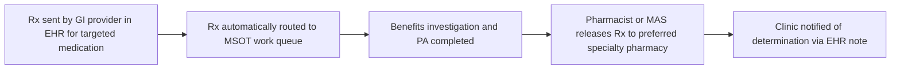

# IMPACT OF MULTI-STEP ORDER TRANSMITTAL IN AN INFLAMMATORY BOWEL DISEASE CLINIC Atrium Health Wake Forest Baptist logo

Caroline Hammond, PharmD; Alyssa Stewart, PharmD, BCACP, CSP, CPP; Kathy Bricker, PharmD, BCPS, DPLA; Jennifer Young, PharmD, BCPS, CSP; Kyle Hansen, PharmD, MS, BCPS, CSP

## BACKGROUND

**GI Clinic and Disease State**

* A clinical pharmacist and medication access specialist (MAS) are embedded in the Atrium Health Wake Forest Baptist (AHWFB) GI clinic to provide comprehensive medication access services to patients using either the internal or an external specialty pharmacy.

* The clinic serves a variety of disease states including inflammatory bowel disease (IBD). Treatment of IBD often necessitates specialty medications, specifically small molecule drugs or biologics.1, 2

**Prior Authorizations (PA)**

* Specialty medications frequently require a PA, which delays the start of treatment and adds complexity for office administration.3

## OBJECTIVE

Evaluate the impact of MSOT implementation on medication access in an IBD Clinic

## METHODS

* IRB approved, retrospective cohort study at an academic medical center

* Inclusion criteria: prescriptions for a targeted medication which required a new PA during the following timeframes

    - Pre-MSOT: May 1, 2021 to November 1, 2021

    - Post-MSOT: May 1, 2022 to November 1, 2022

* Exclusion criteria: uninsured patients, prescriptions requiring a renewal PA

* Primary Endpoint: PA turnaround time (number of days from prescribing to PA submission)

* Secondary Endpoints: Time to internal specialty pharmacy dispense, internal prescription capture rate, and time to PA determination

## MSOT WORKFLOW

* MSOT is a functionality in the electronic health record (EHR) programmed to target select medications by generic name and prescribing department.

* The MSOT algorithm routes targeted prescriptions to a work queue in the EHR monitored by the embedded clinical pharmacist and pharmacy technician.

## RESULTS

**Time to PA Submission**

| Category         | Number of Days |
| ---------------- | -------------- |
| Pre-MSOT (n=68)  | 6.2            |
| Post-MSOT (n=76) | 1.3            |

**Time to PA Determination**

| Category         | Number of Days |
| ---------------- | -------------- |
| Pre-MSOT (n=68)  | 8.9            |
| Post-MSOT (n=76) | 3.8            |

**Time to Internal Specialty Pharmacy Dispense**

| Group                                | Pre-MSOT    | Post-MSOT   |
| ------------------------------------ | ----------- | ----------- |
| Total                                | 40.7 (n=27) | 26.4 (n=34) |
| Only Ustekinumab & Risankizumab      | 72.5 (n=13) | 51.4 (n=14) |
| Excluding Ustekinumab & Risankizumab | 11.6 (n=14) | 9.0 (n=20)  |

## DISCUSSION

* Implementing the MSOT workflow reduced PA turnaround time by transitioning a communication intensive reactive process to a real-time prospective process, without additional pharmacy staff.

* Internal prescription capture rate was not significantly higher post-MSOT (43% vs 48%). Regardless, this is impactful by enhancing patient care and increasing specialty pharmacy revenue.

* Ustekinumab and risankizumab require an IV induction (not routed to MSOT) prior to SQ maintenance therapy (routed to MSOT). Prescriptions for both phases of therapy are often sent simultaneously. This causes a delay between prescribing the maintenance dose and internal pharmacy dispensing. Despite this delay, the time to internal pharmacy dispense decreased.

* Anecdotally, the MSOT workflow improved pharmacists’ ability to make proactive clinical interventions. Additional information is needed to quantify this impact.

## CONCLUSION

Implementing the MSOT workflow lead to improvements in PA turnaround time and offers workflow enhancements which improve quality of patient care.

## REFERENCES

1. Gastroenterology. 2020 Apr;158(5), 1450–1461.

2. Gastroenterology. 2021 Jun;160(7), 2496–2508.

3. AMA Prior Authorization (PA) physician survey. American Medical Association. <u>https://www.ama-assn.org/system/files/prior-authorization-survey.pdf</u>. Published 2022

Disclosures: All authors of this presentation have nothing to disclose concerning possible financial or personal relationships with commercial entities that may have a direct or indirect interest in the subject matter of this presentation.

Acknowledgements: Thank you to our embedded MAS, Alicia Burton, CPhT, for her contributions to the success of MSOT.

