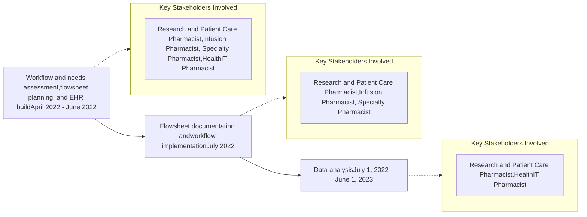
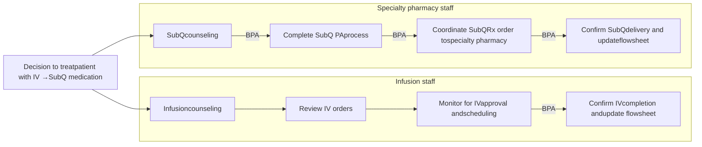

# Implementation of a flowsheet to track patients with inflammatory bowel disease initiating a biologic with complex dosing regimens

Jessica Fann, PharmD; Miranda Kozlicki, PharmD; Patrick Nichols, PharmD, CSP; Bridget Lynch, PharmD, MS; Kristen Whelchel, PharmD, CSP
Vanderbilt Specialty Pharmacy, Vanderbilt Health System

VANDERBILT UNIVERSITY MEDICAL CENTER logo

## CONCLUSION

Using an EHR flowsheet to manage patients with IBD treated with biologic medications requiring an induction IV dose(s) before starting SubQ maintenance injections provided a streamlined approach to patient management and care coordination between infusion and specialty pharmacy staff.

## PURPOSE

To implement a transparent, streamlined process of managing patients with IBD receiving specialty medications that have complex dosing regimens with IV to SubQ routes of administration.

## METHODS

Single-center Quality Improvement Project

## Workflow

\* BPA, best practice advisory

## RESULTS

### Patient Characteristics (n=230)

|                           | n (%)       |
| ------------------------- | ----------- |
| Age, years (median (IQR)) | 43 (30, 53) |
| Gender                    |             |
| Female                    | 135 (59)    |
| Male                      | 95 (41)     |
| Race                      |             |
| White                     | 202 (88)    |
| Black                     | 16 (7)      |
| Unknown                   | 8 (3)       |
| Other                     | 4 (2)       |
| Insurance                 |             |
| Commercial                | 185 (80)    |
| Medicare                  | 25 (11)     |
| Medicaid                  | 14 (6)      |
| Other                     | 6 (3)       |
| Medication                |             |
| risankizumab-rzaa         | 129 (56)    |
| ustekinumab               | 101 (44)    |

### Flowsheet

| INFUSION TO INJECTION | INFUSION TO INJECTION            |                     |
| --------------------- | -------------------------------- | ------------------- |
| INFUSION              | Medication                       | Medication          |
|                       | Provider                         | VUMC Provider       |
|                       | Referral date                    | 4/20/2023           |
|                       | Medication counseling date       | 4/20/2023           |
|                       | Infusion Status Update           | Dose 3 administered |
|                       | Infusion counseling date         | 4/20/2023           |
|                       | Therapy plan entered date        | 4/20/2023           |
|                       | Infusion approval date           | 5/2/2023            |
|                       | Number of infusions              | 3                   |
|                       | Infusion center 1                | VUMC                |
|                       | Infusion 1 scheduled date        | 5/18/2023           |
|                       | Infusion 1 administered date     | 5/18/2023           |
|                       | Infusion center 2                | VUMC                |
|                       | Infusion 2 scheduled date        | 6/15/2023           |
|                       | Infusion 2 administered date     | 6/15/2023           |
|                       | Infusion center 3                | VUMC                |
|                       | Infusion 3 scheduled date        | 7/13/2023           |
|                       | Infusion 3 administered date     | 7/18/2023           |
|                       | Was a Non-VUMC Infusion          | No                  |
| SUBQ                  | Specialty Pharmacy               | VSP                 |
|                       | Injection PA approval date       | 6/21/2023           |
|                       | Injection PA expiration date     | 6/21/2026           |
|                       | Injection RX sent date           | 7/19/2023           |
|                       | Due date of first injection      | 8/15/2023           |
|                       | Injection RX copay card obtained | Yes                 |

### Best Practice Alerts (BPA)

| Infusion Pharmacist BPA trigger                                  | Infusion Pharmacist BPA timing\*\*                                                                        | Infusion Pharmacist Purpose                                        |
| -------------------------------------------------------------------- | ------------------------------------------------------------------------------------------------------------- | ---------------------------------------------------------------------- |
| Date 1st infusion received is documented in the flowsheet            | 2 weeks after trigger                                                                                         | Prompts follow-up with patient about infusion tolerability             |
| Specialty Pharmacist                                                 |                                                                                                               |                                                                        |
| \\\*Date 1st or 2nd infusion received is documented in the flowsheet | Immediately (8 weeks until first SubQ dose is due)                                                            | Prompts initiation of SubQ PA process                                  |
| \\\*Date 3rd infusion received is documented in the flowsheet        | Immediately (4 weeks until first SubQ dose is due)                                                            | Prompts SubQ RX request                                                |
| \\\*Date 1st or 2nd infusion received is documented in the flowsheet | 6 weeks after trigger Only fires if a SubQ RX has not been ordered (2 weeks until first SubQ dose is due) | Prompts investigation into SubQ PA approval status and SubQ RX request |

\*BPA triggers are based on medication
\*\*BPAs are sent through Inbasket messaging in the EHR

### Pharmacist Satisfaction (n=5)

Pharmacist icon = 1 respondent

#### Overall satisfaction

| 0 | 1 | 2 | 3 | 4 | 5 | 6 | 7 | 8 | 9 | 10 |
| - | - | - | - | - | - | - | - | - | - | -- |
| 0 | 0 | 0 | 0 | 0 | 0 | 0 | 0 | 1 | 1 | 3  |

Strongly dissatisfied  EMPTY Strongly satisfied

#### Ease of use satisfaction

| 0 | 1 | 2 | 3 | 4 | 5 | 6 | 7 | 8 | 9 | 10 |
| - | - | - | - | - | - | - | - | - | - | -- |
| 0 | 0 | 0 | 0 | 0 | 0 | 0 | 0 | 1 | 2 | 2  |

Strongly dissatisfied  EMPTY Strongly satisfied

#### Pharmacist Quotes

> "The flowsheet reduces gaps in care and streamlines the workflow."

> "It has helped prevent any patient from slipping through the cracks and ensures they obtain their medication on time."

### Patient Monitoring Dashboard

| Days from Referral to First Infusion | Count of Patients |
| ------------------------------------ | ----------------- |
| 31                                   | 3                 |
| 30                                   | 6                 |
| 29                                   | 10                |
| 28                                   | 23                |
| 27                                   | 17                |
| 26                                   | 7                 |
| 25                                   | 8                 |
| 24                                   | 8                 |
| 23                                   | 5                 |
| 22                                   | 10                |
| 21                                   | 21                |
| 20                                   | 9                 |
| 19                                   | 11                |
| 18                                   | 12                |
| 17                                   | 10                |
| 16                                   | 9                 |
| 15                                   | 9                 |
| 14                                   | 19                |
| 13                                   | 9                 |
| 12                                   | 5                 |
| 11                                   | 8                 |
| 10                                   | 6                 |
| 9                                    | 6                 |

| Infusion Center | Count |
| --------------- | ----- |
| Non-VUMC        | 3     |
| VUMC            | 227   |

| Medication   | Count |
| ------------ | ----- |
| Medication A | 129   |
| Medication B | 101   |

| Year of Ref. | Month of R. | Week 1 | Week 2 | Week 3 | Week 4 | Week 5 |
| ------------ | ----------- | ------ | ------ | ------ | ------ | ------ |
| 2022         | July        | 1      | 4      |        |        |        |
|              | August      | 14     | 19     |        |        |        |
|              | September   | 8      | 4      |        |        |        |
|              | October     | 9      |        |        |        |        |
|              | November    | 6      |        |        |        |        |
|              | December    |        | 6      |        |        |        |
| 2023         | January     | 4      |        |        |        |        |
|              | February    |        | 4      |        |        |        |
|              | March       | 10     | 6      |        |        |        |
|              | April       |        | 9      | 6      |        |        |
|              | May         |        |        |        |        | 5      |

EHR, electronic health record; IBD, inflammatory bowel disease; IQR, interquartile range; IV, intravenous; PA, prior authorization; Rx, prescription; SubQ, subcutaneous; VSP, Vanderbilt Specialty Pharmacy; VUMC, Vanderbilt University Medical Center

