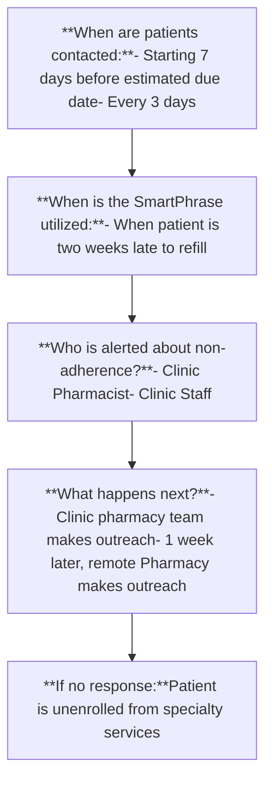

Dartmouth Health logo

# Improving Medication Adherence Documentation for Specialty Pharmacy Patients

Hayley O’Rourke, PharmD, CSP, Kaitlin Ciaramitaro, PharmD, MHA, CSP, Ryan H. Lackey, PharmD
Dartmouth-Hitchcock Medical Center

## Background

* Medication non-adherence is expensive to both patients and the healthcare system, costing billions of dollars yearly in the United States alone.1

* To improve specialty medication adherence, proper non-adherence documentation (referred to as SmartPhrase) must be completed in the electronic medical record (EMR).

* By improving non-adherence documentation and educating patients on the importance of compliance, we aim to improve patient outcomes and decrease cost burden on the patient and healthcare system.2,3

## Objectives

* Primary Outcome: Improve medication non-adherence documentation by increasing utilization of the specialty non-adherence SmartPhrase within the EMR

* Secondary Outcome: Show improvement in Medication Possession Ratio (MPR) for specialty pharmacy patients4

$$ MPR = \frac{\text{(Sum of Days Supply in Time Frame)}}{\text{(Number of Days in Time Frame)}} \times 100 $$

## Methods

* Identified lack of adherence documentation in EMR
    - Reviewed patients with low MRP

* Non-adherence SmartPhrase and workflow created
    - Standardized workflow with a goal of increasing utilization

* Surveyed staff for feedback on updated SmartPhrase and workflow

* Completed retrospective review of SmartPhrase usage
    - Only utilized 57 times from 5/1/22 to 9/30/22

* Implemented SmartPhrase workflow on 10/10/22
    - Monitored usage over next 5 months

## Workflow

## Results

### Primary Outcome

| Month | Pre-Implementation | Post-Implementation |
| ----- | ------------------ | ------------------- |
| 1     | 8                  | 17                  |
| 2     | 5                  | 29                  |
| 3     | 8                  | 28                  |
| 4     | 10                 | 21                  |
| 5     | 22                 | 23                  |

**Primary Outcome: Percent increase in utilization of the Specialty Non-Adherence SmartPhrase**
* Utilized 57 times before workflow implementation
* Sample size of 826 patients with MRP <95%
* Utilized 122 times after workflow implementation
* Sample size of 993 patients with an MRP <95%
* 78.12 % increase in workflow utilization

**Secondary Outcome: Improvement in the average MPR for specialty pharmacy patients**
* Post implementation, the average MPR was 93.15%
* This shows an increase of 0.49% from pre implementation (92.66%)

### Reporting Outcomes

| Metric                              | yes   | no    |
| ----------------------------------- | ----- | ----- |
| Procedure Followed Correctly        | 95.9  | 4.1   |
| Patients Re-Captured                | 58.49 | 44.51 |
| Patients Discharged appropriately   | 72.31 | 27.69 |
| Clinic Team/RPH Response            | 77.05 | 22.95 |
| Clinic intervention upon re-capture | 76.42 | 23.58 |

**Reporting Outcomes:**
* Collected to track usage of new workflow
* Demonstrated proper usage of workflow and benefit of pharmacy intervention

## Discussion

**Impact:**
* Recaptured 58.49% of specialty pharmacy patients
* 76.42% were recaptured due to clinic team intervention

**Outcomes:**
* Notable increase in patient follow-up after standardizing the adherence documentation and workflow
* Increase in interdepartmental communication regarding patient care
* Non-adherence SmartPhrase procedure was successful and implemented into departmental policy
* An MPR increase of 0.49% demonstrates positive impact this standardized practice has on adherence

**Future:**
* Standardized adherence documentation and workflow will continue to facilitate patient follow-up for improved adherence

## Conclusion

Improving adherence leads to favorable outcomes and long-term healthcare savings. Increase in patient follow-up was seen after standardizing the adherence documentation and workflow. The goal MPR of 95% was not reached likely due to the time restraints of the study. However, an MPR increase of 0.49% demonstrates positive impact this standardized practice has on adherence. Standardized adherence documentation and workflow will continue to facilitate patient follow-up for improved adherence.

## References

1) Timothy Aungst, P. (2018). Does Nonadherence Really Cost the Health Care System $300 Billion Annually?

2) Andrea Neiman et al. (2022). Improving Medication Adherence for Chronic Disease Management — Innovations and Opportunities

3) American Society of Health-System Pharmacists. (2020). Accreditation Standards for Specialty Pharmacy Practice.

4) Scott Canfield et al. (2019) Navigating the Wild West of Medication Adherence Reporting in Specialty Pharmacy

### Disclosure

Authors of this presentation have nothing to disclose concerning possible financial or personal relationships with commercial entities that may have a direct or indirect interest in the subject matter of this presentation.

