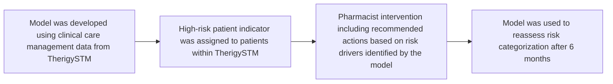

# Implementing targeted adherence outreach for patients with rheumatoid arthritis identified as at risk of nonadherence cps logo

Lily Duong, PharmD; Courtney Smith, PharmD; Josh Bastian, MBA; Pranit Kedarisetty; Khang Tran, PharmD; Abbas Dewji, PharmD; Andrew Wash, PharmD, PhD; Ana I. Lopez-Medina, PharmD, PhD

## BACKGROUND

* Uncontrolled rheumatoid arthritis (RA) poses a significant risk for patients, including increased disease activity and healthcare costs.<sup>1</sup>

* Although a variety of treatment options are available, medication nonadherence remains an issue.<sup>1</sup>

* Traditional strategies to address nonadherence are reactive in that they wait for nonadherence to occur before intervening.

* Specialty pharmacies provide clinical care to patients and gather data that can be used to predict outcomes like nonadherence, allowing pharmacists to proactively perform interventions to promote adherence rather than correct nonadherence.

## OBJECTIVES

To demonstrate the implementation of targeted adherence outreach based on a risk stratification model used to predict nonadherence risk in patients with RA in a specialty pharmacy setting.

## METHODS

### Study Design

This prospective pilot study was conducted at Penn State Health Specialty Pharmacy from September 2023 to February 2024.

### Model Development

A model was developed using clinical care management data from TherigySTM℠ specialty pharmacy management platform to stratify patients based on their risk of nonadherence.

### Adherence Interventions

Patients’ risk categories were added to their profile in TherigySTM along with potential recommended actions. Pharmacists then performed clinical calls to speak with the patient about adherence. Patients’ risk was then re-assessed six months later for changes in their risk category.

### Figure 1: Pilot Study Workflow



## RESULTS

| Table 1: Patient Demographics and Risk Categorization (n=57) | Table 1: Patient Demographics and Risk Categorization (n=57) |
| ------------------------------------------------------------ | ------------------------------------------------------------ |
| Female sex, n (%)                                            | 49 (86)                                                      |
| Age, mean \[SD]                                              | 55.6 \[13.4]                                                 |
| Baseline Risk, n (%)                                         |                                                              |
| Medium                                                       | 16 (28)                                                      |
| High                                                         | 41 (72)                                                      |
| Follow-up Risk, n (%)                                        |                                                              |
| Low                                                          | 20 (49)                                                      |
| Medium                                                       | 3 (7)                                                        |
| High                                                         | 12 (29)                                                      |
| Unable to reach                                              | 6 (15)                                                       |


### Figure 2: Patient Selection

```mermaid
graph TD
    A[69 patients eligible] --> B[57 patients enrolled]
    B --> C[16 (28%) patient identified as medium risk for nonadherence]
    B --> D[41 (72%) patients identified as high risk for nonadherence]
    D --> E[35 (85%) high-risk patients had a clinical call completed]
```

### Figure 3: Identified Patient Problems

| Problem Category             | Percentage (%) |
| ---------------------------- | -------------- |
| Sub-optimal regimen          | 3              |
| Medication monitoring needed | 28             |
| Adherence barriers           | 26             |
| Nonadherence                 | 24             |
| Adverse drug event           | 19             |


**85%** of high-risk patients had at least one clinical call completed during the 6-month follow-up

**97%** of pharmacist interventions were successful in their recommendations to patients, physicians, and other providers

## RESULTS

### Figure 4: Change in Risk Categorization at 6 Months

| Baseline: High-Risk (41) | 6-Month Follow-up |
| ------------------------ | ----------------- |
| High-Risk                | 12                |
| Medium-Risk              | 3                 |
| Low-Risk                 | 20                |
| Unknown                  | 6                 |


**66%** of high-risk patients had a reduction in risk levels at the 6-month follow-up

## DISCUSSION & CONCLUSION

### Benefits of Early Identification of High-Risk Patients

* This novel pilot study demonstrates a system that flags at-risk patients with the potential benefits of identifying patients at risk for nonadherence, potentially before nonadherence even occurs.

* By providing tailored recommendations based on patient-specific factors, specialty pharmacists can play a significant role in addressing and preventing nonadherence in patients with RA.

### Next Steps

* Future studies should focus on determining the impact of the model in other disease states as well as the direct impact on adherence using inferential statistics.

## REFERENCES

1. Chowdhury T, Dutta J, Noel P, et al. An Overview on Causes of Nonadherence in the Treatment of Rheumatoid Arthritis: Its Effect on Mortality and Ways to Improve Adherence. Cureus. 2022;14(4):e24520. Published 2022 Apr 27. doi:10.7759/cureus.24520


