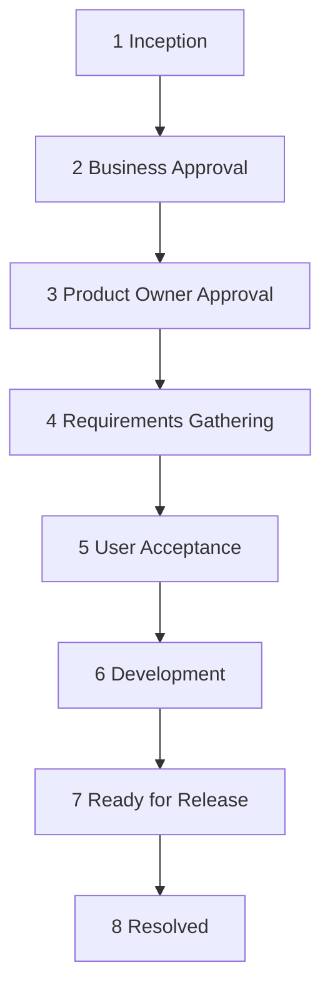
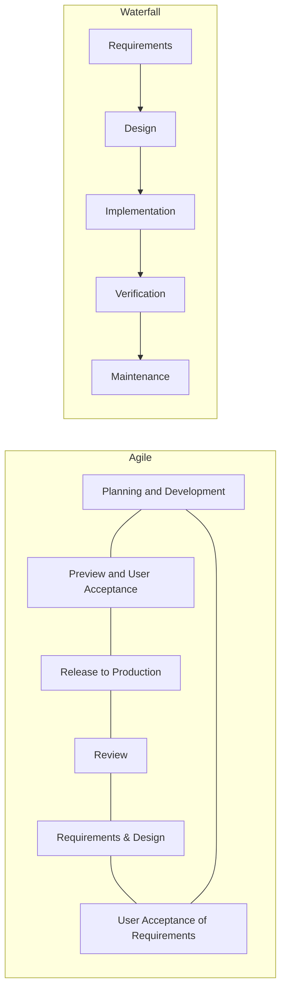

PANTHERx Rare Pharmacy logo

# The Implementation of Agile Methodology and its Impact on the Healthcare and Pharmacy Technology Industry

Dr. Samuel Aronson, PharmD; Dr. Kathleen Dawson, PharmD, MBA; Dr. Rami Chammas, PharmD, MPBA;
Dr. Douglas Gebhard, PharmD, MBA; Dr. Gordon Vanscoy, PharmD, MBA, CACP

## Background

Agile Methodology is quickly becoming the industry standard in software development as the most efficient and practical way to provide the most utility to the end user. The Agile Development methodology advocates for the value of individuals and interactions over processes and tools, and for the ability to respond quickly to change rather than adhere to a set plan. It is not surprising that agile methodology has become more prominent in the healthcare space, as these principles align closely with the shift that healthcare has made towards a more patient-centered care approach. In contrast to plan-driven methodologies like Waterfall, where the software development process is carried out in sequential and ordered phases, Agile entails collaborative development in incremental iterations. Agile enables managing frequently changed user requirements, focuses on delivering more value to patients and providers, and considers the social and technological changes in the IT industry and in general. Specifically, within specialty pharmacy, the need for patient-centered technology has grown and Agile development has allowed us to develop patient portals and other solutions to improve patient care.

## Objective

The objective of this systematic review is to highlight why Agile Methodology became the industry standard for project management in the software development industry, and how it can add value to healthcare technology, with a specific focus on pharmacy clinical and dispensing platforms. This research will review the general principles of Agile Methodology and discuss the strengths and weaknesses of utilizing this type of project management in healthcare technology development projects. It will also discuss the implementation of Agile Methodology in several case-based examples in the healthcare field.

## Methods

Researchers completed a systematic review of peer reviewed articles published from 2001-2022 to evaluate the use cases of implementing Agile Methodology in healthcare and its impacts on patient care and accessibility. Any articles that discussed Agile Methodology outside of the healthcare industry were excluded along with any articles that discussed patient care unrelated to technological development or access. Key points were taken from each article and combined into a composite overview of findings to create a summary of results for the review.

## Results

Through the analysis of over 100 articles related to Agile Methodology and its uses in the healthcare space, we found that Agile has been a successful methodology for developing healthcare software. This can be seen in numerous cases throughout the healthcare industry, but is primarily seen in three major areas: management dashboards for complex scenarios arising from the COVID-19 Pandemic, patient/caregiver-centered portals, and medical devices.

As discussed by Barroca Filho and colleagues, the State Health Department of Rio Grande do Norte were able to rapidly develop a dashboard for the management of ICU beds during the coronavirus outbreak2. To complete this development task, the team utilized Agile Methodology, and was able to complete approximately 70% of the system's requirements within a single, one-week sprint2. By the end of October 2020, over 200 government agents and clinical unit staff had utilized this system, meaning that its development using Agile was crucial in supporting this health department during the early stages of the coronavirus pandemic.

Isabel Voigt and colleagues utilized Agile Methodology to design a digital patient portal for patients with multiple sclerosis, and the use of Agile allowed the portal to be tailored specifically to the patient experience3. Agile co-design of user-centered healthcare applications has allowed such applications to provide much more utility to patients than applications developed under other methodologies such as Waterfall1. Healthcare applications have almost always been designed with the patient in mind, but the use of Agile positions the user (patient) at the center of the development process, and often involves patients directly in development to create a better product1. Additionally, the use of Agile Methodology to develop these patient-centric portals also improved clinician interactions and patient participation1.

Agile has also become the methodology of choice for developing medical device software, as discussed by Ozcan-Top and McCaffery4. Despite concerns around regulatory requirements, Gerber and colleagues found that the use of Agile for their medical device software helped improve the code quality of their devices, reduced release cycle time and field defects, and increased the number of delivered features1,5.

Though these three healthcare industry sectors, and their resultant products, have seen a profound impact as a result of the Agile Methodology, other sectors have also begun benefitting from the useful framework. In particular, telemedicine1 and clinical decision support systems1,6 have begun to see improvements thanks to the implementation of Agile in their development processes. Agile has shown that it can overcome barriers and concerns around safety-critical environments and improve software development in a variety of healthcare settings, strengthening relationships between healthcare and software development professionals1, and improving care for patients. Additionally, AstraZeneca has implemented Agile across several aspects of their company, including specialty pharmacy, and found that it lead to substantial financial benefits in the first year, significantly faster time-to-value delivery (40-60% increases), reduced team sizes (cost reduction of 25-40%), and improve quality of outputs over previous solutions.

## Conclusion

Based on the positive impact that Agile Methodology can have on patient-centric systems development, as well as the results of this analysis, we believe that Agile is currently the ideal software development methodology for creating healthcare systems. The Agile values align closely with the philosophy of patient-centric care, which has become the most prominent school of thought for healthcare in the recent past. Agile allows for nimbleness, responsiveness, and unmatched adaptability in the development of healthcare software, which is critical to the success of healthcare applications. This importance will only grow as technology continues to become increasingly integrated within our healthcare systems. Further, while Agile has already become the prominent development methodology in the software development industry, we believe it has even more room to grow in healthcare, and particularly the rare and complex disease space. Complex disease patients experience unique and challenging situations that cannot be ignored, and it is important that our healthcare tools and applications are adaptable and can aide us in providing care to these patients. We would expect that the adoption of Agile methodology into the development of all healthcare applications will increase the overall quality of the applications, and subsequently the care we can provide with them.

### Agile vs Waterfall

