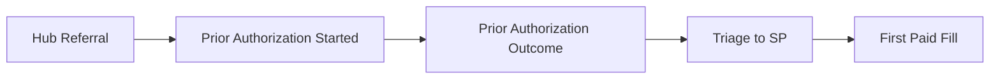

ClaritasRx logo

# Harnessing Insights: An In-Depth Look at Benchmarking in Specialty Channels and Patient Services

## Introduction

This piece highlights the indispensable role of benchmarking as a crucial tool for gauging market performance and pinpointing brand enhancement opportunities. The Benchmarking tool provides immediate access to precise comparisons with similar brands, keeping pace with market trends. This type of information is frequently absent or very challenging to get for most life sciences companies, especially concerning rival brands.

Our research exposes the amplified efficiency of benchmarking when intertwined with robust specialty channel and patient service data, yielding noteworthy results, lucid performance indicators, and implementable findings.

## Background

This assessment underscores the crucial role of benchmarking in assessing market performance and enhancing brand indicators like fill rate and HUB operations (time to fill). In the context of life sciences companies, where comparative data and competition are sparse, benchmarking provides an accurate and timely instrument for analyzing market trends.

## Objective

The aim is to evaluate the effectiveness of merging real-time benchmarking with detailed information on specialty channels and patient services. The results are interpreted through clear performance metrics such as fill rates and time to fill, in order to ascertain whether it can offer valuable guidance for brands.

## Description

* This study focuses on identifying previously untapped levels of benchmarking data in relation to competitive brands in the industry. It aims to facilitate a better understanding of fill rates, time to fill, and HUB performance comparisons. The importance of benchmarking is underlined by the potential for eliminating obstacles and enhancing care coordination for treatment access.

* The study further delves into how to benchmark brands effectively, with actionable strategies to capture more patients to access your brand. The study will provide insight into one’s brand standing compared to the rest of the industry, comparing patient demographics with competitive brands and ways to optimize patient service strategies for better healthcare professional (HCP) and payer engagement.

## Methods

* *Benchmarking*: Analyzed proprietary data and scrutinized “Brand Basket Market Data-Immunology” to ascertain average market fill rates.

### Case Study: Patient Journey Market Data - Chronic Skin Diseases

Variation in fill rate across specialty therapies illustrates influence around patient access and pull through

| Brand      | Fill Rate (%) |
| ---------- | ------------- |
| Brand 10   | 65            |
| Brand 1437 | 60            |
| Brand 1449 | 52            |
| Brand 832  | 50            |
| Brand 1380 | 48            |
| Your Brand | 42            |
| Brand 1433 | 40            |
| Brand 1379 | 38            |
| Brand 1383 | 37            |
| Brand 1445 | 36            |
| Brand 11   | 35            |
| Brand 1439 | 34            |

* *Efficiency Assessment of HUBs*: Analysis of the operational performance of HUBs in the sphere of rare disease. The review focused on three distinct therapies for benchmark comparison, and the efficiency was assessed through important KPIs such as fill rates (medication fill) and time-to-fill (the average duration required to ready a prescription for pick-up/delivery).

### Case: Rare Disease HUB Performance Benchmarking
Mean Turnaround Days

| Therapeutic Area   | Days from Referral to PA (%) | Days for PA Turnaround (%) | Days from PA Outcome to First Paid Shipment (%) |
| ------------------ | ---------------------------- | -------------------------- | ----------------------------------------------- |
| Therapeutic Area C | 15                           | 35                         | 0                                               |
| Therapeutic Area B | 12                           | 18                         | 80                                              |
| Therapeutic Area A | 10                           | 45                         | 55                                              |

## Results

* Utilizing Benchmarks aids brands in enhancing fill rates and HUB performance.

* This approach highlights Benchmarks as an effective tool for evaluating brand performance and market activity. A close examination of market trends like fill rate and HUB Performance can yield insights into fill rates and delivery periods, aiding brands in aligning with productive HUBs.

* A detailed analysis of 91,500* treatment plans can shed light on customer accessibility and brand ranking comparisons. Case studies on benchmarking can provide vital KPI comparisons for effective alignment.

* The number of PA days, turnover rates, and results can differ in rare disease treatments.

* The HUB Performance benchmarking case study provided insightful results that facilitated the comparison of crucial KPIs. These include fill rates and the time it takes to fill orders. Once brands comprehend these metrics, especially fill rates and Turnaround time (TAT), they are able to formulate strategies that are in sync with top-performing HUBs, enabling precise and effective strategic planning. The findings from our HUB Performance benchmarking case study have facilitated the comparison of vital KPIs, including fill rates and time-to-fill ratios. Once brands comprehend these fill rates and TATs, they can formulate strategies that mirror the successful patterns of high-performing HUBs, and subsequently activate these strategies accurately. The following snapshot uncovers that, even within the therapeutic areas for rare diseases, the Days from Referral to PA can range from 10 to 25. Additionally, the Days required for the PA turnaround can fluctuate between 12 and 40, and the Days from PA outcomes to the first paid shipment can stretch from 25 to 115.

## Conclusion

The use of Benchmarks is instrumental in spurring brand growth by escalating fill rates and optimizing HUB efficiency. It acts as a critical gauge for market dynamics, enhances key metrics, and keeps track of shifting trends. This evaluation offers novel viewpoints on sector benchmarking, broadening understanding of fill rates, time to fill, and providing comparative data.

QR code

## Scan here to learn more

https://www.claritasrx.com/solutions/competitive-insights/

\*Data as of 9/7/2021, N > 91,500 unique treatment courses

