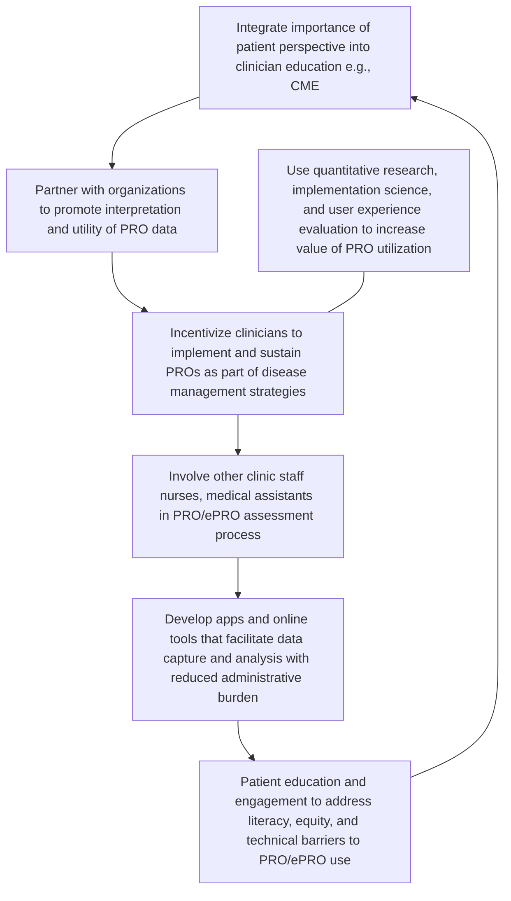

# Optimizing Use of Electronic Patient-Reported Outcomes (ePROs) to Assess and Improve Disease Management

Merrion Buckley1, Jeffrey R Curtis2, Jason Lynn1, Hesper Chan3, Mary E. Bowler3, Jeff Vawter3, Michele L. Arling3, Cate Polacek3, Jasmin Thompson3, Maisha Freeman1, Elizabeth Maclean1, Rena Coll1, Saira Haque1

1Pfizer, Inc., New York, NY, USA; 2University of Alabama at Birmingham, Division of Clinical Immunology and Rheumatology, Birmingham, AL, USA; 3Premier, Inc., Charlotte, NC, USA

## Background

* The value of patient-centric healthcare including use of patient-reported outcomes (PROs) to understand the patient’s perspective in disease management is well-recognized1

* PROs, which may also be captured electronically (ePROs), are defined as “any report of the status of a patient’s health condition that comes directly from the patient, without interpretation of the patient’s response by a clinician or anyone else”2

* PROs/ePROs complement clinical measures and can help clinicians understand symptoms and health status (e.g., pain, function, and quality of life) from the patient’s perspective overall and in response to changes in treatment

- Especially relevant for informing the shared decision-making process,3 as discordance exists between patient and clinician perspectives of disease activity, risk-benefit assessment, information gaps, and clinician-patient communication4-6

* Treat-to-target (T2T) is the recommended disease-management strategy for rheumatoid arthritis (RA)7,8

- Proactive strategy in which a specific treatment target is defined and tight disease control (e.g., frequent visits and treatment adjustments) is applied until the target is reached

- Relies on shared decision-making between clinician and patient that includes use of PROs/ePROs

* As PROs have been typically collected at in-person visits, a gap in determining how to integrate them into clinical practice may have been amplified by recent uptake in telehealth and virtual management of chronic conditions

## Objectives

* To characterize current perspectives, challenges, and solutions for implementation and sustainable use of ePROs using RA as an example that can be extrapolated to patients with other diseases

## Methods

* A targeted literature review was conducted in November and December 2022 for relevant articles published from November 2014 to December 2022 on use of PROs/ePROs in T2T RA care in ambulatory or outpatient settings in the United States

* PubMed and EBSCO/CINAHL databases were searched, abstracts were reviewed, and for those considered of potential relevance, full text articles were obtained for further review

- From the final set of articles identified as relevant, we extracted emerging concepts and perspectives to develop a discussion guide for a focus group

* A moderated focus group was convened virtually in March 2023 to discuss challenges and solutions for implementing PRO/ePRO-based T2T strategies in clinical settings for RA care

- The multidisciplinary panel consisted of rheumatologist physician assistant; infusion services director; population health leader; rheumatologist/innovation leader; clinic office manager; clinical informaticist/pharmacist; rheumatologist/immunologist; and subject matter expert (rheumatologist with extensive experience on efficacy, comparative effectiveness, and safety of treatments for RA)

- The focus group moderator asked questions based on findings from the targeted literature review to stimulate qualitative discussion on challenges and potential solutions for sustainable implementation of T2T and use of PROs/ePROs

## Results

### Targeted Literature Review

* Twenty articles were identified as relevant for inclusion in the targeted literature review9-28

* A major key finding was that while the importance of patient involvement in T2T was recognized, there was poor long-term adherence to T2T strategies in part due to lack of focus on patient-centered care and low patient involvement in decision-making

* Specific challenges to implementation and sustainability of PRO-based T2T included

- Patient concerns including function, quality of life, and work productivity may not be considered12,14,18

- Time burden associated with data capture and processing17,18

- Need for tools and integrated techniques to improve data capture and processing in clinical practice12,13,15

* ePROs may be of potential use in overcoming these challenges, and while multiple mechanisms for collecting ePRO data were identified, a major challenge was low patient and healthcare provider (HCP) commitment to collect and use such data18

## Results, cont.

### Focus Group

* Participants noted that while T2T is valued for its benefits for improving patient outcomes and increasing efficiency and productivity of clinic workflows, out-of-office mechanisms (i.e., remote monitoring) to support key elements of T2T strategies are infrequently used

* All focus group participants except one reported using various elements of T2T care including PROs/ePROs (Figure 1A)

- The most commonly used elements were assessment of clinical disease activity and longitudinal follow-up based on disease activity

- The Routine Assessment of Patient Index 3 (RAPID3) was the most commonly collected PRO (Figure 1B)

Figure 1. Use of treat-to-target management strategy elements (A) and patient-reported outcome measures (B) for patients with rheumatoid arthritis

| A) Use of treat-to-target management strategy elements                                                                 | A) Use of treat-to-target management strategy elements |
| ---------------------------------------------------------------------------------------------------------------------- | ------------------------------------------------------ |
| Shared decision on treatment target                                                                                    | 5                                                      |
| Disease activity assessment                                                                                            | 5                                                      |
| Patient-reported outcome/electronic reported outcome assessment                                                        | 5                                                      |
| Patient assessment/follow-up at intervals based on disease activity                                                    | 5                                                      |
| Therapy adjustment every 3 months if target not reached                                                                | 4                                                      |
| None                                                                                                                   | 0                                                      |
| B) Patient-reported outcome measures                                                                                   |                                                        |
| Routine Assessment of Patient Index Data 3 (RAPID3)                                                                    | 5                                                      |
| Health Assessment Questionnaire (HAQ)                                                                                  | 2                                                      |
| Multidimensional Health Assessment Questionnaire (MDHAQ)                                                               | 1                                                      |
| Other (Health Assessment Questionnaire II \[HAQ-II]; Patient Activity Scale II \[PAS II]; fatigue visual analog scale) | 1                                                      |
| None                                                                                                                   | 0                                                      |

* The focus group confirmed and expanded on the challenges for sustainable PRO/ePRO use identified in the targeted literature review, and suggested potential solutions (Table 1)

- Participants agreed that these challenges contribute to the dis-incentivization of clinicians, which was considered the main barrier to implementing sustainable PRO-based T2T strategies in clinical settings

- ePROs, especially if combined with remote therapeutic monitoring, were thought to be useful for visit triage (i.e., to accelerate or postpone already scheduled clinic visits)

- An essential solution for enhancing systematic use of PROs/ePROs was integrating these measures into electronic health records to reduce manual data entry

Table 1. Challenges to and potential solutions for sustainable use of patient-reported outcomes (PROs)

| KEY CHALLENGES                                                                                                                                     | POTENTIAL SOLUTIONS                                                                                                                                                                                                                                                                                                                                                |
| -------------------------------------------------------------------------------------------------------------------------------------------------- | ------------------------------------------------------------------------------------------------------------------------------------------------------------------------------------------------------------------------------------------------------------------------------------------------------------------------------------------------------------------ |
| Lack of incentive; clinicians may not recognize the value of collecting PRO data or may be unsure how to use such data in clinical decision-making | \* Including PROs in a clinical decision tree can contribute to shared decision-making process \* Document PRO data collection processes and protocols so that new staff are consistently trained on process, expectations, and commitment to quality \* Reinforcement of value and benefits of PROs to complement clinical assessment of disease activity |
| Uncertainty regarding which PROs to use for comprehensive assessment while limiting clinician workload                                             | \* Generate evidence-based consensus on appropriate PROs - PROs that assess disease activity/impact, e.g., RAPID3 in RA (other PROs as appropriate in other diseases) - PROs that assess outcomes considered important by patients (e.g., quality of life, daily function, work productivity)                                                              |
| Clinicians and healthcare staff have limited bandwidth to collect and process more patient information                                             | \* Patients complete surveys in electronic health record portal or via touchscreen in office during check-in \* Patients use remote treatment monitoring to report PROs between visits                                                                                                                                                                         |
| Lack of information technology integration makes collection and documentation of ePROs difficult and inconsistent                                  | \* Integrate ePROs into electronic health records so that clinicians do not have to perform manual data entry \* Reduce documentation burden of electronic health records, which should center around safety and treatment outcomes rather than billing or medicolegal issues                                                                                  |
| Patients may not understand value of completing ePROs                                                                                              | \* Healthcare providers communicate to patients how and why the collected data are being used, and incorporate the collected data into the shared decision-making process \* Clinical office staff to “champion” ePROs and ensure patients complete questionnaires                                                                                             |

* Clinical decision trees that incorporate concomitant use of a PRO/ePRO and a clinical measure of disease activity were suggested for establishing the value of the patient perspective in the joint decision-making process

* An example of such a decision tree was proposed for RA using the RAPID3, which assesses physical abilities, pain, and overall health)29 as the PRO/ePRO and the CDAI (Clinical Disease Activity Index, which includes tender and swollen joint counts as well as patient and clinician global assessments)30 as the measure of clinical disease activity (Figure 2)

- When the PRO and clinical measure are concordant and show poor outcomes, there is agreement for treatment escalation

- Concordance between the PRO and clinical measure that shows good outcomes indicates that current therapy can be maintained

- Poor outcomes on the PRO in the presence of a good outcome on the clinical measure likely indicates a secondary process that may need to be identified and resolved

- A good outcome on the PRO in the presence of a poor outcome on the clinical measure may indicate that the patient doesn't understand that their disease is still active

Figure 2. Example of incorporating a patient-reported outcome (e.g., RAPID3) into a shared decision-making treat-to target strategy for rheumatoid arthritis.

| Routine Assessment of Patient Index Data 3 (RAPID3)                                                                                                                                                                                | Clinical decision tree for shared decision-making       | Clinical Disease Activity Index (CDAI)                                                                                                                                                              | Clinical Disease Activity Index (CDAI)         |
| ---------------------------------------------------------------------------------------------------------------------------------------------------------------------------------------------------------------------------------- | ------------------------------------------------------- | --------------------------------------------------------------------------------------------------------------------------------------------------------------------------------------------------- | ---------------------------------------------- |
| \* Quick and easy \* Integrates into workflow \* Convenient point-of-care assessment \* Patients can complete in the office while waiting or before office visit \* Can be uploaded into electronic health records |                                                         | \* Integrates into workflow \* Objective clinician assessment that includes tender and swollen joint counts \* Point-of-care assessment \* Treatment decisions can be made in real time |                                                |
| Concordant increase in RAPID3 + CDAI                                                                                                                                                                                               | Concordant decrease in RAPID3 + CDAI                    | High RAPID3 + low CDAI                                                                                                                                                                              | Low RAPID3 + high CDAI                         |
| Provider and patient agree to escalate treatment                                                                                                                                                                                   | Provider and patient agree no need for treatment change | Potential secondary issue that needs to be evaluated                                                                                                                                                | Potential misunderstanding of disease activity |

* With clinician incentivization as the central barrier, actionable solutions could be codified into a proposed inter-related cycle of next steps that would help healthcare providers, patients, and other stakeholders understand the utility of a PRO-based management strategy and more fully engage with it (Figure 3)

- Top-down and bottom-up steps include emphasizing the importance of the patient perspective in continuing education activities, and involving all clinic staff in gathering and scoring PRO assessments and explaining their utility to patients.

- Parallel steps, with healthcare provider-focused steps on one side and steps oriented toward enhancing patient-engagement on the other side, would help all stakeholders understand the need for including PROs/ePROs as part of patient care, thereby providing additional support and clinician incentivization

Figure 3. Suggested multistep program with a central goal of incentivizing clinicians for implementing and sustaining patient-reported outcomes in clinical care

CME, continuing medical education; ePRO, electronic patient-reported outcome; PRO, patient-reported outcomes

## Conclusions

* Based on literature review and focus group discussion, challenges for PRO implementation were clinician time restrictions, information technology integration issues, and lack of patient understanding

* Next steps in overcoming these challenges should include

- Education and incentivization of clinicians and patients to integrate PROs/ePROs into workflows

- Partnering with professional medical organizations to support use and interpretation of PROs/ePROs

- Development of apps and online tools that can facilitate data capture while reducing the administrative burden

* The proposed solutions to the identified challenges and the multistep incentivization program have general implications beyond RA, and can be extrapolated for enhancing the patient-centric approach to management of a variety of diseases

* These findings also highlight an opportunity for specialty pharmacies to implement pathways and develop workflows for facilitating widespread adoption of ePROs to improve disease management and patient outcomes

## References

1. Weldring T, Smith SM. Patient-Reported Outcomes (PROs) and Patient-Reported Outcome Measures (PROMs). Health Serv Insights. 2013;6:61-68.

2. Food and Drug Administration. Guidance for Industry. Patient-Reported Outcome Measures: Use in Medical Product Development to Support Labeling Claims. 2009.

3. Bartlett SJ et al. Patient-reported outcomes in RA care improve patient communication, decision-making, satisfaction and confidence: qualitative results. Rheumatology (Oxford). 2020;59(7):1662-1670.

4. Gibofsky A et al. Comparison of patient and physician perspectives in the management of rheumatoid arthritis: results from global physician- and patient-based surveys. Health Qual Life Outcomes. 2018;16(1):211.

5. Hsiao B et al. Rheumatologist and Patient Mental Models for Treatment of Rheumatoid Arthritis Help Explain Low Treat-to Target Rates. ACR Open Rheumatol. 2022;4(8):700-710.

6. Wei W et al. The prevalence and types of discordance between physician perception and objective data from standardized measures of rheumatoid arthritis disease activity in real-world clinical practice in the US. BMC Rheumatol. 2019;3:25.

7. Fraenkel L et al. 2021 American College of Rheumatology Guideline for the Treatment of Rheumatoid Arthritis. Arthritis Care Res (Hoboken). 2021;73(7):924-939.

8. Smolen JS et al. EULAR recommendations for the management of rheumatoid arthritis with synthetic and biological disease-modifying antirheumatic drugs: 2022 update. Ann Rheum Dis. 2023;82(1):3-18.

9. Smolen JS et al. Treating rheumatoid arthritis to target: recommendations of an international task force. Ann Rheum Dis. 2010;69(4):631-637.

10. Singh JA et al. 2015 American College of Rheumatology Guideline for the Treatment of Rheumatoid Arthritis. Arthritis Rheumatol. 2016;68(1):1-26.

11. Aletaha D, Smolen JS. Diagnosis and Management of Rheumatoid Arthritis: A Review. JAMA. 2018;320(13):1360-1372.

12. Bacalao EJ et al. Standardizing and personalizing the treat to target (T2T) approach for rheumatoid arthritis using the Patient-Reported Outcomes Measurement Information System (PROMIS): baseline findings on patient-centered treatment priorities. Clin Rheumatol. 2017;36(8):1729-1736.

13. Bajaj P et al. Coupled Effect of Electronic Medical Record Modifications and Lean Six Sigma Methodology on Rheumatoid Arthritis Disease Activity Measurement and Treat-to-Target Outcomes. ACR Open Rheumatol. 2021;3(3):164-172.

14. Falzer PR. Treat-to-target and shared decision making in rheumatoid arthritis treatment: Is it feasible? Int J Rheum Dis. 2019;22(9):1706-1713.

15. Ford JA, Solomon DH. Challenges in Implementing Treat-to-Target Strategies in Rheumatology. Rheum Dis Clin North Am. 2019;45(1):101-112.

16. Markusse IM et al. Evaluating Adherence to a Treat-to-Target Protocol in Recent-Onset Rheumatoid Arthritis: Reasons for Compliance and Hesitation. Arthritis Care Res (Hoboken). 2016;68(4):446-453.

17. Ramiro S et al. Is treat-to-target really working in rheumatoid arthritis? a longitudinal analysis of a cohort of patients treated in daily practice (RA BIODAM). Ann Rheum Dis. 2020;79(4):453-459.

18. Sepriano A et al. Adherence to Treat-to-target Management in Rheumatoid Arthritis and Associated Factors: Data from the International RA BIODAM Cohort. J Rheumatol. 2020;47(6):809-819.

19. Smolen JS et al. Treating rheumatoid arthritis to target: 2014 update of the recommendations of an international task force. Ann Rheum Dis. 2016;75(1):3-15.

20. Aletaha D et al. Information technology concerning SDAI and CDAI. Clin Exp Rheumatol. 2016;34(5 Suppl 101):S45-S48.

21. Bingham CO et al. Use of daily electronic patient-reported outcome (PRO) diaries in randomized controlled trials for rheumatoid arthritis: rationale and implementation. Trials. 2019;20(1):182.

22. Colls J et al. Patient adherence with a smartphone app for patient-reported outcomes in rheumatoid arthritis. Rheumatology (Oxford). 2021;60(1):108-112.

23. Kuusalo L et al. Patient-reported outcomes as predictors of remission in early rheumatoid arthritis patients treated with tight control treat-to-target approach. Rheumatol Int. 2017;37(5):825-830.

24. Orbai AM, Bingham CO, 3rd. Patient reported outcomes in rheumatoid arthritis clinical trials. Curr Rheumatol Rep. 2015;17(4):28.

25. Subash M et al. The Development of the Rheumatology Informatics System for Effectiveness Learning Collaborative for Improving Patient-Reported Outcome Collection and Patient-Centered Communication in Adult Rheumatology. ACR Open Rheumatol. 2021;3(10):690-698.

26. Farley S et al. Nurse telephone education for promoting a treat-to-target approach in recently diagnosed rheumatoid arthritis patients: A pilot project. Musculoskeletal Care. 2019;17(1):156-160.

27. Ellrodt J et al. Satisfaction With a Virtual Learning Collaborative Aimed at Implementing Treat-to-Target in Rheumatoid Arthritis. J Clin Rheumatol. 2022;28(5):265-269.

28. Solomon DH et al. Implementing a Treat-to-Target Approach for Rheumatoid Arthritis During the COVID-19 Pandemic: Results of a Virtual Learning Collaborative Program. Arthritis Care Res (Hoboken). 2022;74(4):572-578.

29. Pincus T et al. RAPID3, an index to assess and monitor patients with rheumatoid arthritis, without formal joint counts: similar results to DAS28 and CDAI in clinical trials and clinical care. Rheum Dis Clin North Am. 2009;35(4):773-778, viii.

30. Aletaha D, Smolen J. The Simplified Disease Activity Index (SDAI) and the Clinical Disease Activity Index (CDAI): a review of their usefulness and validity in rheumatoid arthritis. Clin Exp Rheumatol. 2005;23(5 Suppl 39):S100-108.

Pfizer logo

Graphic element

Pfizer Confidential

