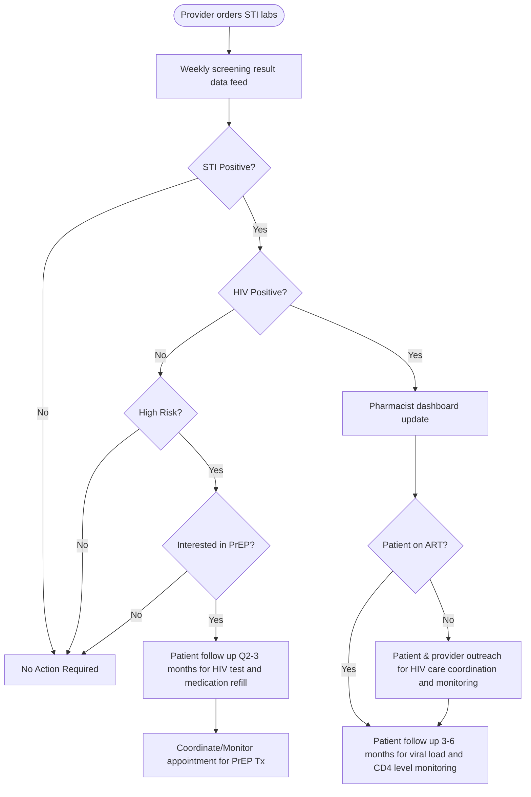

Clearway Health logo

# Optimizing HIV Pre-Exposure Prophylaxis Services in a Primary Care Settings: Pharmacist-Led Performance Improvement Program

Amanuel Kehasse, PharmD, PhD1
1Clearway Health

## Background

* Curbing the HIV epidemic requires prevention of new infections and the treatment of currently infected patients to achieve viral suppression and minimize transmission to others.

* Pharmacologic approach to HIV prevention involves the use of pre-exposure prophylaxis (PrEP) medications. Currently, there are three FDA approved PrEP medications and most are prescribed by infectious disease specialists. This limits access to PrEP therapy to only 30% of eligible patients in the US.

* Retrospective data analysis of Sexually Transmitted Infection (STI) screening lab results from January 1, 2023 to December 31, 2023 shows more than 50% of patients with positive result for STI (Gonorrhea, Chlamydia or Syphilis) did not have follow up HIV screening.

* Among those who tested positive for STI and negative for HIV, less than 3% of them were linked to PrEP therapy, leading to the development of a pharmacist-led performance improvement initiative.

* Engaging and supporting primary care physicians (PCPs) to provide PrEP services may help increase the identification of eligible patients and linkage to care.

* Our program design helps to identify high-risk patient populations, minimize attrition rate from treatment, and support patients and PCPs with medication access issues, therapy lab monitoring and medication refill needs.

## Objective

The purpose of this study is to evaluate the impact of a pharmacist-led system-wide STI screening and linkage to PrEP care in a primary care setting.

## Methodology

* This is a prospective observational descriptive study that aims to evaluate the impact of pharmacist-led system-wide STI screening and linkage to PrEP care at a primary care setting.

* We developed a weekly STI screening lab result data feed to a pharmacist monitored dashboard. The dashboard generates target lists for pharmacist intervention. Pharmacist ensures all screening labs are drawn, test results communicated to patients and eligible individuals are linked to PrEP care.

* Pharmacist ensures all patients on PrEP therapy do necessary lab tests every 2-3 months and renew their prescription only if they test negative for HIV.

* Descriptive data analysis will be used to compare screening rate and linkage to care, and persistence on PrEP therapy pre and post implementation of this program.

## Hypothesis

Pharmacist-led, clinical dashboard supported performance improvement initiative will lead to a higher rate of screening, minimize the attrition rate and improve linkage to PrEP care.

## Sexually Transmitted Infection Screening and Linkage to PrEP Care Workflow

### High Risk Patient Population

* HIV + Partner

* Men having sex with men

* IV drug use

* Multiple sexual partners

* HAD STI in the past 6 months

