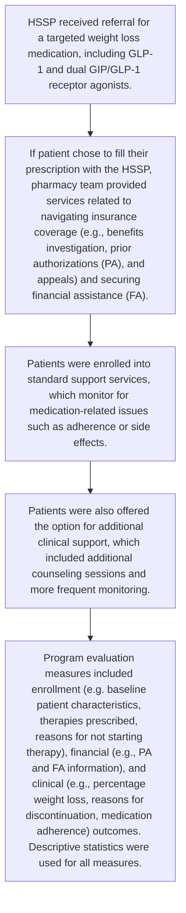

# Health-System Specialty Pharmacy Role in Managing Medications for Weight Loss in Patients Without Evidence of Type 2 Diabetes

cps logo

Andrew Wash, PharmD, PhD; Lauren Bryant, PharmD; Ana I. Lopez-Medina, PharmD, PhD; Carly Giavatto, PharmD; Casey Fitzpatrick, PharmD; Elizabeth Carpenter, PharmD; Nicholas McDonald, PharmD; Brandon Hardin, PharmD; Jessica Mourani, PharmD

## BACKGROUND

* Approximately three-quarters of U.S. adults are overweight or obese, which has significant economic costs and negative effects on personal health.1

* A comprehensive weight management plan may involve pharmacologic options; however, many of these medications have faced access issues related to drug shortages and high medication costs.2,3

* Health-system specialty pharmacy (HSSP) teams expertly navigate these areas and may have a role in the management of medications for weight loss.

## OBJECTIVES

To describe a novel HSSP-led chronic disease management (CDM) program for patients without evidence of type 2 diabetes who were prescribed a weight loss medication as part of a comprehensive weight management plan.

## METHODS

This descriptive study was conducted across 12 health systems nationwide with HSSP services managed by CPS Solutions, LLC that currently offer CDM programs for patients prescribed weight loss medication.

## Program Design and Evaluation

## RESULTS

| Patients prescribed ≥1 targeted therapy since program began (Fall 2021) | Patients actively on therapy (May 2024) | Patients initiated in 2024 |
| ----------------------------------------------------------------------- | --------------------------------------- | -------------------------- |
| 1,646                                                                   | 671                                     | 540                        |

**Table 1: Characteristics of Patients on Therapy**

| CHARACTERISTICS             | n=671        |
| --------------------------- | ------------ |
| Patient Sex, n(%)           |              |
| Female                      | 542 (81)     |
| Male                        | 129 (19)     |
| Age, mean \[SD]             | 46.9 \[11.9] |
| Weight Loss Therapy,\* n(%) |              |
| Semaglutide                 | 395 (59)     |
| Tirzepatide                 | 265 (39)     |
| Liraglutide                 | 11 (2)       |

\*Only FDA-approved products for weight management were included

**Figure 1: Reasons for Not Starting Therapy (n=662)**

| Reason                  | Percentage |
| ----------------------- | ---------- |
| Insurance Denial        | 39         |
| Formulary Restrictions  | 26         |
| Patient Choice          | 19         |
| Therapy Not Appropriate | 8          |
| Cost                    | 5          |
| Other                   | 3          |

**Figure 2: Prior Authorization Decisions**

| 334 | Patients with PA data available       |
| --- | ------------------------------------- |
| 228 | Patients with >1 approved PA          |
| 31  | Patients with a PA approved on appeal |

| \[Icon: Clock]    | The mean turnaround time from HSSP referral to PA submission was 0.4+0.9 days |
| ----------------- | ----------------------------------------------------------------------------- |
| \[Icon: Calendar] | PA approval was typically obtained within 4 days of initial HSSP referral     |
| \[Icon: Money]    | FA was secured for 128 of 146 (88%) patients who requested it.                |

## RESULTS

**Figure 3: Reasons for Discontinuing Therapy (n=223)**

| Reason              | Percentage |
| ------------------- | ---------- |
| New Medication      | 28         |
| Therapy Completed   | 21         |
| Patient Choice      | 13         |
| Inability to Pay    | 11         |
| Side Effects        | 10         |
| Therapy Ineffective | 10         |
| Other               | 7          |

# 97%
Mean proportion of days covered (SD=0.07) seen in patients with adherence data (n=347)

# ↓ 7.5%
Mean percentage weight loss (SD=7.4%) seen by patients with ≥1 follow-up weight measurement (n=394)

## DISCUSSION AND CONCLUSION

* HSSP teams provided integral support for patients prescribed medications for weight loss, particularly regarding insurance coverage and FA.

* Many patients required assistance with PAs or FA, which HSSP teams were able to provide in a timely fashion and with a high rate of success.

* The HSSP model provides high-touch care that helps to support patients with chronic diseases, enabling them to maintain high rates of adherence and allowing pharmacists to monitor for medication-related problems or therapy discontinuations.

* When patients have access to weight loss medications, they are empowered to achieve their weight loss goals as part of a comprehensive weight management plan.

## REFERENCES

1. Prevalence of Overweight, Obesity, and Extreme Obesity Among Adults Aged 20 and Over: United States, 1960–1962 Through 2017–2018. Published February 5, 2021. Accessed March 13, 2024. https://www.cdc.gov/nchs/data/hestat/obesity-adult-17-18/obesity-adult.htm

2. Whitley HP, Trujillo JM, Neumiller JJ. Special Report: Potential Strategies for Addressing GLP-1 and Dual GLP-1/GIP Receptor Agonist Shortages. Clin Diabetes Publ Am Diabetes Assoc. 2023;41(3):467-473. doi:10.2337/cd23-0023

3. Gómez Lumbreras A, Tan MS, Villa-Zapata L, Ilham S, Earl JC, Malone DC. Cost-effectiveness analysis of five anti-obesity medications from a US payer’s perspective. Nutr Metab Cardiovasc Dis NMCD. 2023;33(6):1268-1276. doi:10.1016/j.numecd.2023.03.012

