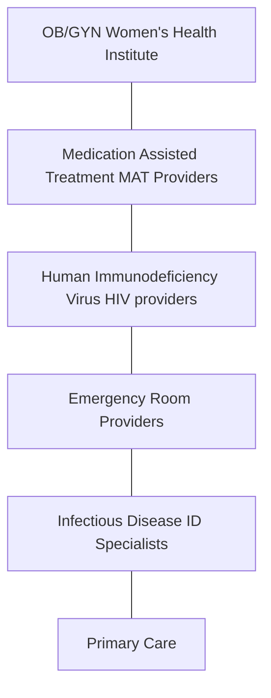
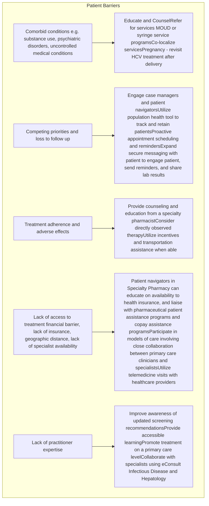
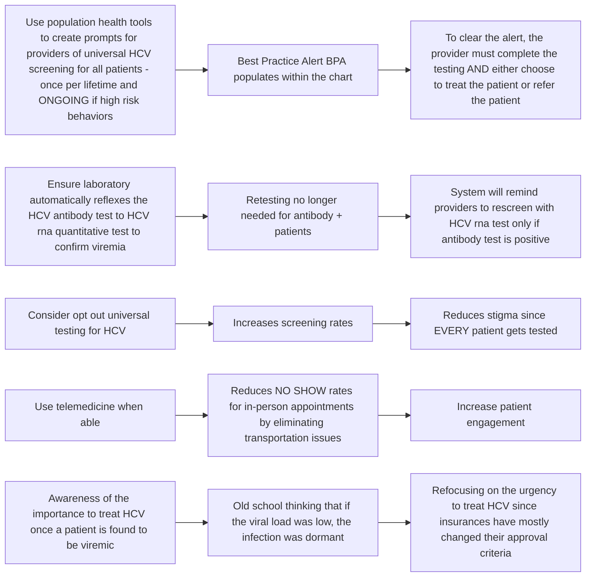

Cleveland Clinic logo

# Breaking Barriers: Patient Navigation in Specialty Pharmacy for Chronic Hepatitis C Treatment Access

Erika Harrington | Cleveland Clinic Specialty Pharmacy

## Background

Hepatitis C (HCV) is blood borne and infections occur through exposure to blood or blood products. Hepatitis C is an inflammation of the liver caused by the hepatitis C virus. The virus can cause both acute and chronic hepatitis, ranging from severity from a mild illness to a serious, lifelong illness including liver cirrhosis, cancer and death.1 Most hepatitis C infections occur through exposure to blood from unsafe injection practices, unsafe healthcare, unscreened blood transfusions, injection drug use, and high-risk sexual practices that lead to exposure to blood.2

Globally, an estimated 50 million people have chronic HCV, with about 1 million new infections occurring per year. Ohio has 10,975 confirmed and probably new cases of hepatitis C in 2022 (most recent data available) with an estimated 89,000 people living with chronic HCV.3 This number is likely underreported due to lack of awareness to screen.

Direct-acting medications (DAAs) can cure more than 95% of persons with HCV viremia, but access to diagnosis and treatment is low.4 Despite the availability of highly effective treatments, access to these therapies remains a significant barrier for many patients. Patient navigation programs have emerged as a promising approach to improving access to specialty pharmacy services for chronic HCV treatment.

Patient navigation is a process that involves guiding patients through the healthcare system, providing education and support, and addressing barriers to care. In the context of specialty pharmacy for chronic HCV treatment, patient navigators can help patients access and adhere to treatment, coordinate care with healthcare providers, and navigate insurance and financial assistance programs. This QI/QA project was used to identify and remove system barriers, patient specific barriers simultaneously with the creation of a collaborative practice agreement (CPA) and Pharmacy HCV Ambulatory Clinic to reduce time to wait for HCV treatment.

## Objectives

* To quantify a Health System Specialty Pharmacy (HSSP) impact on HCV treatment rates and clinical outcomes

* To engage stakeholders across a large enterprise to engage in patient navigation to reduce barriers to treatment for HCV

* To increase acceptance of pharmacist recommendations by providers

## Stakeholders

* OB/GYN ensured HCV screening is completed with each pregnancy. A workflow has been developed to triage patient into care once the pregnancy is concluded

* Providers who prescribe MAT were educated to screen and rescreen high risk patients for HCV. A workflow is in place to triage patient for HCV treatment if viremic.

* Many risk factors for HIV overlap those for HCV. HIV providers can refer HCV+ patients for appropriate HCV treatment.

* Patients who are taken to the emergency room for overdose are screened for HCV on admission and the Antibiotic Governance Committee call back service notifies patients who test HCV+ and refers the patient to treatment providers.

* Infectious Disease specialists who see patients with infectious endocarditis associated with injection drug use refer HCV+ patients.

* Primary care providers are encouraged to screen each patient for HCV and if positive, refer the patient to the Pharmacy HCV Ambulatory Clinic.

## Patient Barriers

Specialty Pharmacists and other stakeholders serve as patient navigators to coordinate removal of patient barriers whenever possible.
Lack of practitioner expertise on a primary care level was addressed in two ways: with the creation of Pharmacy HCV Ambulatory Clinic and by offering learning and mentorship through a four-hour continuing education program. The on-demand learning is called Ohio Hepatitis Education Program (OH-HEP) and will be available to any interested learner across Ohio (not limited by area of practice or association with this health system hospital). Continuing education credits will be offered to physician, advanced practice nurses, nurses and pharmacists. http://www.ccfcme.org/OH-HEP OH-HEP logo

## Service Description

Specialty Pharmacists receive a daily report of all new HCV viral loads across the enterprise regardless of where the order was placed. Pharmacists perform manual chart review to identify if the patient is eligible for treatment. Pharmacists document within the patient chart the positive lab test and when possible, inform the ordering provider and primary care provider of the unexpected result. All patients with HCV viremia are added to an HCV registry (Compass Rose) which provides a method to track patient identifiers and a reminder system for follow up.

Patients who will not be pursued for treatment are those living outside of the licensed state of practice, those who did not see any provider at this health system within the past two years, and those who had no demographic or contact information in their electronic chart. All other patients are eligible for treatment by an appropriate provider.

Guidance on triaging patients to appropriate care, as well as creating treating plans and follow up for patients who need HCV treatment is readily available online at HCVguidelines.org.4,5 These guidelines are updated regularly by the American Association for the Study of Liver Diseases (AASLD) and the Infectious Disease Society of America (IDSA) and provide easy to use recommendations on whether a patient qualifies for "simplified treatment" and who is NOT eligible. This program used the same list of patient characteristics to determine if patient could be treated by a primary care provider or a specialty pharmacist working under a collaborative practice agreement (CPA), or if the patient should be triaged to a specialist.

* Prior Hepatitis C treatment with a direct-acting agent

* Hepatitis B core antibody (HBcAb) positive

* HIV

* Known or suspected hepatocellular carcinoma

* Prior organ transplant

* Cirrhosis: one or more of the following:

    - Radiographic evidence of cirrhosis

    - AST to Platelet Ratio Index (APRI) >=2.0

    - Fibrosis-4 (FIB-4) >= 3.25

Patients who are found to be HCV+ and currently pregnant were added to the HCV registry for follow up upon the expected end of the pregnancy.

## System Barriers

## Discussion

This is a prospective study and many patient specific factors will be collected as outcome measures. The overarching goal is to double the number of treated patients each quarter while maintaining completion and cure rates The study period is July 1, 2024 to June 30, 2025.

| Number of HCV treated patients in 2023 | Goal number of HCV patients treated in 2024/2025 | Cure rates 2023 | Completion Rates |
| -------------------------------------- | ------------------------------------------------ | --------------- | ---------------- |
| Q1 62                                  | Q2 2024 150                                  | Q1 100%         | Q1 87%           |
| Q2 75                                  | Q3 2024 108                                  | Q2 96%          | Q2 87%           |
| Q3 54                                  | Q4 2024 132                                  | Q3 95%          | Q3 83%           |
| Q4 66                                  | Q1 2025 124                                  | Q4 98%          | Q4 89%           |

### Confounding factors to implementation

* Original go-live was delayed due to staff training and requirement for specialized training before the CPA could be utilized. This led to a backlog of HCV positive patients needing chart review and triage to care.

* Pharmacy experienced unexpected reluctance with some providers to create the referral to the HCV Ambulatory Clinic. This could be described as a lack of patient ownership.

### Unexpected use of the Pharmacy HCV Ambulatory Clinic

* Specialists such as Gastroenterology, Hepatology, Infectious Disease, and Transplant surgeons have all made referrals to the clinic demonstrating that pharmacists can collaborate as treatment providers in a variety of simplified and complex patient variables.

## References

1. World Health Organization/Fact sheets/Detail/ Hepatitis C Accessed 7/24/2024 https://www.who.int/news-room/fact-sheets/detail/hepatitis-c

2. Hepatitis C Basics Overview of Viral Hepatitis for Health Care Professionals Center for Disease Control and Prevention. Accessed 7/24/2024. https://www.cdc.gov/hepatitis-c/site.html

3. https://odh.ohio.gov/know-our-programs/viral-hepatitis/data-statistics/hcv-5yr-report

4. Practice guidelines. American Association for The Study of Liver Diseases. Updated 2023. Accessed 7/24/2024 www.aasld.org/practice-guidelines

5. Treatment and Management. HCV Guidelines. Updated October 2023. Accessed 7/24/24. www.hcvguidelines.org

Cleveland Clinic logo

# Title of poster

Authors | Department

## Background

This is a template for a poster sized to 4 feet by 4 feet (48 inches by 48 inches). The headers (blue bands with type in white) are a starting point. The header type is Arial Bold, 44 pt. type size. They can be moved around, have different names for headers, can be deleted or more added as needed. The current size of the headers is the minimum recommended size.

This text box is also a starting point. The text is in Arial Regular and is at 27 pt. type size. This is the minimum recommended size for text.

The space between paragraphs can be flexible as space allows. You can enlarge type if you have the space. Please NOTE: whatever size of type you do end up using, please make it consistent throughout the whole poster. If there is a Reference List at end of poster, this can be in a smaller font. Recommend 14 pt. type size as smallest.

## Outcomes

This is a template for a poster sized to 4 feet by 4 feet (48 inches by 48 inches). The headers (blue bands with type in white) are a starting point. The header type is Arial Bold, 44 pt. type size. They can be moved around, have different names for headers, can be deleted or more added as needed. The current size of the headers is the minimum recommended size.

This text box is also a starting point. The text is in Arial Regular and is at 27 pt. type size. This is the minimum recommended size for text.

The space between paragraphs can be flexible as space allows. You can enlarge type if you have the space. Please NOTE: whatever size of type you do end up using, please make it consistent throughout the whole poster. If there is a Reference List at end of poster, this can be in a smaller font. Recommend 14 pt. type size as smallest.

## Objectives/Purpose

This is a template for a poster sized to 4 feet by 4 feet (48 inches by 48 inches). The headers (blue bands with type in white) are a starting point. The header type is Arial Bold, 44 pt. type size. They can be moved around, have different names for headers, can be deleted or more added as needed. The current size of the headers is the minimum recommended size.

This text box is also a starting point. The text is in Arial Regular and is at 27 pt. type size. This is the minimum recommended size for text.

The space between paragraphs can be flexible as space allows. You can enlarge type if you have the space. Please NOTE: whatever size of type you do end up using, please make it consistent throughout the whole poster. If there is a Reference List at end of poster, this can be in a smaller font. Recommend 14 pt. type size as smallest.

## Conclusion

This is a template for a poster sized to 4 feet by 4 feet (48 inches by 48 inches). The headers (blue bands with type in white) are a starting point. The header type is Arial Bold, 44 pt. type size. They can be moved around, have different names for headers, can be deleted or more added as needed. The current size of the headers is the minimum recommended size.

This text box is also a starting point. The text is in Arial Regular and is at 27 pt. type size. This is the minimum recommended size for text.

The space between paragraphs can be flexible as space allows. You can enlarge type if you have the space. Please NOTE: whatever size of type you do end up using, please make it consistent throughout the whole poster. If there is a Reference List at end of poster, this can be in a smaller font. Recommend 14 pt. type size as smallest.

## Methods

This is a template for a poster sized to 4 feet by 4 feet (48 inches by 48 inches). The headers (blue bands with type in white) are a starting point. The header type is Arial Bold, 44 pt. type size. They can be moved around, have different names for headers, can be deleted or more added as needed. The current size of the headers is the minimum recommended size.

This text box is also a starting point. The text is in Arial Regular and is at 27 pt. type size. This is the minimum recommended size for text.

The space between paragraphs can be flexible as space allows. You can enlarge type if you have the space. Please NOTE: whatever size of type you do end up using, please make it consistent throughout the whole poster. If there is a Reference List at end of poster, this can be in a smaller font. Recommend 14 pt. type size as smallest.

## References

This is a template for a poster sized to 4 feet by 4 feet (48 inches by 48 inches). The headers (blue bands with type in white) are a starting point. The header type is Arial Bold, 44 pt. type size. They can be moved around, have different names for headers, can be deleted or more added as needed. The current size of the headers is the minimum recommended size.

This text box is also a starting point. The text is in Arial Regular and is at 27 pt. type size. This is the minimum recommended size for text.

The space between paragraphs can be flexible as space allows. You can enlarge type if you have the space. Please NOTE: whatever size of type you do end up using, please make it consistent throughout the whole poster. If there is a Reference List at end of poster, this can be in a smaller font. Recommend 14 pt. type size as smallest.

Cleveland Clinic logo

# Title of poster

Authors | Department

## Background

This is a template for a poster sized to 4 feet by 4 feet (48 inches by 48 inches). The headers (blue bands with type in white) are a starting point. The header type is Arial Bold, 44 pt. type size. They can be moved around, have different names for headers, can be deleted or more added as needed. The current size of the headers is the minimum recommended size.

This text box is also a starting point. The text is in Arial Regular and is at 27 pt. type size. This is the minimum recommended size for text.

The space between paragraphs can be flexible as space allows. You can enlarge type if you have the space. Please NOTE: whatever size of type you do end up using, please make it consistent throughout the whole poster. If there is a Reference List at end of poster, this can be in a smaller font. Recommend 14 pt. type size as smallest

## Methods

This is a template for a poster sized to 4 feet by 4 feet (48 inches by 48 inches). The headers (blue bands with type in white) are a starting point. The header type is Arial Bold, 44 pt. type size. They can be moved around, have different names for headers, can be deleted or more added as needed. The current size of the headers is the minimum recommended size.

This text box is also a starting point. The text is in Arial Regular and is at 27 pt. type size. This is the minimum recommended size for text.

The space between paragraphs can be flexible as space allows. You can enlarge type if you have the space. Please NOTE: whatever size of type you do end up using, please make it consistent throughout the whole poster. If there is a Reference List at end of poster, this can be in a smaller font. Recommend 14 pt. type size as smallest.

## Conclusion

This is a template for a poster sized to 4 feet by 4 feet (48 inches by 48 inches). The headers (blue bands with type in white) are a starting point. The header type is Arial Bold, 44 pt. type size. They can be moved around, have different names for headers, can be deleted or more added as needed. The current size of the headers is the minimum recommended size.

This text box is also a starting point. The text is in Arial Regular and is at 27 pt. type size. This is the minimum recommended size for text.

The space between paragraphs can be flexible as space allows. You can enlarge type if you have the space. Please NOTE: whatever size of type you do end up using, please make it consistent throughout the whole poster. If there is a Reference List at end of poster, this can be in a smaller font. Recommend 14 pt. type size as smallest.

## Objectives/Purpose

This is a template for a poster sized to 4 feet by 4 feet (48 inches by 48 inches). The headers (blue bands with type in white) are a starting point. The header type is Arial Bold, 44 pt. type size. They can be moved around, have different names for headers, can be deleted or more added as needed. The current size of the headers is the minimum recommended size.

This text box is also a starting point. The text is in Arial Regular and is at 27 pt. type size. This is the minimum recommended size for text.

The space between paragraphs can be flexible as space allows. You can enlarge type if you have the space. Please NOTE: whatever size of type you do end up using, please make it consistent throughout the whole poster. If there is a Reference List at end of poster, this can be in a smaller font. Recommend 14 pt. type size as smallest.

## Outcomes

This is a template for a poster sized to 4 feet by 4 feet (48 inches by 48 inches). The headers (blue bands with type in white) are a starting point. The header type is Arial Bold, 44 pt. type size. They can be moved around, have different names for headers, can be deleted or more added as needed. The current size of the headers is the minimum recommended size.

This text box is also a starting point. The text is in Arial Regular and is at 27 pt. type size. This is the minimum recommended size for text.

The space between paragraphs can be flexible as space allows. You can enlarge type if you have the space. Please NOTE: whatever size of type you do end up using, please make it consistent throughout the whole poster. If there is a Reference List at end of poster, this can be in a smaller font. Recommend 14 pt. type size as smallest.

## References

This is a template for a poster sized to 4 feet by 4 feet (48 inches by 48 inches). The headers (blue bands with type in white) are a starting point. The header type is Arial Bold, 44 pt. type size. They can be moved around, have different names for headers, can be deleted or more added as needed. The current size of the headers is the minimum recommended size.

This text box is also a starting point. The text is in Arial Regular and is at 27 pt. type size. This is the minimum recommended size for text.

The space between paragraphs can be flexible as space allows. You can enlarge type if you have the space. Please NOTE: whatever size of type you do end up using, please make it consistent throughout the whole poster. If there is a Reference List at end of poster, this can be in a smaller font. Recommend 14 pt. type size as smallest.

