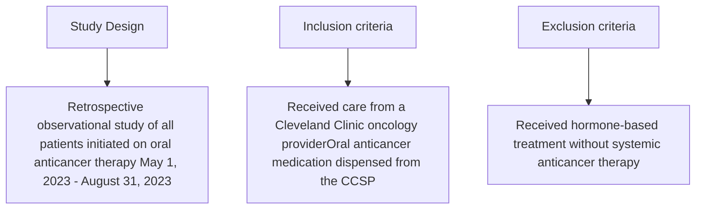

Cleveland Clinic logo

# Analysis of Hepatitis B Screening with Oral Anticancer Therapy Initiation Within a Large Academic Medical Center Specialty Pharmacy

Anthony Angyal, PharmD<sup>1</sup>; Kristel Geyer, PharmD, BCOP, BCPS<sup>1</sup>; Shubha Bhat, PharmD, MS, FCCP, BCACP<sup>1</sup>; Leighton Boquist, PharmD<sup>1</sup>; McKay Herpel, PharmD, BCOP<sup>1</sup>
<sup>1</sup>Department of Pharmacy, Cleveland Clinic

**Contact information:**
Anthony Angyal, Pharm.D.
9500 Euclid Ave.
Cleveland, OH, 44195
Email: angyala@ccf.org

## Background

* The World Health Organization estimated that 296 million people worldwide were living with hepatitis B virus (HBV) in 2019<sup>1</sup>

* Patients treated with oral anticancer therapy are at heightened risk for HBV infection due to being considered immunocompromised

* A large portion of patients are unaware of their HBV status given approximately 50-70% of patients with an acute infection are asymptomatic<sup>2</sup>

* The National Comprehensive Cancer Network estimated that up to 45% of patients positive for HBcAb will develop HBV reactivation, which could lead to self-limited hepatitis, fulminant hepatic failure, or death

* The American Society of Clinical Oncology (ASCO) recommends all newly diagnosed patients receiving anticancer therapy should be screened for HBV with 3 tests at the start of therapy, including HBsAg, HBcAb, and HBsAb<sup>3</sup>

* A recent Cleveland Clinic Specialty Pharmacy (CCSP) internal assessment of oncology patients identified deficiencies in HBV screening prior to many new start anticancer therapy

## Objectives

**Primary**
* Assess the percentage of patients screened for HBV prior to initiation of oral anticancer therapy

**Secondary**
* Percentage of HBV screening recommendations made by pharmacists prior to initiation of oral anticancer therapy, in compliance with ASCO's recommendation
* Percentage of provider acceptance rate of HBV screening recommendations made by specialty pharmacists
* Percentage of all patients starting oral anticancer therapy that tested positive for HBsAg
* Percentage of all patients starting oral anticancer therapy that tested positive for HBcAb
* Percentage of all patients starting oral anticancer therapy that tested positive for HBsAb
* Percentage of patients initiated on antiviral prophylaxis for chronic HBV

## Methods



```mermaid
graph TD
    Start[Patients Included483] --> Screened[HBV screening prior to treatment84 (17.4)]
    Start --> NotScreened[No HBV screening prior to treatment399 (82.6)]
    
    Screened --> FullPanel[Full HBV panel67 (79.8)]
    Screened --> PartialPanel[Partial HBV panel17 (20.2)]
    
    NotScreened --> RPhRec[RPh screening recommendation229 (57.4)]
    
    RPhRec --> Accepted[Accepted168 (73.4)]
    RPhRec --> Rejected[Rejected61 (26.6)]
    
    Accepted --> FullPanel2[Full HBV panel93 (55.4)]
    Accepted --> PartialPanel2[Partial HBV panel75 (44.6)]
```
Data presented as n(%)

## Data Collection Points

| Baseline Characteristics<br/>Variable                    | Baseline Characteristics<br/>Total Population (N = 483) |
| -------------------------------------------------------- | ------------------------------------------------------- |
| Age, years                                               | 68 \[60-76]                                             |
| Gender, female                                           | 240 (49.7)                                              |
| Race                                                     |                                                         |
| Caucasian                                                | 370 (76.6)                                              |
| African American                                         | 77 (15.9)                                               |
| Other                                                    | 36 (7.5)                                                |
| Prescriber's state                                       |                                                         |
| Ohio                                                     | 416 (86.1)                                              |
| Florida                                                  | 67 (13.9)                                               |
| Cancer diagnosis                                         |                                                         |
| Breast                                                   | 55 (11.4)                                               |
| Prostate                                                 | 50 (10.4)                                               |
| CLL                                                      | 41 (8.5)                                                |
| Colon                                                    | 40 (8.3)                                                |
| AML                                                      | 28 (5.8)                                                |
| Other                                                    | 269 (55.7)                                              |
| Line of therapy                                          |                                                         |
| First line                                               | 115 (23.8)                                              |
| Second line                                              | 144 (29.8)                                              |
| Third line or greater                                    | 224 (46.4)                                              |
| Time from RPh recommendation to HBV panel obtained, days | 29 \[11.25-54]                                          |


\*Data presented as median [IQR]
\*Data presented as n (%)

## Results

| Patients that Received HBV Screening<br/>N = 252 | Patients that Received HBV Screening<br/>Yes | Patients that Received HBV Screening<br/>Yes |
| ------------------------------------------------ | -------------------------------------------- | -------------------------------------------- |
| HBV screening prior to treatment                 | 84 (33.3)                                    |                                              |
| HBV screening after RPh rec                      | 168 (66.7)                                   |                                              |
| Full HBV panel collected                         | 160 (63.5)                                   |                                              |
| HBsAg positive result                            | 0 (0)                                        |                                              |
| HBsAb positive result                            | 44 (17.5)                                    |                                              |
| HBcAb positive result                            | 7 (2.8)                                      |                                              |
|                                                  | HBsAb (+), HBsAg (-)                         | 4 (57.1)                                     |
|                                                  | HBsAb (-), HBsAg (-)                         | 2 (28.6)                                     |
|                                                  | No HBsAb or HBsAg result                     | 1 (14.3)                                     |
| Partial HBV panel collected                      | 92 (36.5)                                    |                                              |
|                                                  | Missing HBsAg                                | 18 (19.6)                                    |
|                                                  | Missing HBsAb                                | 63 (68.5)                                    |
|                                                  | Missing HBcAb                                | 40 (43.4)                                    |
| Antiviral usage for those HBcAb positive         | 2 (28.6)                                     |                                              |


\*Data presented as n (%)

## Conclusion

Pharmacist recommendations to complete HBV screening in patients prior to initiation of oral anticancer therapy were accepted by providers majority of the time, permitting for further optimization of treatment safety prior to medication initiation.

## Disclosure and References

The authors of this study have no conflicts of interest to disclose.

1. World Health Organization. Global progress report on HIV, viral hepatitis and sexually transmitted infections, 2021.

2. Viral Hepatitis Surveillance and Case Management - Hepatitis B [Internet]. CDC. [revised 2024 Feb 2; cited 2024 Mar 10].

3. Hwang JP, Feld JJ, Hammond SP, et al. Hepatitis B Virus Screening and Management for Patients With Cancer Prior to Therapy: ASCO Provisional Clinical Opinion Update. J Clin Oncol. 2020 Nov 1;38(31):3398-3715.


