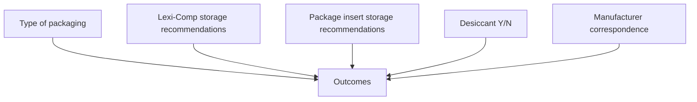

Cleveland Clinic logo Speaker icon

# Analysis of Appropriate Storage and Stability of Oral Anticancer Agents

Kristel Geyer, PharmD, BCOP, BCPS; Rebecca Freedman, PharmD; Amruth Krishnamurthy, PharmD; Sean Krohn, PharmD

## Background

* In order to minimize waste and cost, clinical review of oral oncolytics often warrants sending partial fills due to scans, laboratory measures, or dosing regimen changes.

* It is important to consider the stability and appropriate storage of medications to ensure the patient is still receiving a viable product.

* Manufacturer labeling often has limited information, making it difficult to extrapolate the true necessity to keep medications in the original container.

* This project was designed to help oncology pharmacists better assess when it is appropriate to open bottles and/or packages to prevent waste and minimize cost.

* Thorough analysis of each medication via tertiary drug references, package labeling, and outreach to manufacturer will occur as applicable to identify best practice for each individual product.

## Objectives

* To create a systematic workflow for the specialty pharmacy to utilize in determining whether a medication may be opened

## Methodology

| Identify Medications          | \* Initial phase was to conduct a retrospective review of all the medications that the pharmacy had historically opened \* Various students, residents, and pharmacists worked to compile data over time \* Resources included: \* Package insert \* Medication guide or patient guide \* Outreach to manufacturers |
| ----------------------------- | --------------------------------------------------------------------------------------------------------------------------------------------------------------------------------------------------------------------------------------------------------------------------------------------------------------------------------------- |
| Conduct Research and Outreach | \* Requested written correspondence from manufacturers, if available, or alternatively documented phone calls \* Assess whether medication contains a desiccant, any open dish studies, and any literature regarding use outside of the original container (with and/or without desiccant put into the alternative source)          |
| Compile Findings              | \* All medications were put into a consolidated spreadsheet                                                                                                                                                                                                                                                                             |

## Medication Use Evaluation (MUE) Program Design
* MUE identified over 160 medications to review
* 50% of applicable medications had been historically opened
* Equivalent to 36% of hematology/oncology medications

**Initially reviewed and approved:**
* Apalutamide (Erleada)
* Axitinib (Inlyta)
* Dabrafenib (Tafinlar)
* Enzalutamide (Xtandi)
* Pacritinib (Vonjo)
* Venetoclax (Venclexta)

## Data Collection

Reported as median with interquartile range of a 5-point Likert scale (1-strongly disagree, 2-disagree, 3-neutral, 4-agree, 5-strongly agree).

## Prescribing Information and Excel Template

**Storage and Handling**
Store at 20 °C to 25 °C (68 °F to 77 °F); excursions permitted to 15 °C to 30 °C (59 °F to 86 °F) [see USP Controlled Room Temperature].
Store in original package to protect from light and moisture. Do not discard desiccant.

| Brand Name | Generic Name | Desiccant (Y/N) | Additional Comments                                                                                         | Package Size | Historically Opened Bottle (MUE) / uneven multiple of blister pack | Recommendations - OK TO OPEN? |
| ---------- | ------------ | --------------- | ----------------------------------------------------------------------------------------------------------- | ------------ | ------------------------------------------------------------------ | ----------------------------- |
| Erleada    | Apalutamide  | Y               | Only good for 10 days in pill boxes; advise against this based on manf correspondence and studies conducted | #120         | Y                                                                  | Y - BUT NOT PILL BOXES        |

## Discussion Timeline

| Date    | Milestone                                                                                                       |
| ------- | --------------------------------------------------------------------------------------------------------------- |
| 10/2020 | \* Project started                                                                                              |
| 5/2021  | \* MUE completed and target drugs identified \* Outreach and analysis began                                 |
| 12/2021 | \* Depth/complexity of outreach became known \* Project timeline extended                                   |
| 5/2023  | \* Ongoing meetings with legal and medication safety groups                                                     |
| 8/2023  | **Future Directions** \* Sent first list of 6 drugs to legal/Drug Information center for review             |
| 2/2024  | **Opportunities for Expansion** \* First 6 drugs officially approved by main campus Drug Information center |
| Ongoing | \* Evaluation of all oral anticancer agents is currently in progress \* Results will be compiled            |

## References

1. Erleada® (apalutamide) [package insert]. Horsham, PA: Janssen Pharmaceutical Companies; 2019, revised 2024.

2. Akgöl K, van Merendonk LN, Barkman HJ, van Balen DE, van den Hoek HL, Klous MG, Hendrikx JJ, Huitema AD, Beijnen JH, Nuijen B. Redispensing of expensive oral anticancer medicines: A practical application. J Oncol Pharm Pract. 2024 Apr;30(3):519-526. doi: 10.1177/10781552231176199. Epub 2023 May 16. PMID: 37192749.

3. Waterman KC, MacDonald BC. Package selection for moisture protection for solid, oral drug products. J Pharm Sci. 2010 Nov;99(11):4437-52. doi: 10.1002/jps.22161. PMID: 20845442.

4. Sato K, Inaoka N, Kodama Y, Muro T, Nakamura T, Sasaki H, Kitahara T. [Influence of Storage Conditions after One-dose Packaging on Stability of Magnesium Oxide Tablets]. Yakugaku Zasshi. 2018;138(11):1435-1441. Japanese. doi: 10.1248/yakushi.18-00024. PMID: 30381651.

5. Trovato JA, Tuttle LA. Oral chemotherapy handling and storage practices among Veterans Affairs oncology patients and caregivers. J Oncol Pharm Pract. 2014 Apr;20(2):88-92. doi: 10.1177/1078155213479417. Epub 2013 Mar 19. PMID: 23512268.

6. Zerillo JA, Goldenberg BA, Kotecha RR, Tewari AK, Jacobson JO, Krzyzanowska MK. Interventions to Improve Oral Chemotherapy Safety and Quality: A Systematic Review. JAMA Oncol. 2018;4(1):105–117. doi:10.1001/jamaoncol.2017.0625

