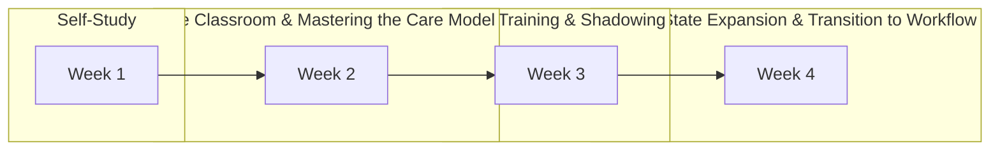

SHIELDS HEALTH SOLUTIONS logo

# Highlighting the Benefits of a Personalized Onboarding Program for Clinical Pharmacists with Diverse Work Experience

Lauren Skilton, PharmD, CSP
Lindsey Bolster, PharmD, CSP

QR code with "SCAN ME" text
Phone icon with "SCAN ME" text

### DISCLOSURES

The authors of this presentation have nothing to disclose concerning possible financial or personal relationships with commercial entities that may have a direct or indirect interest in the subject matter of this presentation.

### BACKGROUND

* Effectively onboarding new employees with diverse backgrounds is a universal challenge, especially in specialty pharmacy. Shields Health Solutions has implemented a standardized yet personalized training program aimed at equipping pharmacists with the essential competencies needed for their roles as specialty clinical pharmacists.

* Recent enhancements to this program include a greater emphasis on self-study during the first week, allowing new hires to engage with core content independently and assess their understanding through knowledge checks. Key concepts are then reinforced in live sessions during the second week.

* The program also adopts a phased approach to expanding clinical knowledge: Phase 1 focuses on inflammatory, oncologic, hematologic, and an additional specialty condition tailored to the needs of the hospital site, while Phase 2 extends this foundation by providing self-study content covering all other specialty conditions.

### Objectives

1. Assess the impact of the training program on the quality of patient care provided, as indicated by call and documentation quality scores.

2. Compare time to efficiency in-seat between graduates of the new program and those of previous programs, serving as a measure of transition readiness.

### METHODS

The Clinical Pharmacist Education and Development (CPED) Team at Shields launched an enhanced, four-week remote onboarding program in December 2022. During the first week, new hires engage primarily with self-study content. The following weeks incorporate live sessions, shadowing opportunities, and patient care outreach activities. Personalized support is central to the program, with each new hire paired with a CPED Specialist who acts as a mentor, facilitating weekly check-ins, reviewing patient workups, and providing tailored feedback utilizing a meticulously designed standards-based rubric. Additionally, various teammates within the hospital site host a series of three introductory sessions, ensuring a comprehensive understanding of the pharmacist's role.

Figure 1: Onboarding Training Foundations and Modalities

Figure 2: Personalized Support During Training

* Question mark icon **Partnership with a CPED Mentor**
* Checklist icon **Workup Review and Enhancement**
* Person with headset icon Magnifying glass icon **Call Quality Auditing and Documentation Review**
* Speech bubbles icon **Hospital Site Training and Site-Specific Mentor**

### RESULTS

To quantify the knowledge of patient care and processes gained through the program, we conducted a comparative analysis of call and documentation quality scores for twenty-nine trainees at the start and end of their onboarding training.

Figure 3: Call and Documentation Quality Scores (N=29)

| Category              | Initial Score | Final Score | Increase |
| --------------------- | ------------- | ----------- | -------- |
| Documentation Quality | 82%           | 92.80%      | 13.1%    |
| Call Quality          | 85.40%        | 92.30%      | 8.1%     |

8.1% Increase in Call Quality scores callout

We evaluated the effectiveness of the new program in enabling pharmacists to achieve in-seat efficiency after transitioning from training to workflow. We compared the time it took new hires to reach their efficiency goals between individuals in the previous program (hired between September 2022 and November 2022) to those onboarded in the new program (hired between December 2022 and December 2023).

Figure 4: Time to Full Efficiency In-Seat

| Program          | Time to Full Efficiency (Days) |
| ---------------- | ------------------------------ |
| New Program      | 66.4 Days                      |
| Previous Program | 96.7 Days                      |

**31.3% Faster at achieving efficiency in-seat**

### CONCLUSION

With this onboarding program, we have noted an overall increase in call and documentation quality scores from the first call to the last and improved time to efficiency in seat. In short, this approach has produced pharmacists who are equipped with the skills needed to be impactful when they transition to their new role, despite varying professional backgrounds.

