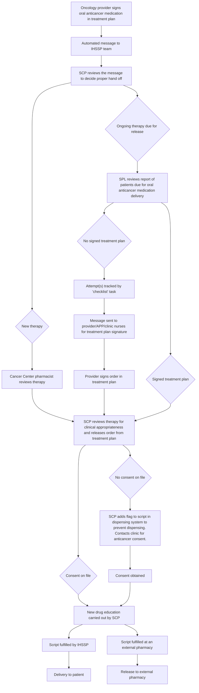

Yale New Haven Health logo

# Development of a Comprehensive Workflow for the Management of Oral Anticancer Medications in an Integrated Health System Specialty Pharmacy

NASP NATIONAL ASSOCIATION OF SPECIALTY PHARMACY logo

Michael Zummo PharmD, CSP; Sarah E. Wright, PharmD, BCACP; Bisni Narayanan, PharmD, MBA, MS; Kimhouy Tong, PharmD, BCPS; Mitchell DelVecchio, PharmD, CSP; Terri Sue Rubino, PharmD, CSP; Vinay Sawant, RPh, MPH, MBA
Yale New Haven Health, Department of Pharmacy, New Haven, CT

## Background

* Outpatient Pharmacy Services (OPS) at Yale New Haven Health is an integrated health system specialty pharmacy (IHSSP).

* OPS’s specialty clinical pharmacists (SCP) have dual responsibilities for the accreditation standards of the specialty pharmacy and the health system’s cancer center.

* SCPs clinically review medications in the treatment plan, provide patient education for new or dose changes of oral anticancer medications, and complete ongoing assessments of the patient’s progress.

* SCPs carry out the above tasks regardless of the patient’s dispensing pharmacy to fulfill the health system’s cancer center accreditation requirements.

* In May 2023, OPS transitioned from an in-house electronic health record documentation platform to Epic Systems’ care management application, Compass Rose.

* Customized tools were needed to facilitate the intricacies of the oral anticancer medication workflow.

* As of May 2023, the total number of oral anticancer patients enrolled was 6,000 (approximately a third of the total specialty pharmacy patient population).

## Objectives

To customize a new care management application to facilitate a novel comprehensive oral anticancer medication workflow.

## Description

* A multidisciplinary group of SCPs, specialty pharmacy liaisons (SPL), information technology experts and pharmacy clinical leadership was created.

* The group examined the current capabilities of the care management application documentation system, and identified areas where modifications were needed for the oral anticancer workflow.

* Specific issues identified included:

1. Use of treatment plans instead of refills on the order

2. The SCP’s responsibility for managing the treatment plan orders for patients filling at non-health system pharmacies

3. Oral anticancer therapies require a signed patient consent before dispensing

4. A trackable method to gather treatment plan request data

## Evaluation

Figure 1. Workflow for Managing Oral Anticancer Medications

| Unique Workflow Steps                          | Workflow modifications                                                                                                                                                                                                                                                  |
| ---------------------------------------------- | ----------------------------------------------------------------------------------------------------------------------------------------------------------------------------------------------------------------------------------------------------------------------- |
| Management of treatment plans                  | \* A novel automated message was created, where an automated message is sent whenever an oncology provider signs a specialty oral anticancer medication \* “External Treatment release” with a date for when the patient is due for their next release added by SCP |
| Requesting signed orders in the treatment plan | \* A “Renewal Review” task was created specifically for the oral anticancer receiving patients \* A manual “checklist task” was developed                                                                                                                           |
| Signed consent review                          | \* A “Consent Required” flag was created and manually added to orders in the dispensing system                                                                                                                                                                          |

## Discussion

* At initiation of the new care management application, the external patient management tasks, request “checklists” and consent flag were integrated into workflow.

* From May 2023 to May 2024, 6,367 external patient release tasks were completed.

* After initiation of the new care management application, it was deemed that optimizations were necessary to better accommodate the intricacies in the oral anticancer medication workflow.

* In April 2024, a new task, “Renewal Review” was developed to manage future deliveries for oral anticancer medication patients.

* As of August 2024, 2,165 Renewal Review tasks had been completed by IHSSP staff.

* In April 2024, a report was developed to analyze the treatment plan signature request information submitted in the “checklist” task.

* From August 2023 to August 2024, greater than 6,000 “checklist” tasks were completed in the pursuit of treatment plan signatures.

## Conclusion

The oral anticancer medication specific tasks were successfully adapted in the new care management application.

## Future Direction

* Ongoing education of the IHSSP staff and cancer center staff on the nuances of the oral anticancer medication workflow and proper steps for adding and documenting the “checklist” task.

* Analyze data from the treatment plan request “checklist” data to identify deviations in prescribing practices and find targets of reeducation.

* Consideration of Epic Systems’ care management application, Compass Rose by care centers, thus furthering pharmacy and clinic integration.

## References

1. DelVecchio et al. Development of a Workflow to Manage Non-specialty Medications at a Specialty Pharmacy. Poster presented at: NASP Annual Meeting & Expo, Sept 18-21, 2023; Grapevine, TX.

2. Tong et al. Implementation of a new patient case management system at a large health system specialty pharmacy. Poster presented at: NASP Annual Meeting & Expo, Sept 18-21, 2023; Grapevine, TX.

3. Riccardi M et al. Developing a disease state specific patient management program at an integrated health system specialty pharmacy. Poster presented at: NASP Annual Meeting & Expo, Sept 18-21, 2023; Grapevine, TX.

4. Wright S et al. Education and evaluation strategies to implement a new care management documentation system in a health system specialty pharmacy. Poster presented at: NASP Annual Meeting & Expo, Sept 18-21, 2023; Grapevine, TX.

The authors of this presentation have nothing to disclose concerning possible financial or personal relationships with commercial entities that may have a direct or indirect interest in the subject matter of this presentation.
NASP Annual Meeting & Expo 2024. October 6-9, 2024

