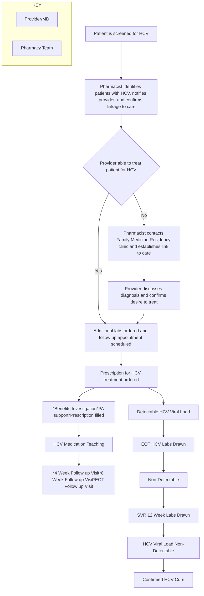

Clearway Health logo

# Impact of Implementing a Pharmacist-Led System-Wide Hepatitis C Screening and Test-To-Treat Program

Michelle Coady, PharmD1,2, Amanuel Kehasse, PharmD, PhD2, Richard McCormack, DPh1,2, Sarah Curtin, CPhT2
1Comanche County Memorial Hospital; 2Clearway Health

Comanche County Memorial Hospital logo

## Introduction

The World Health Organization (WHO)1 and U.S. national strategic2 plan aim to achieve a 90% reduction in hepatitis C infection and increase hepatitis C (HCV) diagnoses by 90% by year 2030. However, the 2023 National Progress Report3 indicated acute hepatitis C infections have been steadily on the rise; a 60% and 7% increase from 2017 and 2022, respectively. A recent study shows 1 in 3 adults in the United States are not aware of their potentially life-threatening infection. At the time of diagnosis, around 20% of patients will already have serious liver damage, cirrhosis and/or end-stage liver disease. Results of a recent study highlighted the average national hepatitis C cure rate is 37%. This highlights the need for a comprehensive screening program for early diagnosis and linkage to care.

## Objective

The purpose of this study is to evaluate the impact of pharmacist lead system wide Hepatitis C screening and linkage to care workflow in Rural Community Health Center.

Rates\* of reported cases† of acute hepatitis C virus infection, by state or jurisdiction — United States, 20214

Geographical map of the United States showing rates of reported cases of acute hepatitis C virus infection by state in 2021

## Methodology

* **Study Design**: Retrospective observational descriptive study

* **Data Source**: HCV lab data pulled from VigiLanz, the lab software at Comanche County Memorial Hospital (CCMH)

* **Study Population**: Patients who had HCV tests conducted at the CCMH lab between April 1, 2023 and April 30, 2024.

* **Exclusion**: Patients who were not tested at the CCMH lab, but receiving treatment for HCV were excluded from the study.

* **Statistical Analysis**: Descriptive Statistics: Data presented as numbers and percentage.

## Workflow

## Results

| Category                | Percentage |
| ----------------------- | ---------- |
| Patients linked to care | 67%        |
| Medical deferral        | 33%        |

> 116% increase in Linkage to HCV Care in 4 months of study period

| Category                                    | Percentage |
| ------------------------------------------- | ---------- |
| HCV antibody not detected                   | 94.2%      |
| HCV antibody detected                       | 5.8%       |
| HCV RNA not detected (of antibody detected) | 52.4%      |
| HCV RNA detected (of antibody detected)     | 47.6%      |
| Cure Confirmed (of RNA detected)            | 51.3%      |
| Tx in progress (of RNA detected)            | 35.9%      |
| Pending SVR12 (of RNA detected)             | 12.8%      |

## Discussion

Significant attrition exists in the hepatitis C treatment cascade. To address this problem, we conceptualized a pharmacist-led system wide hepatitis C (HCV) screening and linkage to care program. The pharmacy department collaborated with the Family Medicine Residency Program at Lawton Community Health Center to create a linkage to care for patients with or without a primary care provider. In this pharmacist-led test-to-treat model, a pharmacist monitors the HCV screening lab results dashboard that is refreshed weekly. When an HCV-infected patient is identified, the pharmacist contacts the lab ordering provider to facilitate a discussion of the diagnosis with the patient, refer the patient to the HCV clinic and ensure linkage to care. Once treatment is started, the pharmacist follows up with patients at 4 weeks, 8 weeks, end-of-treatment (EOT), and ensures that EOT and 12-week SVR labs are completed.

During the 4 months of our study, our health system screened 1,416 patients. We identified 39 patients with detectable HCV RNA; out of which 67% were linked to HCV care and started treatment.

Compared with the preceding year (2023), the pharmacist-led test-to-treat model resulted in a 116% increase in the linkage to HCV care.

Overall, implementing a pharmacist-led, clinical dashboard supported, test-to-treat protocol helps to minimize attrition rate in the HCV treatment cascade and improves linkage to care, medication access and adherence.

## References

1. https://www.who.int/health-topics/hepatitis/elimination-of-hepatitis-by-2030#tab=tab_1

2. https://www.cdc.gov/hepatitis/statistics/surveillanceguidance/HepatitisC.htm

3. https://www.hhs.gov/sites/default/files/Viral-Hepatitis-National-Strategic-Plan-2021-2025.pdf

4. https://www.cdc.gov/hepatitis/policy/npr/2023/index.htm

5. https://www.cdc.gov/hepatitis/statistics/2021surveillance/hepatitis-c/figure-3.3.htm

## Acknowledgments

**Dr. Mercades Bernard, DO**
**Dr. Gretchen Stroud, DO**
**Dr. Lindsay Stoops, DO**
**Dr. Nathan Blacker, DO**
**Dr. Daniel Joyce, DO**
**Seth Julian, DPh**
**Cheryl Hale, DPh, Director of Pharmacy**
**Kendra Knox, CPhT, Pharmacy Liaison**
**Shannon Harger, CPhT, Pharmacy Liaison**
**Derek Dennis, PharmD, VP Client Services**
**Christopher Wilson, PharmD, MBA, Regional Director**

