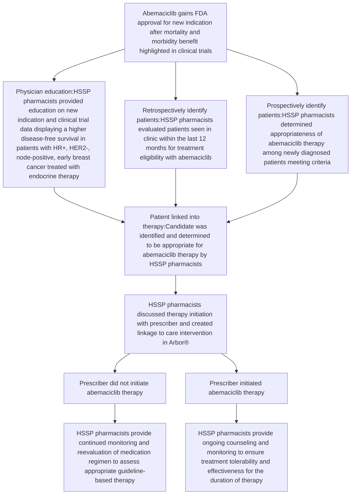
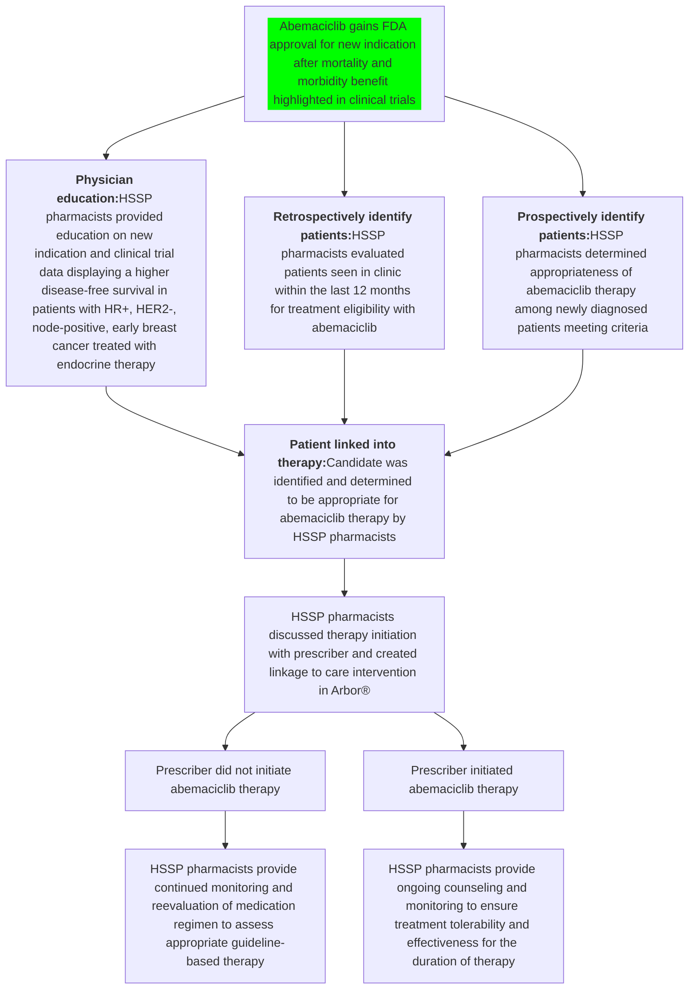

# Abemaciclib Linkage to Care: A Health System Specialty Pharmacy Initiative

Chasity Mosby, PharmD Candidate; Ana Lopez Medina, PharmD; Casey Fitzpatrick, PharmD, BCPS; Jessica Mourani, PharmD; Steven Fosnight, PharmD; Megan Rees, PharmD, BCACP, CSP; Amber Skrtic, PharmD, CSP, AAHIVP; Katie Jo Cash, PharmD, CSP; Carly Giavatto, PharmD

Summa Health logo

cps. logo

## BACKGROUND

* Linkage to care initiatives can accelerate education about therapeutic advancements and promote awareness of new medication indications.

* Health system specialty pharmacy (HSSP) pharmacists are embedded within clinics where they can offer linkage to care services by collaborating with prescribers and patients to ensure optimal therapy, identify high-risk patients, and provide education on changes to medication labeling.

* In October 2021, the U.S. Food and Drug Administration (FDA) approved abemaciclib as the first therapy to treat patients with hormone receptor positive (HR+), human epidermal growth factor receptor 2 negative (HER2–), node-positive early breast cancer (EBC) who are at high risk of recurrence, as an adjunct to endocrine therapy (ET).1

* Abemaciclib was identified as having morbidity and mortality benefit,2 therefore prompting a need for a linkage to care initiative to identify patients who otherwise would not have been identified in a timely manner.

## OBJECTIVES

The objective of this study is to describe the linkage to care initiative performed by HSSP pharmacists in evaluating patients with EBC who may benefit from abemaciclib therapy based on new FDA indication approval.

## METHODS

Single-center descriptive study from October 2021 to February 2023 evaluating the impact of HSSP pharmacists in identifying candidates for abemaciclib therapy based on updated drug labeling. Retrospective chart review was used to identify patients meeting inclusion criteria. Education to providers was completed by HSSP pharmacists in March 2022. Prospective identification of patients meeting inclusion criteria was used for new patients seen in clinic to evaluate appropriateness of abemaciclib therapy.

| INCLUSION CRITERIA                                                                                 | EXCLUSION CRITERIA                                                |
| -------------------------------------------------------------------------------------------------- | ----------------------------------------------------------------- |
| • Patients with ICD10 C50                                                                          | • Patients who were not clinically managed by HSSP pharmacists    |
| • Adult patients (≥18 years old) with with HR+, HER2- node-positive, EBC high-risk treated with ET | • Patient previously prescribed abemaciclib prior to study period |

## EBC HIGH-RISK DEFINITION

Those with ≥ 4 positive lymph nodes
OR
1-3 positive lymph nodes
<u>With one or more of the following:</u>
Grade 3 disease
Tumor size ≥ 5 cm
Ki-67 score ≥ 20%

## DATA COLLECTION AND ENDPOINTS

* Data was collected from Arbor® specialty pharmacy technology platform

* Primary endpoint is the increase of abemaciclib prescriptions post linkage to care initiative

## RESULTS

Figure 1: Linkage to Care Framework

Figure 2: Abemaciclib Prescription Uptake

| Month        | Prescriptions | FDA Approval | Education Provided/Chart Reviews Performed |
| ------------ | ------------- | ------------ | ------------------------------------------ |
| October-21   | 4             | 1            | 0                                          |
| November-21  | 4             | 1            | 0                                          |
| December-21  | 3             | 1            | 0                                          |
| January-22   | 4             | 1            | 0                                          |
| February-22  | 3             | 1            | 0                                          |
| March-22     | 4             | 1            | 1                                          |
| April-22     | 5             | 1            | 1                                          |
| May-22       | 4             | 1            | 1                                          |
| June-22      | 5             | 1            | 1                                          |
| July-22      | 6             | 1            | 1                                          |
| August-22    | 6             | 1            | 1                                          |
| September-22 | 7             | 1            | 1                                          |
| October-22   | 8             | 1            | 1                                          |
| November-22  | 8             | 1            | 1                                          |
| December-22  | 9             | 1            | 1                                          |
| January-23   | 12            | 1            | 1                                          |
| February-23  | 11            | 1            | 1                                          |

The total number of abemaciclib prescriptions tripled from 4 to 12 after the HSSP pharmacist provided prescriber education and performed evaluations for treatment eligibility.

## DISCUSSION AND CONCLUSION

icon Linkage to care initiatives are critical for identification of high-risk patients who may otherwise go unevaluated in a timely manner.

icon HSSP pharmacists are uniquely positioned to spearhead these initiatives due to the embedded model where they have direct access to patients and prescribers.

HSSP pharmacists effectively identified patients who qualify for abemaciclib in combination with ET for the adjuvant treatment of patients with HR+, HER2-, node-positive EBC at high risk for recurrence.

icon As a result of this pharmacist-led linkage to care intervention, the number of patients appropriately prescribed abemaciclib greatly increased.

icon HSSP pharmacists appropriately linked patients into therapy, which was shown to offer morbidity and mortality benefit.

## FUTURE DIRECTIONS

* Linkage to care initiatives should become standardized to identify patients who would benefit from therapy.

* This project can serve as a framework for implementation of a linkage to care initiative in an HSSP setting.

* Patients not initiated on therapy should be reevaluated to assess appropriate guideline-based therapy.

## REFERENCES

1. FDA approves Verzenio® (abemaciclib) as the first and only CDK4/6 inhibitor for certain people with HR+ HER2- high risk early breast cancer. Eli Lilly and Company. (2021, October 13). Retrieved from https://investor.lilly.com/news-releases/news-release-details/fda-approves-verzenior-abemaciclib-first-and-only-cdk46

2. Johnston SRD, et.al; Abemaciclib Combined With Endocrine Therapy for the Adjuvant Treatment of HR+, HER2- Node-Positive, High-Risk, Early Breast Cancer (MonarchE). J Clin Oncol. 2020 Dec 1;38(34):3987-3998.

# Abemaciclib Linkage to Care: A Health System Specialty Pharmacy Initiative

Summa Health logo

cps. logo

Chasity Mosby, PharmD Candidate; Ana Lopez Medina, PharmD; Casey Fitzpatrick, PharmD, BCPS; Jessica Mourani, PharmD; Steven Fosnight, PharmD;
Megan Rees, PharmD, BCACP, CSP; Amber Skrtic, PharmD, CSP, AAHIVP; Katie Jo Cash, PharmD, CSP; Carly Giavatto, PharmD

## BACKGROUND

* Linkage to care initiatives can accelerate education about therapeutic advancements and promote awareness of new medication indications.

* Health system specialty pharmacy (HSSP) pharmacists are embedded within clinics where they can offer linkage to care services by collaborating with prescribers and patients to ensure optimal therapy, identify high-risk patients, and provide education on changes to medication labeling.

* In October 2021, the U.S. Food and Drug Administration (FDA) approved abemaciclib as the first therapy to treat patients with hormone receptor positive (HR+), human epidermal growth factor receptor 2 negative (HER2–), node-positive early breast cancer (EBC) who are at high risk of recurrence, as an adjunct to endocrine therapy (ET).1

* Abemaciclib was identified as having morbidity and mortality benefit,2 therefore prompting a need for a linkage to care initiative to identify patients who otherwise would not have been identified in a timely manner.

## OBJECTIVES

The objective of this study is to describe the linkage to care initiative performed by HSSP pharmacists in evaluating patients with EBC who may benefit from abemaciclib therapy based on new FDA indication approval.

## METHODS

Single-center descriptive study from October 2021 to February 2023 evaluating the impact of HSSP pharmacists in identifying candidates for abemaciclib therapy based on updated drug labeling. Retrospective chart review was used to identify patients meeting inclusion criteria. Education to providers was completed by HSSP pharmacists in March 2022. Prospective identification of patients meeting inclusion criteria was used for new patients seen in clinic to evaluate appropriateness of abemaciclib therapy.

| INCLUSION CRITERIA                                                                                                                 | EXCLUSION CRITERIA                                                                                                                     |
| ---------------------------------------------------------------------------------------------------------------------------------- | -------------------------------------------------------------------------------------------------------------------------------------- |
| \* Patients with ICD10 C50 \* Adult patients (≥18 years old) with with HR+, HER2- node-positive, EBC high-risk treated with ET | \* Patients who were not clinically managed by HSSP pharmacists \* Patient previously prescribed abemaciclib prior to study period |

### EBC HIGH-RISK DEFINITION

Those with ≥ 4 positive lymph nodes

OR

1-3 positive lymph nodes

<u>With one or more of the following:</u>

Grade 3 disease

Tumor size ≥ 5 cm

Ki-67 score ≥ 20%

## DATA COLLECTION AND ENDPOINTS

* Data was collected from Arbor® specialty pharmacy technology platform

* Primary endpoint is the increase of abemaciclib prescriptions post linkage to care initiative

## RESULTS

Figure 1: Linkage to Care Framework

Figure 2: Abemaciclib Prescription Uptake

| Month        | Prescriptions | Event                                      |
| ------------ | ------------- | ------------------------------------------ |
| October-21   | 4             | FDA Approval                               |
| November-21  | 4             |                                            |
| December-21  | 4             |                                            |
| January-22   | 4             |                                            |
| February-22  | 4             |                                            |
| March-22     | 4             | Education Provided/Chart Reviews Performed |
| April-22     | 5             |                                            |
| May-22       | 5             |                                            |
| June-22      | 6             |                                            |
| July-22      | 6             |                                            |
| August-22    | 7             |                                            |
| September-22 | 7             |                                            |
| October-22   | 8             |                                            |
| November-22  | 8             |                                            |
| December-22  | 9             |                                            |
| January-23   | 12            |                                            |
| February-23  | 12            |                                            |

The total number of abemaciclib prescriptions tripled from 4 to 12 after the HSSP pharmacist provided prescriber education and performed evaluations for treatment eligibility.

## DISCUSSION AND CONCLUSION

Icon of arrows pointing right Linkage to care initiatives are critical for identification of high-risk patients who may otherwise go unevaluated in a timely manner.

HSSP pharmacists are uniquely positioned to spearhead these initiatives due to the embedded model where they have direct access to patients and prescribers.

HSSP pharmacists effectively identified patients who qualify for abemaciclib in combination with ET for the adjuvant treatment of patients with HR+, HER2-, node-positive EBC at high risk for recurrence.

Icon of arrows pointing right As a result of this pharmacist-led linkage to care intervention, the number of patients appropriately prescribed abemaciclib greatly increased.

Icon of arrows pointing right HSSP pharmacists appropriately linked patients into therapy, which was shown to offer morbidity and mortality benefit.

## FUTURE DIRECTIONS

* Linkage to care initiatives should become standardized to identify patients who would benefit from therapy.

* This project can serve as a framework for implementation of a linkage to care initiative in an HSSP setting.

* Patients not initiated on therapy should be reevaluated to assess appropriate guideline-based therapy.

## REFERENCES

1. FDA approves Verzenio® (abemaciclib) as the first and only CDK4/6 inhibitor for certain people with HR+ HER2- high risk early breast cancer. Eli Lilly and Company. (2021, October 13). Retrieved from https://investor.lilly.com/news-releases/news-release-details/fda-approves-verzenior-abemaciclib-first-and-only-cdk46

2. Johnston SRD, et.al; Abemaciclib Combined With Endocrine Therapy for the Adjuvant Treatment of HR+, HER2-, Node-Positive, High-Risk, Early Breast Cancer (MonarchE). J Clin Oncol. 2020 Dec 1;38(34):3987-3998.

