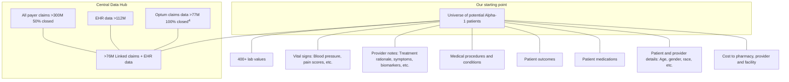

# Hidden in plain sight: A data-driven approach to identifying patients earlier in their Alpha-1 antitrypsin deficiency diagnostic odyssey

Authors: Adam Reyna, PharmD; Jay Bryant-Wimp, RPh; Miranda Morrison, MBA, MPP

## Background

Alpha-1 antitrypsin deficiency (AATD) is a genetic disorder that affects the body’s ability to produce sufficient levels of alpha-1 protein that circulates in the bloodstream and protects the lungs from inflammation. AATD prevalence is approximately 1 in 2,000–5,000.1

A patient may experience delayed AATD diagnosis for many reasons, including late onset of symptoms. Despite accepted clinical guidelines to test all patients with chronic obstructive pulmonary disease (COPD) for AATD, not all practitioners test.2 A diagnosis can take over 7 years.3

## Objectives

We had three objectives:

* Identify patients who could be evaluated sooner

* Design a novel approach to using claims data and information from medical records to be used as signals to identify potential patients

* Educate prescribers to test for AATD sooner

## Methods

Our team reviewed over 76 million deidentified pharmacy, medical and prescriber claims and records from 2016 through 2022. We identified 11,954 patients diagnosed with AATD and took the top 50 symptoms and comorbidities associated with AATD.

Next, we identified the most common medications that a patient with AATD would receive, as well as standard lab tests and durable medical equipment (DME) commonly used in the treatment of AATD. We categorized the medication NDCs and validated them against treatment guidelines to identify the most common signals, such as those with COPD and granulomatosis. Finally, we used machine learning to create k-mode clusters to find potential patients — patients who had not yet been diagnosed with AATD — and target practitioners for AATD education.

Narrowing the field using data analytics

We developed a custom algorithm that flags patients likely living with undiagnosed alpha-1 antitrypsin deficiency.

| Narrowing the field using data analytics   |
| ------------------------------------------ |
| 76M+ linked EHR + claims records           |
| 25M+ eligible for alpha-1 analysis         |
| Top 30% of matches                         |
| Providers with closest relationship        |
| Prioritization logic                       |
| Several hundred providers in first tranche |

## Results

Our team found 25,297 potential patients and 21,515 potential providers. After eliminating pulmonologists, we found 1,787 general practitioner targets, with 2,764 potential patients in their respective practices. The target prescriber list was further reduced, with the first subgroup of 208 providers with 4 or more probable patients and no known patients in their practice. Outreach to this subgroup will begin this year.

## Conclusion

We created a reproducible process to identify potential patients and prescribers for other rare diseases.

We look forward to presenting our data on the number of previously undiagnosed patients and the number of educational interventions.

## References

1 Sieluk J, Levy J, Sandhaus RA, Silverman H, Holm KE, Mullins CD. Costs of Medical Care Among Augmentation Therapy Users and Non-Users with Alpha-1 Antitrypsin Deficiency in the United States. *Chronic Obstr Pulm Dis*. 2018 Nov 8;6(1):6-16. doi: 10.15326/jcopdf.6.1.2017.0187. PMID: 30775420; PMCID: PMC6373584.

2 Evidence-based guidelines. Alpha-1 Antitrypsin Deficiency Clinical Practice Guidelines | *Journal of the COPD Foundation*.

3 Strnad P, McElvaney NG, Lomas DA. Alpha-1 antitrypsin deficiency. *N Engl J Med* 2020; 382:1443-1455.

4 Closed claims are insurance company-only data points. Open claims come from external sources such as health care system records.

All Optum trademarks and logos are owned and operated by Optum, Inc. in the U.S. and other jurisdictions. All other trademarks are the property of their respective owners. © 2023 Optum, Inc. All rights reserved. WF11232554_230810

Optum Life Sciences

Optum Frontier Therapies logo

