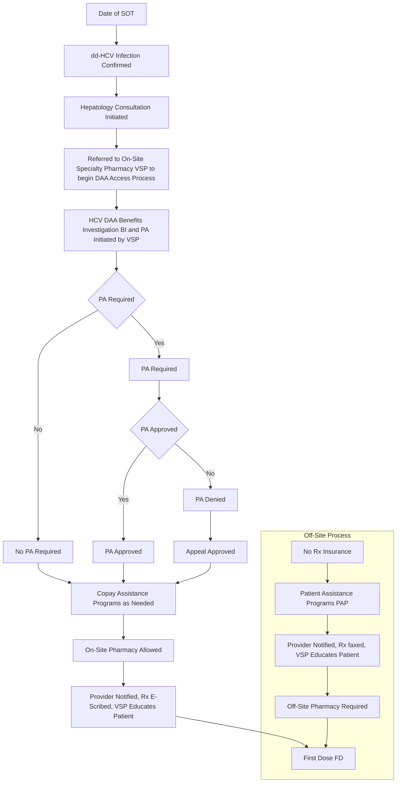

VANDERBILT UNIVERSITY MEDICAL CENTER

# ACCESS TO DIRECT ACTING ANTIVIRAL THERAPY FOR RECIPIENTS OF SOLID ORGANS FROM HEPATITIS C - VIREMIC DONORS

CORI EDMONDS, PHARMD | ALICIA CARVER, PHARMD | JOSH DECLERCQ, MS | LEENA CHOI, PHD | MEGAN PETER, PHD | RACHEL FORBES, MD | BEATRICE CONCEPCION, MD | KELLY SCHLENDORF, MD | ROMAN PERRI, MD

## INTRODUCTION

Medications to treat the hepatitis C virus (HCV) are notoriously expensive and plagued by strict insurance prior authorization (PA) criteria. Emerging data supports transplantation of organs from viremic, HCV-positive donors into HCV-negative recipients to expand the donor pool.1, 2 However, when implemented as standard practice post solid organ transplantation (SOT), prescription (Rx) access to HCV direct acting antivirals (DAAs) to treat patients who develop donor-derived hepatitis C (dd-HCV) has not been well described.

References:

1. Schlendorf KH, Zalawadiya S, Shah Ashish, et al. Early outcomes using hepatits C-positive donors for cardiac transplantation in the era of effective direct-acting anti-viral therapies. *J Heart Lung Transplant.* 2018; 37:763-769.

2. Potluri VS, Goldberg DS, Mohan S, et al. National trends in utilization and 1-year outcomes with transplantation of HCV-viremic kidneys. *J Am Soc Nephrol.* 2019;30:1929-1951.

Disclosures: Authors of this study have no relevant financial or non-financial interests to disclose

## PURPOSE

Evaluate HCV DAA prescription access, cost, timing and barriers to first dose (FD) in solid organ transplant recipients with confirmed, active dd-HCV infection post transplantation in a real-world, standard practice.

## METHODS

| DESIGN                 | Single center, IRB approved, retrospective cohort review                                                                                                                                                               |
| ---------------------- | ---------------------------------------------------------------------------------------------------------------------------------------------------------------------------------------------------------------------- |
| SAMPLE                 | dd-HCV solid organ transplant recipients transplanted between October 2016 and May 2019 prescribed HCV DAA therapy at Vanderbilt University Medical Center                                                             |
| OUTCOMES and VARIABLES | HCV DAA insurance approval rates Insurance PA denial reasons Time to FD Barriers encountered from BI to FD Predictors of delay from BI to FD Copay assistance use Out-of-pocket (OOP) DAA cost |
| ANALYSIS               | Descriptive statistics to summarize data. Univariate proportional odds logistic regression to assess factors related to time from BI to FD.                                                                            |

## RESULTS

| Cohort Characteristics (n=91)       | Cohort Characteristics (n=91) M \[SD] or % (n) |
| ----------------------------------- | -------------------------------------------------- |
| Age (Years)                         | 55 \[11]                                           |
| Gender (Male)                       | 68 (62)                                            |
| Race (White)                        | 72.5 (66)                                          |
| Genotype                            |                                                    |
| 1                                   | 69 (63)                                            |
| 2                                   | 8 (7)                                              |
| 3                                   | 22 (20)                                            |
| Mixed                               | 1 (1)                                              |
| Transplant Type                     |                                                    |
| Heart                               | 52 (47)                                            |
| Kidney                              | 30 (27)                                            |
| Liver                               | 11 (10)                                            |
| Heart/Kidney                        | 4 (4)                                              |
| Liver/Kidney                        | 1 (1)                                              |
| Lung                                | 2 (2)                                              |
| Insurance Type                      |                                                    |
| Government                          | 46 (42)                                            |
| Private/Commercial                  | 54 (49)                                            |
| Prescription Coverage               |                                                    |
| Insured                             | 97 (88)                                            |
| Not Insured                         | 2 (2)                                              |
| Underinsured                        | 1 (1)                                              |
| Specialty Pharmacy Rx Dispense Site |                                                    |
| On-Site (VSP)                       | 69 (63)                                            |
| Off-Site (Non-VSP)                  | 31 (28)                                            |
| HCV DAA Prescribed (12 weeks)       |                                                    |
| Sofosbuvir/Ledipasvir               | 46 (42)                                            |
| Sofosbuvir/Velpatasvir              | 13 (12)                                            |
| Glecaprevir/Pibrentasvir            | 41 (37)                                            |
| Pre-Therapy HCV Viral Load          |                                                    |
| < 1 million                         | 48 (44)                                            |
| 1 to < 25 million                   | 26 (24)                                            |
| ≥ 25 million                        | 23 (23)                                            |
| Therapy Response Rate               |                                                    |
| Sustained Viral Response            | 98 (89)                                            |
| Relapsed                            | 1 (1)                                              |
| Therapy not completed               | 1 (1)                                              |

### HCV DAA Access Rates

| Prescription Insurance Status   | % (n)    |
| ------------------------------- | -------- |
| Rx Insurance Approvals          | 100 (88) |
| PAP (no Rx insurance) Approvals | 100 (3)  |

| Rx Insurance Approvals        | Value      |
| ----------------------------- | ---------- |
| Approved by PA                | 65% (n=57) |
| PA Denied, Approved by Appeal | 35% (n=31) |

| PA Denial Reasons | Percentage |
| ----------------- | ---------- |
| Diagnosis Code    | 42%        |
| Length of Therapy | 35%        |
| Non-Formulary     | 10%        |
| Liver Fibrosis    | 6.5%       |
| Other             | 6.5%       |

### HCV DAA Access Timeline

| Time Period    | Median Days | IQR            |
| -------------- | ----------- | -------------- |
| SOT to FD      | 45          | \[34 – 66]     |
| SOT to BI      | 28          | \[18.5 - 41.5] |
| BI to FD       | 16          | \[9 - 27]      |
| BI to Approval | 6           | \[4 - 12]      |
| Approval to FD | 8           | \[5 - 12.5]    |

### Mean Days in Time Periods following SOT by Organ Type

| Organ Type          | SOT to BI | BI to Approval | Approval to FD |
| ------------------- | --------- | -------------- | -------------- |
| Multi-Organ (n=5)   | 85        | 12             | 10             |
| Heart (n=47)        | 40        | 11             | 11             |
| Liver (n=10)        | 40        | 16             | 10             |
| Lung (n=2)          | 26        | 5              | 17             |
| Kidney (n=27)       | 17        | 6              | 8              |
| Total Cohort (n=91) | 35        | 10             | 10             |

### HCV DAA Therapy Access Standard Process

### Predictors of Time in Days from BI to FD

| Category                                   | Odds Ratio (OR) | p-value |
| ------------------------------------------ | --------------- | ------- |
| Pharmacy (Non-VSP vs VSP)                  | 5.7             | <0.001  |
| Appeal (Yes vs No)                         | 4.7             | <0.001  |
| Insurance (Private vs Government)          | 3.2             | 0.002   |
| Indication (Off label vs Approved for use) | 1.9             | 0.098   |
| Transplant type (Kidney vs Any non-kidney) | 2.5             | 0.023   |

### Barriers and Delays to First Dose

* In univariate analyses, time between BI and FD was significantly longer for patients who:

    - Filled their first Rx at an off-site specialty pharmacy

    - Required an insurance appeal

    - Held private/commercial insurance

    - Received a non-kidney solid organ transplant

* A third of patients (n=33, 36%) encountered a delay between BI to FD that was not related to a PA denial:

    - **BI to Approval Period (n=9, 27%)**

        - Missing clinical data for PA (n=4)

        - Delay in obtaining PA form (n=3)

        - PAP paperwork process delay (n=2)

    - **Approval to FD Period (n=24, 71%)**

        - Awaiting inpatient setting discharge (n=11)

        - Pharmacy Rx processing/shipping issue (n=9)

        - Patient/Provider request (n=2)

        - Insurance changed between Approval to FD (n=2).

### HCV DAA Rx Cost

| Copay Assistance Required\* | Copay Assistance Required\* Yes | Copay Assistance Required\* No |
| --------------------------- | ----------------------------------- | ---------------------------------- |
|                             | 49% (n=31)                          | 51% (n=32)                         |
| Mean OOP Cost               |                                     |                                    |
| Pre Assistance              | $2,003 \[Range: $7-$7,536]          | $8 \[Range: $0-$100]               |
| Post Assistance             | $2 \[Range: $0-$5]                  | Not Applicable                     |

\* On-Site Pharmacy (VSP) Data Only

## CONCLUSIONS

* HCV DAA therapy for dd-HCV solid organ transplant patients is achievable and affordable in the outpatient setting.

* Use of an on-site specialty pharmacy for the first Rx fill is associated with a significantly shorter time to FD.

* Delays to FD after referral for BI/PA initiation are more likely when insurance requires use an off-site specialty pharmacy to fill the prescription, coverage is with private insurance, SOT was non-kidney, and an insurance appeal after initial PA denial is required.

