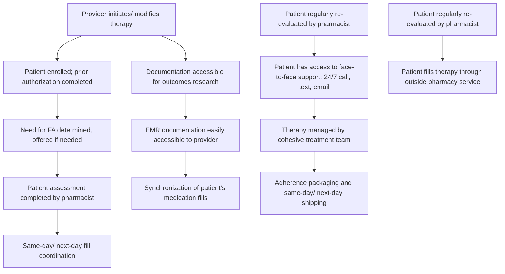

Trellis Rx logo

# Evaluating the Benefit of a Clinically-Integrated Health System Specialty Pharmacy Care Model in Treating Rheumatologic Diseases

Suprina Patel, PharmD; Travis Fransen, PharmD, MBA

## BACKGROUND

* Trellis Rx partners with health systems to offer clinically-integrated health system specialty pharmacy (HSSP) services to their patients. Our approach embeds pharmacists and liaisons alongside other providers, under the health system's brand, ensuring patients receive coordinated, high-touch support to improve outcomes.

* Routine Assessment of Patient Index Data 3 (RAPID3) is a pooled index of three patient-reported measures the American College of Rheumatology (ACR) accepts as core data set measures in Rheumatoid Arthritis (RA) and Psoriatic Arthritis (PsA): function, pain and patient global estimate of status. The values range from 1 to 30, where a score of 1 indicates the patient is near remission, and a score of 30 indicates the patient has high severity of disease.

* There are two different paths a patient can take under our care: clinical services only (e.g. dispense opt-out) or clinical and dispensing services (e.g. dispense opt-in). Dispense opt-out patients have their medications filled by an external specialty pharmacy, while dispense opt-in patients have their medications filled by the HSSP.

## OBJECTIVE

* The primary objective of this study is to compare the benefit of utilizing dispensing services alongside clinical services by measuring overall disease severity of patients with RA or PsA.

* The data will also be analyzed to determine if any drug class, payor, demographic, or monetary trends correlated with disease severity in the population.

## METHODS

* Multi-center, retrospective, case control study of adult patients with a diagnosis of RA or PsA receiving care from the HSSP from August 2018 to May 2020.

* We will administer RAPID3 tests to all adult patients with RA and PsA seen by rheumatology providers and assess that data, alongside demographic and medication administration data collected from the electronic health record (EHR).

## DATA ANALYSIS/RESULTS

* 1320 patient cases were reviewed, resulting in 198 patients with three or more data points.

* The change of RAPID3 from baseline to first data point collected was 1.4 in patients who were dispense opt-in (n=38) versus 0.8 in patients who were dispense opt-out (n=160).

* Change in RAPID3 from baseline to most recent RAPID3 collected for patients who were dispense opt-in was 1.6 versus dispense opt-out of 1.2.

* After performing an analysis of the demographic, drug class, payor, and monetary trends the results were similar in that there was no one agent or class that showed a better cost or efficacy profile than any other.

## FIGURE 1

Comparison of Average RAPID3 Score in Patients Dispensed Medications through HSSP vs Outside Pharmacy

| Category           | HSSP (n=38) | Outside Pharmacy (n=160) |
| ------------------ | ----------- | ------------------------ |
| RAPID3 Baseline    | 7.9         | 10.8                     |
| RAPID3 Follow Up 1 | 6.5         | 10.0                     |
| RAPID3 Follow Up 2 | 6.3         | 9.6                      |

## MALE/FEMALE COMPARISON

| HSSP (n=93) Category | HSSP (n=93) Percentage |
| ------------------------ | -------------------------- |
| Female                   | 68.8                       |
| Male                     | 31.2                       |

| Outside Pharmacies (n=1227) Category | Outside Pharmacies (n=1227) Percentage |
| ---------------------------------------- | ------------------------------------------ |
| Female                                   | 72.2                                       |
| Male                                     | 27.8                                       |

## PAYOR BREAKDOWN

| HSSP (n=93) Category | HSSP (n=93) Percentage |
| ------------------------ | -------------------------- |
| Commercial Insurance     | 77.4                       |
| Medicaid                 | 8.6                        |
| Medicare                 | 14                         |

| Outside Pharmacies (n=1227) Category | Outside Pharmacies (n=1227) Percentage |
| ---------------------------------------- | ------------------------------------------ |
| Commercial Insurance                     | 57.9                                       |
| Other/None                               | 3.7                                        |
| Medicaid                                 | 8.1                                        |
| Medicare                                 | 30.3                                       |

## MOST FREQUENTLY DISPENSED THERAPIES

| HSSP (n=93) Category | HSSP (n=93) Percentage |
| ------------------------ | -------------------------- |
| Adalimumab               | 20.4                       |
| Etanercept               | 21.5                       |
| Tofacitinib              | 10.7                       |
| Apremilast               | 8.6                        |
| Upadacitinib             | 8.6                        |
| Other                    | 30.2                       |

| Outside Pharmacies (n=1227) Category | Outside Pharmacies (n=1227) Percentage |
| ---------------------------------------- | ------------------------------------------ |
| Etanercept                               | 30.8                                       |
| Adalimumab                               | 32.4                                       |
| Apremilast                               | 3.7                                        |
| Abatacept                                | 5                                          |
| Tofacitinib                              | 13.2                                       |
| Other                                    | 14.9                                       |

## AGE TABLE

| Group                     | Average Age (years) | Age Range (years) |
| ------------------------- | ------------------- | ----------------- |
| HSSP (n=93)               | 54                  | 26-82             |
| Outside Pharmacy (n=1227) | 56                  | 9-90              |

## PATIENT MANAGEMENT PATHWAY FOR HEALTH SYSTEM SPECIALTY PHARMACY

Dispense opt-out patients icon Dispense opt-out patients

Dispense in-opt patients icon Dispense in-opt patients

## CONCLUSIONS

* When comparing outcomes of patients who opted to dispense through their HSSP versus an outside pharmacy, the HSSP produced 1.75 times better results in change from baseline to first collection of RAPID3 scores, and 1.33 times better results in change overall.

* There is no evidence of superiority when comparing the medications head to head in this subset of data.

