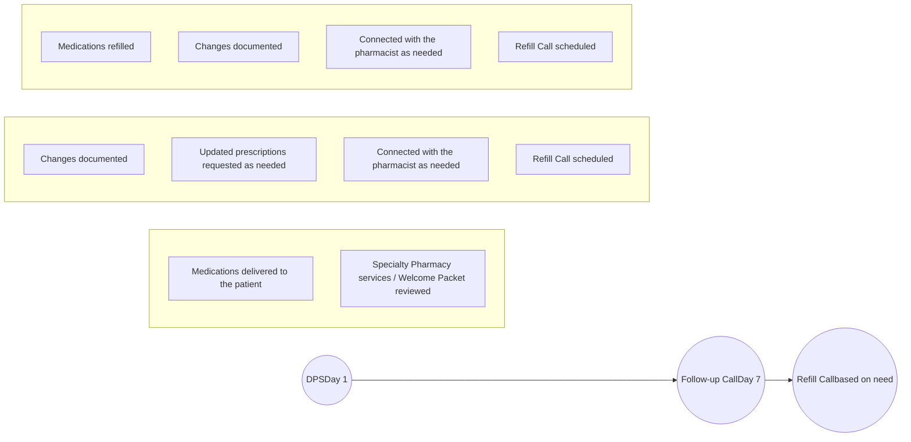

Contact information:
Helen Northrup
Medical Center Blvd
Winston-Salem, NC
336-713-8064
onorthru@wakehealth.edu

# Evaluation of an integrated health-system specialty pharmacy technician-driven 7 day post-transplant discharge follow-up call

Wake Forest Baptist Health logo

**Helen Northrup, PharmD, BCACP, Kyle Hansen, PharmD, BCPS, Jennifer Young, PharmD, BCPS, CSP**

**Wake Forest Baptist Medical Center, Winston-Salem, NC**

## Background

* Patients discharged after organ or stem cell transplant on multifaceted drug regimens are often naïve to specialty pharmacy services

* As these patients will be on specialty medications generally lifelong after transplant there is a significant opportunity for early connections and explanation of specialty pharmacy services

* The Wake Forest Baptist Health (WFBH) Specialty Pharmacy is a dually accredited specialty pharmacy, embedded in an academic medical center, serving a myriad of patients

* Abdominal, heart and bone marrow transplant patients are a large portion of patient volumes (45%) and discharge prescription services (DPS) are a key component for these patients

* In November 2019 the Specialty Pharmacy implemented a technician-driven 7 day post transplant discharge call to review specialty pharmacy services, discuss billing, reiterate refill processes, determine early medication changes and offer additional pharmacists counseling

## Objectives

* Determine the average time to completion of post transplant discharge follow-up calls

* Assess the impact of a technician-drive 7 day post transplant discharge follow-up call on patient retention

* Evaluate the number of early medication changes, and pharmacist interventions required at the time of the call

## Methods

* IRB-approved single-center, retrospective chart review preformed on abdominal, heart and bone marrow transplant patients with a completed post transplant discharge follow-up call between November, 1 2019 and June, 1 2020

## Technician-Driven Follow-up Call Process

| Content Reviewed and Services Offered During 7 Day Post-Transplant Discharge Follow-up Call | Content Reviewed and Services Offered During 7 Day Post-Transplant Discharge Follow-up Call | Content Reviewed and Services Offered During 7 Day Post-Transplant Discharge Follow-up Call | Content Reviewed and Services Offered During 7 Day Post-Transplant Discharge Follow-up Call | Content Reviewed and Services Offered During 7 Day Post-Transplant Discharge Follow-up Call | Content Reviewed and Services Offered During 7 Day Post-Transplant Discharge Follow-up Call | Content Reviewed and Services Offered During 7 Day Post-Transplant Discharge Follow-up Call | Content Reviewed and Services Offered During 7 Day Post-Transplant Discharge Follow-up Call | Content Reviewed and Services Offered During 7 Day Post-Transplant Discharge Follow-up Call |
| ------------------------------------------------------------------------------------------- | ------------------------------------------------------------------------------------------- | ------------------------------------------------------------------------------------------- | ------------------------------------------------------------------------------------------- | ------------------------------------------------------------------------------------------- | ------------------------------------------------------------------------------------------- | ------------------------------------------------------------------------------------------- | ------------------------------------------------------------------------------------------- | ------------------------------------------------------------------------------------------- |
| Specialty Pharmacy Welcome Packet                                                           | Pharmacy hours                                                                              | 24/7 On-call Pharmacist Availability                                                        | Delivery Options                                                                            | Refill Order Process                                                                        | Billing                                                                                     | Changes in Therapies                                                                        | Dose Changes                                                                                | Pharmacist Counseling                                                                       |

## Results

* Calls were completed at an average of 9.7 days post-discharge and the majority were completed on the first attempt on Post-discharge Day 7

* 157 patients had documented post-transplant discharge follow-up call with the majority being kidney transplant recipients

| Category    | Percentage |
| ----------- | ---------- |
| Kidney      | 85         |
| Bone Marrow | 10         |
| Heart       | 4          |
| Multiple    | 1          |

Figure 1. Patient Population

| Category             | Percentage |
| -------------------- | ---------- |
| Patient Retained     | 85         |
| Patient Not Retained | 15         |

Figure 2. Patient Retention

* 85% of patients were retained for future refills of medications, with the most common reason for transfer out being insurance restriction

| Category            | Percentage |
| ------------------- | ---------- |
| Change Reported     | 53         |
| Change Not Reported | 47         |

Figure 3. Patient Reported Medication Changes

* 53% of patients reported at least 1 medication change and 47% of patients reported no medication changes during the follow-up call

* Among reported changes 30% of patients had immunosuppressant medication changes, 33% other medication changes and 13% infection prophylaxis changes. Some patients reported multiple medication changes

* 3% of patients required pharmacist consultation with 50% of these being medication related questions, 25% being adverse effect concerns and 25% being billing questions

## Discussion

* This process was an efficient technician-driven process with the majority of patients reached at 7 days post-discharge

* A positive retention rate was potentially related to relationship building during patient interactions

* The majority of patients unable to continue filling were due to insurance restrictions

* Amount of identified medication changes allowed for timely documentation and proactive request of updated prescriptions

* The low amount of required pharmacist interventions supported a technician-driven process

* Limitations include lack of comparator group, variations in free text documentation and rotation of various individuals through discharge transplant technician role

## Conclusions

* The 7-day post-transplant discharge follow-up call offered a timely opportunity to review pertinent specialty pharmacy information and assess any changes in therapy after discharge

* This was a successful technician-driven process with most patients able and willing to continue filling with WFBH Specialty Pharmacy

* Future opportunities include utilization of technology for alternative methods of contact during this touchpoint

## References

1. Kalluri HV, Hardinger KL. Current state of renal transplant immunosuppression: Present and future. World J Transplant. 2012;2(4):51-68. doi:10.5500/wjt.v2.i4.51

2. Black CK, Termanini KM, Aguirre O, Hawksworth JS, Sosin M. Solid organ transplantation in the 21st century. Ann Transl Med. 2018;6(20):409. doi:10.21037/atm.2018.09.68

3. Sam S, Guérin A, Rieutord A, Belaiche S, Bussières JF. Roles and Impacts of the Transplant Pharmacist: A Systematic Review. Can J Hosp Pharm. 2018;71(5):324-337.

## Acknowledgment

Authors would like to express gratitude to Amanda Barlow, CPhT, for her immense contribution to the development and implementation of this process.

## Disclosures

All authors of this presentation have nothing to disclose concerning possible financial or personal relationships with commercial entities that may have a direct or indirect interest in the subject matter of this presentation.

