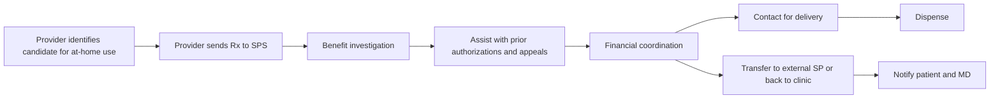

Atrium Health logo

# Evaluation of an Integrated Health-System’s Approach in Facilitating At-Home Use of Granulocyte-Colony Stimulating Factors in the Face of the COVID 19 Pandemic

Nicole Cowgill, PharmD, BCOP, CSP; Gale Fraser III, CPhT; John Robicsek, MBA
Specialty Pharmacy Service
Atrium Health, Charlotte, NC, USA

## Background

* Studies have demonstrated significantly worse outcomes for patients with cancer who are infected with COVID 19 including higher incidence of severe adverse events and death.1,2

* Health care institutions should implement new practices and procedures to reduce the necessity of in-person care and decrease the risk of exposure to the SARS-CoV-2 virus, especially in patients who are immunocompromised.3

* Granulocyte-colony stimulating factors (GCSF) are routinely given to patients with a ≥ 20% risk of developing neutropenic fever 24 hours after chemotherapy, requiring many patients to return to clinic to receive a subcutaneous injection.4

* Levine Cancer Institute (LCI) and the specialty pharmacy service (SPS) at Atrium Health piloted a care coordination program to transition as many patients as possible from on-site to at-home self-administered injections of GCSF.

* Due to the change in coverage benefits from a medically billed on-site injection to a pharmacy billed at-home self-injection, challenges include high out-of-pocket copays at the time of dispense and potential delays in care due to outpatient pharmacy coordination.

## Pilot Model

**PROVIDER INITIATION**

* Provider evaluates patient to determine appropriate candidate for at-home self-injection

* Provider sends electronic prescription to SPS

**SPECIALTY PHARMACY SERVICE**

Technicians complete the following:

* Benefit investigation (BI)

* Assist with prior authorization (PA) and appeal paperwork

* Financial coordination:

  - consult with patient regarding affordability and

  - assist with obtaining copay cards

  - Investigate grants

* Care coordination depending on BI/PA/financial outcome:

  - SPS in-network: patient outreach for delivery

  - SPS out of network: transfer prescription and copay assistance to in-network pharmacy and notify patient and MD

  - Patient cannot afford outpatient dispense: confirm with clinic patient to receive on-site injection or application of auto-injection device

## Objectives

The objectives of this investigation are to evaluate outcomes of the pilot service including the successful transition rate from medically billed on-site GCSF use to pharmacy billed at-home use, turn around times of key service endpoints, and values associated with financial coordination activities.

## Figure 1. Workflow of GCSF care coordination through the specialty pharmacy service

## Results

| Figure 2. Transition Success Rate           | Figure 2. Transition Success Rate |
| ------------------------------------------- | --------------------------------- |
| Total patients                              | 137                               |
| Transitions to SPS                          | 50                                |
| Transitions to external pharmacy            | 42                                |
| Unsuccessful transitions                    | 45                                |
| Total transition success rate               | 67%                               |
| Reasons for unsuccessful transition         |                                   |
| Medicare (ineligible for copay card)        | 88                                |
| Other insurance (ineligible for copay card) | 8                                 |
| No insurance                                | 4                                 |

Figure 3. Prior Authorization TAT

| Days | Count (n) |
| ---- | --------- |
| 0    | 30        |
| 1    | 58        |
| 2    | 9         |
| 3    | 4         |
| 4    | 4         |
| 5    | 1         |
| 8    | 1         |

Average TAT = 0.97 days

Figure 4. Patient/MD Outreach TAT

| Days | Count (n) |
| ---- | --------- |
| 0    | 22        |
| 1    | 23        |
| 2    | 4         |
| 8    | 1         |

Average TAT = 0.78 days

| Figure 5. Financial Outcomes          | Figure 5. Financial Outcomes |
| ------------------------------------- | ---------------------------- |
| Patients needing financial assistance | 34                           |
| Copay cards                           | 32                           |
| Total copay card value                | $455,000                     |
| Grants                                | 2                            |
| Total grant value                     | $15,000                      |
| Total assistance value                | $470,000                     |
| Out of Pocket Copays at SPS           |                              |
| Average copay                         | $4.67                        |
| Median copay                          | $0.00                        |

* **Figure 2.** Of 141 patients referred, 4 orders were canceled by MD before PA determination. Of the 137 remaining: 50 transitioned to SPS, 42 transitioned to external pharmacies, and 45 continued to receive on-site injection or application of autoinjector. Transition success rate was 67%. Reasons for unsuccessful transition included high copays due to ineligibility for copay card (n = 41) and uninsured (n = 4). **Figure 3.** Of 141 referrals, 115 need prior authorizations and 6 required appeals. Of the 115 completed PAs, 8 were denied or canceled prior to determination. Of the remaining 107, average time to PA determination was 0.97 business days. **Figure 4.** For the 50 patients able to fill with SPS, the turn-around-time to patient or MD outreach to schedule delivery was an average of 0.78 business days. **Figure 5.** SPS obtained financial assistance for 34 eligible patients requesting assistance for a combined value of $470,000.00 The average copay of patients filling with SPS was $4.67. The median copay was $0.00.

## Methods

* This investigation was an observational, retrospective, quality evaluation of services provided.

* Prescription orders were identified through the electronic prescribing system in the electronic medical record (EMR).

* Orders prescribed between March 23, 2020 and April 23, 2020 were included.

* Prescription dates, transactions, electronic messaging, and documentation were collected from the EMR and pharmacy dispensing software.

* Rate of successful transition from clinic provided GCSF to outpatient pharmacy provided GCSF was calculated.

* Turn-around-time was defined as the number of business days between the date the prescription was written and the outcomes of the following:

  - Date prior authorization status was determined

  - Date of outreach to patient or provider to schedule delivery if filling with SPS

  - Same day = 0, next day = 1, etc.

* Average and median copays were calculated for prescriptions filled with SPS.

## Discussion

* Due to collaborative integration with providers and access to the EMR, health-system specialty pharmacies are well-positioned to support the many challenges associated with patient access to specialty medications. Research has demonstrated that these programs have the ability to significantly impact medication access through prior authorization support and fast turn-around-times.5 Our investigation complements these findings by demonstrating average turn-around-times of less than one business day.

* The success of transitioning patients from on-site to at-home self-injection GCSF was strongly related to patient out-of-pocket affordability. Patients may qualify for grant funds if they are ineligible to use copay cards, however during the time period these funds were only open for enrollment briefly and could only be secured for 2 patients. In order to ensure all self-injection patients could afford their medications, SPS enrolled patients for financial support regardless of being in-network or out-of-network with the patient’s insurance plan. This ensured a low average copay for all GCSF filled through SPS.

## Conclusions

* Health-system SP services can delver efficient benefit investigation and care coordination services when transitioning from on-site to at-home self-injection administration of GCSF.

* SPs can ensure low out-of-pocket expenses through the appropriate use of available financial resources.

## Resources

1. Landman, A., Feeham, L., Stuckey, D. Cancer patients in SARS-CoV-2 infection: a nationwide analysis in China. The Lancet Online Oncology. Feb 14, 2020. Https://doi.org/10.1.16/S1470-2045(20)30096-6.

2. Deng, G. et al. Clinical determinants for fatality of 44,672 patients with COVID-19. Critical Care. 2020. 24:179 https://doi.org/10.1186/s13054-020-02902-w.

3. CDC. 2020, June 28. Healthcare Facilities: Managing Operations During the COVID-19 Pandemic. Retrieved from https://www.cdc.gov/coronavirus/2019-ncov/hcp/guidance-hcf.html.

4. Smith TJ, Bohlke K, Lyman GH, et al. Recommendations for the Use of WBC Growth Factors: American Society of Clinical Oncology Clinical Practice Guideline Update. J Clin Oncol. 2015;33(28):3199-3212. doi:10.1200/JCO.2015.62.3488

5. Newman,B. 2019, August. Trellis Rx. Oral Oncology Medication Turnaround Times Outcomes Report. Trellis RX. Retrieved from https://www.trellisrx.com/trellis-rx-outcomes-report-oral-oncology-medication-turnaround-times.

## Contact Info

Nicole.Cowgill@atriumhealth.org

## Acknowledgements

The presenting authors have no conflicts of interest to disclose

