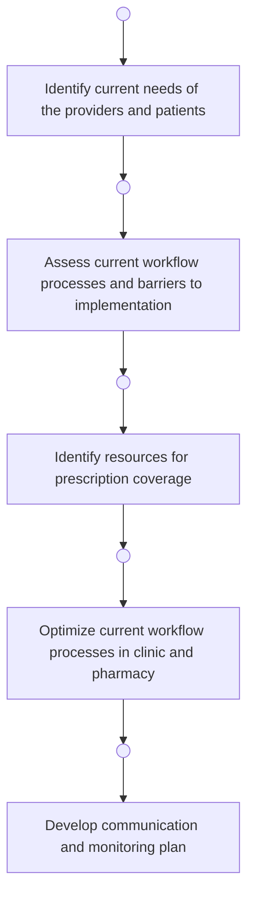
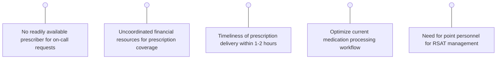
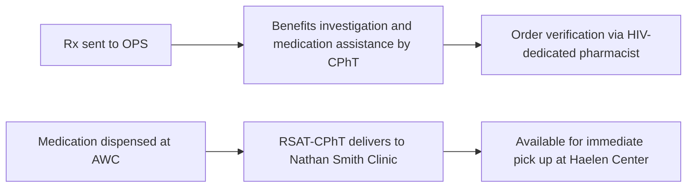

Yale New Haven Health logo

# Expansion of outpatient pharmacy services through initiation of a rapid-start antiretroviral therapy program

Jennifer E. Marvin, PharmD, Eric M. Szydlowski, PharmD, MPH, AAHIVP, Martha Stutsky, PharmD, BCPS, Kimberly Tynik, PharmD, CSP, PRS, Tina Do, PharmD, MS, BCPS, Kimhouy Tong, PharmD
Yale New Haven Health (YNHH), New Haven, Connecticut

# Background

* World Health Organization recommends immediate initiation of antiretroviral therapy (ART) on day of HIV diagnosis1

* Rapid-start antiretroviral therapy (RSAT) programs are recommendations from the Health Resources and Services Administration (HRSA) for 20201

* Yale New Haven Hospital (YNHH) has two infectious diseases clinics, The Haelen Center and The Nathan Smith Clinic, that provide comprehensive HIV services

* YNHH has two outpatient pharmacies, Outpatient Pharmacy Services (OPS) and the Apothecary & Wellness Center (AWC)

* Currently there is not an established RSAT program at YNHH

* In 2018, there were 10,574 individuals living with HIV in Connecticut2

# Objectives

* Identify and address barriers to initiating an RSAT program

* Develop new workflow processes across pharmacy sub-specialties for successful program implementation

# Methods

## Inclusion:

* New HIV diagnosis

* Likely to be adherent to therapy as determined by provider

* Ready to initiate therapy

## Exclusion:

* Active opportunistic infection as defined by laboratory or microbiology evidence or high clinical suspicion

* Emotional reluctance to initiate therapy

# Results

## Figure 1: Identified Differences in Initial Workflow Maps

| Timeframe | Haelen Center                     | Timeframe | Nathan Smith Clinic               |
| --------- | --------------------------------- | --------- | --------------------------------- |
| Day 1     | Referral to HIV clinic            | Day 1     | Referral to HIV clinic            |
|           | Same-day appointment with MD      |           | Appointment with social work      |
|           | Labs                              |           | Labs                              |
|           | Benefits investigation            |           | Benefits investigation            |
| Day 1     | Rx sent                           | Day 7     | MD appointment                    |
|           | Mail delivery or physical pick-up |           | Rx sent                           |
| Day 2-7   |                                   | Day 7-14  | Mail delivery or physical pick-up |

Figure 2: Identified Barriers Requiring Optimization

## Figure 3: Optimized Infectious Disease Clinic Workflow

| Timeframe | Haelen Center                    | Timeframe | Nathan Smith Clinic            | On-call PA or MD program |
| --------- | -------------------------------- | --------- | ------------------------------ | ------------------------ |
| Day 1     | Referral to HIV clinic           | Day 1     | Referral to HIV clinic         | On-call PA or MD program |
|           | Same-day appointment with MD     |           | Appointment with social work   |                          |
|           | Benefits investigation           |           | Benefits investigation         |                          |
|           | Rx sent                          |           | Rx sent                        |                          |
|           | Rx available on-site for pick up |           | Rx delivered to clinic via M2B |                          |
|           | Labs                             |           | Labs                           |                          |
| Day 2-7   | MD appointment                   | Day 2-7   | MD appointment                 |                          |

Figure 4: Optimized Medication Processing Workflow

CPhT: certified pharmacy technician; HIV: human immunodeficiency virus; M2B: Meds-to-Beds program

# Discussion

* Workflow mapping of both infectious disease clinics identified opportunities to standardize clinical processes including the addition of an on-call prescriber to manage newly diagnosed HIV patients

* Drug manufacturer and Yale New Haven Hospital medication assistance programs were optimized to meet the need for immediate coverage for uninsured or unfunded patients in both clinics

* Pre-existing prescription processing workflows at two different pharmacy sites including the Meds-to-Beds program were leveraged to expedite medication delivery to meet the goal of medication-in-hand at time of diagnosis

# Conclusions

* Implemented a successful RSAT program for patients to receive drug in-hand on day of diagnosis

* It is anticipated that this project will enhance Yale New Haven Health System's comprehensive care for patients with HIV by providing enhanced access to vital ART

# Future Directions

* Future studies will assess the impact on clinical outcomes from implementing this program, which will include time to viral suppression and rates of retention in care analyzed pre-and post-program implementation

# References

1. World Health Organization. Guidelines for managing advanced HIV disease and rapid initiation of antiretroviral therapy. 2017. https://www.who.int/hiv/pub/guidelines/advanced-HIV-disease/en. Accessed August 10, 2020.

2. Centers for Disease Control and Prevention. HIV Surveillance Report, 2018 (Updated); vol.31. http://www.cdc.gov/hiv/library/reports/hiv-surveillance.html. Published May 2020. Accessed August 10, 2020.

NASP 2020 Annual Meeting & Expo Virtual Experience. Disclosure: The authors of this presentation have the following to disclose concerning possible financial or personal relationships with commercial entities that may have a direct or indirect interest in the subject matter of this presentation: Authors have nothing to disclose.

