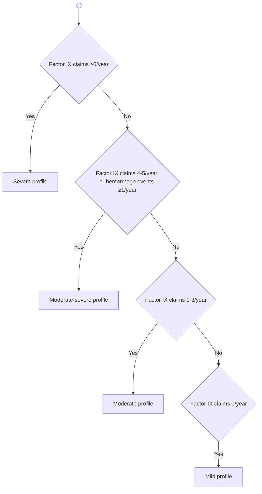
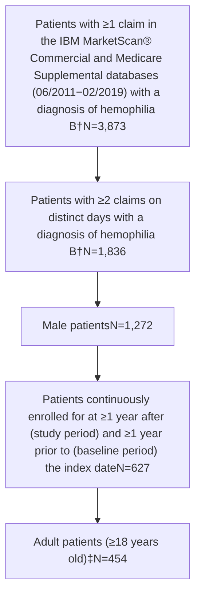

# Healthcare Resource Utilization and Cost Burden of Hemophilia B in the United States

Tyler W. Buckner1, Kaitlin A. Hagan2, Eli Orvis2, Hongbo Yang2, Eileen K. Sawyer3, Nanxin (Nick) Li3

1Hemophilia and Thrombosis Center, University of Colorado School of Medicine, Aurora, CO, USA. 2Analysis Group, Inc., Boston, MA, USA. 3uniQure, Inc., Lexington, MA, USA.

Poster No:     

## INTRODUCTION

* The number of people living with hemophilia B worldwide is over 30,000 and in the United States (US) alone is over 6,000.1,2

* Despite the rarity of hemophilia B, it is associated with a substantial economic and societal burden.3

* Several studies have investigated the economic burden of hemophilia B using real-world administrative claims data, but focused on outcomes within the overall study sample4,5 or among patients receiving extended half-life vs. standard half-life factor IX (FIX) treatments.6

* To date, no studies have examined the economic burden of hemophilia B with stratification by disease severity or clinical profile.

## OBJECTIVES

* To construct an insurance database algorithm to identify clinical profile of hemophilia B.

* To quantify healthcare resource utilization (HRU) and healthcare costs associated with hemophilia B from a US health system perspective, both overall and by clinical profile.

## METHODS

### Data source and study population

* This study used the IBM MarketScan® Commercial and Medicare Supplemental databases (06/2011−02/2019).

* Patients were included in the hemophilia B cohort if they met the following criteria:

    - Adult male patients with ≥2 claims on separate dates with diagnosis of hemophilia B.

    - Patients continuously enrolled for ≥1 year after (study period) and ≥1 year prior to (baseline period) the index date (see definition below).

* The dates of all medical visits associated with a hemophilia B diagnosis were considered as potential index dates. For patients with multiple qualifying index dates, one was randomly selected as their index date.

* A demographic-matched control sample of enrollees without any diagnoses for hemophilia B, hemophilia A, or other coagulation disorders (e.g., Von Willebrand’s disease) was also generated.

### Algorithm for clinical profile

* The clinical profile of hemophilia B was categorized as mild, moderate, moderate-severe, or severe, using a claims-based algorithm informed by literature7,8 and expert opinion (Figure 1).

### Figure 1. Algorithm for clinical profile

### Study outcomes and statistical analyses

* Patient characteristics at baseline and all-cause HRU and healthcare costs during the 1-year study period were compared between patients with hemophilia B vs. matched controls, both overall and with stratification by clinical profile.

* Statistical comparisons between patients with hemophilia B vs. matched controls were conducted using Wilcoxon signed-rank tests for continuous variables, and McNemar test for categorical variables.

## RESULTS

### Baseline characteristics

* A total of 454 patients with hemophilia B and 454 matched controls were included in the analysis (Figure 2).

* Patients with hemophilia B had a significantly higher comorbidity burden compared to matched controls (Charlson Comorbidity Index: 0.9 vs. 0.3, p<0.001) (Table 1).

### Figure 2. Sample selection flow chart

†Hemophilia B was identified using ICD-9-CM code 286.1 or ICD-10-CM code D67.
‡Patients with hemophilia B were matched 1:1 to control enrollees without hemophilia or other coagulation disorders (N=454).

### Table 1. Baseline characteristics

| Patient characteristics                 | Patients with hemophilia B N=454 | Controls N=454 | P-value |
| --------------------------------------- | -------------------------------- | -------------- | ------- |
| **Demographics**                        |                                  |                |         |
| Age (years), mean (SD)                  | 46.0 (18.4)                      | 46.0 (18.4)    | 1.000   |
| Geographic region, n (%)                |                                  |                | 1.000   |
| North central                           | 132 (29.1%)                      | 132 (29.1%)    |         |
| Northeast                               | 90 (19.8%)                       | 90 (19.8%)     |         |
| South                                   | 163 (35.9%)                      | 163 (35.9%)    |         |
| West                                    | 69 (15.2%)                       | 69 (15.2%)     |         |
| Insurance type, n (%)                   |                                  |                | 1.000   |
| Comprehensive                           | 33 (7.3%)                        | 33 (7.3%)      |         |
| Preferred provider organization (PPO)   | 276 (60.8%)                      | 276 (60.8%)    |         |
| Capitated                               | 50 (11.0%)                       | 50 (11.0%)     |         |
| Other                                   | 95 (20.9%)                       | 95 (20.9%)     |         |
| Index year, n (%)                       |                                  |                | 1.000   |
| 2012−2013                               | 184 (40.5%)                      | 184 (40.5%)    |         |
| 2014−2015                               | 131 (28.9%)                      | 131 (28.9%)    |         |
| 2016−2018                               | 139 (30.6%)                      | 139 (30.6%)    |         |
| **Comorbidities**                       |                                  |                |         |
| Charlson Comorbidity Index, mean (SD)   | 0.9 (1.7)                        | 0.3 (0.9)      | <0.001  |
| Hemophilia-related comorbidities, n (%) |                                  |                |         |
| HIV/AIDS                                | 17 (3.7%)                        | 1 (0.2%)       | <0.001  |
| Hepatitis B                             | 7 (1.5%)                         | 0 (0.0%)       | 0.008   |
| Hepatitis C                             | 76 (16.7%)                       | 2 (0.4%)       | <0.001  |

### HRU and costs

* Overall, patients with hemophilia B had over twice as many inpatient (IP) admissions (mean number of admissions: 0.3 vs. 0.1, p<0.001), emergency room (ER) visits (mean: 0.6 vs. 0.2, p<0.001), and outpatient (OP) visits (mean: 17.7 vs. 8.0, p<0.001; Table 2).

* Use of prescribed opioids was significantly higher among patients with hemophilia B compared to matched controls, with patients in the severe cohort receiving on average 2-month supply of opioid prescriptions.

* Consistent with HRU results, healthcare costs were greater among patients with hemophilia B than matched controls across every category (all p<0.05) (Figure 3).

* Annual total healthcare costs increased with increasing severity of clinical profile, ranging from $83,291 and $141,101 in the mild and moderate cohorts, to $254,077 and $643,979 in the moderate-severe and severe cohorts.

* Hemophilia-related treatment costs accounted for 72% of total healthcare costs in patients with hemophilia B, and 94% in the severe cohort.

### Table 2. Annual all-cause healthcare resource utilization

|                                     | Patients with hemophilia B N=454 | Controls N=454 | P-value |
| ----------------------------------- | -------------------------------- | -------------- | ------- |
| **≥1 admission, n (%)**             |                                  |                |         |
| IP admission                        | 87 (19.2%)                       | 26 (5.7%)      | <0.001  |
| ER visit                            | 133 (29.3%)                      | 64 (14.1%)     | <0.001  |
| OP visit                            | 454 (100.0%)                     | 366 (80.6%)    | <0.001  |
| **Number of admissions, mean (SD)** |                                  |                |         |
| IP admissions                       | 0.3 (0.6)                        | 0.1 (0.3)      | <0.001  |
| Days of hospitalization             | 1.2 (3.7)                        | 0.3 (1.5)      | <0.001  |
| ER visits                           | 0.6 (1.2)                        | 0.2 (0.6)      | <0.001  |
| OP visits                           | 17.7 (22.9)                      | 8.0 (11.0)     | <0.001  |
| **≥1 specialist visit,‡ n (%)**     |                                  |                |         |
| Hematologist                        | 289 (63.7%)                      | 34 (7.5%)      | <0.001  |
| Orthopedist                         | 151 (33.3%)                      | 81 (17.8%)     | <0.001  |
| Psychologist/psychiatrist           | 45 (9.9%)                        | 21 (4.6%)      | 0.002   |
| **Prescribed opioids**              |                                  |                |         |
| ≥ 1 prescription, n (%)             | 185 (40.7%)                      | 102 (22.5%)    | <0.001  |
| Days of supply, mean (SD)           | 35.2 (114.1)                     | 9.9 (39.1)     | <0.001  |

‡Specialist visits were identified based on provider type or Current Procedural Terminology code reported on a claim.

### Figure 3. Annual healthcare costs

| Patient Cohort                         | Pharmacy | Medical services | Total Cost | Control Cost | P-value |
| -------------------------------------- | -------- | ---------------- | ---------- | ------------ | ------- |
| All patients with hemophilia B (N=454) | $155,942 | $49,841          | $205,783   | $8,052       | <0.001  |
| Severe hemophilia B (N=66)             | $615,095 | $28,884          | $643,979   | $7,823       | <0.001  |
| Moderate-severe hemophilia B (N=69)    | $173,851 | $80,225          | $254,077   | $5,679       | <0.001  |
| Moderate hemophilia B (N=118)          | $108,964 | $32,137          | $141,101   | $3,525       | <0.001  |
| Mild hemophilia B (N=201)              | $56,685  | $26,606          | $83,291    | $11,599      | <0.001  |

## LIMITATIONS

* In the absence of laboratory data that is integrated with the administrative claims data, it was not feasible to formally validate the claims-based profile identification algorithm against clotting factor level.

* Administrative claims only capture clinical events that result in medical service use. Consequently, bleeding events were likely to be under-identified using claims data as a result of bleeding events that were treated and resolved at home.

## CONCLUSIONS

* Hemophilia B is associated with substantial healthcare resource use and costs in the US. The significant economic burden measured in this study highlights that unmet needs remain in hemophilia B.

* The claims-based algorithm developed in the present study may support opportunities to expand uses of existing claims databases to understand the burden of disease of hemophilia B from a US health system perspective.

## REFERENCES

1. World Federation of Hemophilia. Annual global survey 2017. October 2018.

2. CDC. Community Counts - Registry for Bleeding Disorders Surveillance.

3. Chen CX, et al. Value Health. 2017;20(8):1074-1082.

4. Eldar-Lissai A, et al. ISPOR 20th Annual International Meeting, May 2015.
5. Guh S, et al. Haemophilia. 2012;18(2):268-275.

6. Tortella BJ, et al. J Manag Care Spec Pharm. 2018;24(7):643-653.

7. National Hemophilia Foundation. MASAC recommendations concerning prophylaxis. February, 2016.

8. Castaman G. Expert Rev Hematol. 2018;11(8):673-683.

## DISCLOSURES

uniQure, Inc. provided funding for this research to Analysis Group, Inc.

Presented at the National Association of Specialty Pharmacy (NASP) Annual Meeting & Expo Virtual Experience, September 14-18, 2020

